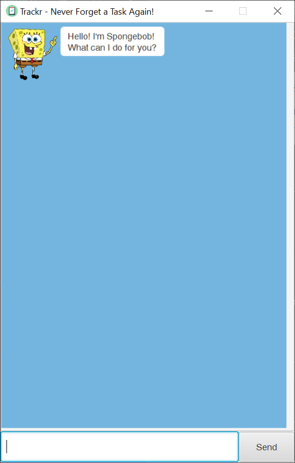

# Trackr

Trackr is a desktop application that helps you to manage tasks. Trackr is **optimized for users who prefer to work with a Command Line Interface** (CLI) while still having the benefits of a Graphical User Interface (GUI).

If you can type fast, Trackr can help you complete your task management process faster than traditional GUI apps.

### 1. Quick Start
1. Ensure you have Java `11` or above installed in your computer.
2. Download the latest `Trackr.jar` [here](https://github.com/shawnlsj97/duke/releases/tag/v0.1.4).
3. Copy the file to the folder you want to use as the home folder for your list of tasks.
4. Double-click the file to start to app. The GUI should appear in a few seconds.

5. Type all commands in the command box at the bottom and press "Enter" on your keyboard to execute it.
e.g. typing `help` and pressing "Enter" will show a list of available commands.
    * Some example commands you can try:
        * `list`: lists all tasks
        * `todo 100 pushups`: adds a task to be done called `100 pushups` to the task list
        * `delete 1`: deletes the 1st task shown in the list
        * `exit`: exits the app
        * Refer to the section below for details of available commands in this application

### 2. Features

Words in `UPPER_CASE` are the parameters to be supplied by the user e.g. in `todo TASK_NAME'`, `TASK_NAME` is a parameter which can be used as `todo gym workout`.

#### 2.1 Viewing help: `help`
Displays all available commands in the application.
Format: `help`

#### 2.2 Adding a task to be done: `todo`
Adds a task to be done with the provided name to your list.
Format: `todo TASK_NAME`

#### 2.3 Adding a deadline: `deadline`
Adds a deadline to your list.
Format: `deadline DEADLINE_NAME /by DD/MM/YYYY HHMM`

#### 2.4 Adding an event to be attended: `event`
Adds a deadline to your list.
Format: `event EVENT_NAME /at DD/MM/YYYY HHMM`

#### 2.5 Listing all tasks: `list`
Shows all tasks in your list.
Format: `list`

#### 2.6 Updating name of task in your list: `update`
Updates name of specified task in your list.
Format: `update INDEX NEW_TASK_NAME`

#### 2.7 Retrieving tasks by name: `find`
Finds tasks whose names contain any of the given keywords.
Format: `find KEYWORD`

#### 2.8 Marking a task as completed: `complete`
Marks specified task on the list as completed.
Format: `complete INDEX`

#### 2.9 Removing a task: `remove`
Remove specified task from the list.
Format: `remove INDEX`

#### 2.10 Undoing previous command: `undo`
Undo previous command and revert changes to the list of tasks.
Format: `undo`

#### 2.11 Display input history: `history`
Display all input you made into the application during the current session.
Format: `history`

#### 2.12 Exiting the application: `exit`
Exits the program.
Format: `exit`

#### 2.13 Saving data
Task list data is saved in the hard disk automatically after any command that changes the data.
There is no need to save manually.

### 3. FAQ
*Q*: How can I transfer my task list to a new computer?
*A*: Install the app in the other computer and overwrite the empty data file it creates with the file that contains the data of your previous Trackr folder.

### 4. Feedback, Bug Reports

* If you have feedback or bug reports, please post in [shawnlsj97/duke issue tracker](https://github.com/shawnlsj97/duke/issues).
* We welcome pull requests too.

### 5. License
Trackr is [MIT-licensed](https://github.com/shawnlsj97/duke/blob/master/LICENSE).

### 6. Command Summary
* **Add**
    * **Todo**: `todo TASK_NAME`
    * **Deadline**: `deadline DEADLINE_NAME /by DD/MM/YYYY HHMM`
    * **Event**: `event EVENT_NAME /at DD/MM/YYYY HHMM`
* **Update**: `update INDEX NEW_TASK_NAME`
* **List**: `list`
* **Find**: `find KEYWORD`
* **Complete**: `complete INDEX`
* **Remove**: `remove INDEX`
* **Undo**: `undo`
* **History**: `history`
* **Help**: `help`
* **Exit**: `exit`