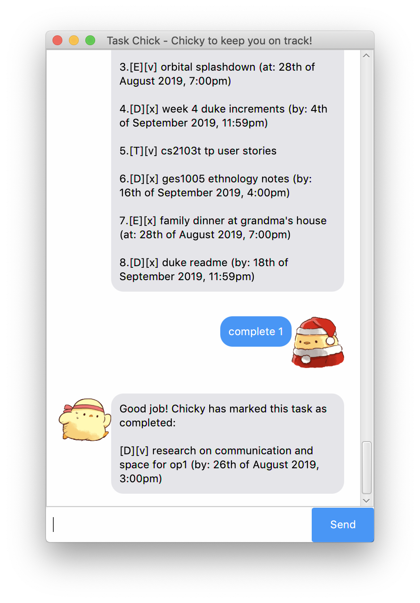

# Task Chick

Task Chick is a Personal Assistant Chatbot that helps you to keep track of various things.
Task Chick is **optimized for users who prefer to work with a Command Line Interface (CLI)** while still
 having the benefits of a Graphical User Interface (GUI).

## Features 

### Add tasks 

Chicky is able to add _todos_, _events_ and _deadlines_ to your task list.

* _Todos_ are tasks without any date or time attached to it
* _Events_ and _deadlines_ are tasks with a date and time attached to it

### Update task description

Chicky can modify the description of your task.

### Complete tasks

Chicky helps you feel accomplished by marking completed tasks with a _v_. Good job!

### Delete tasks

If you no longer want a task to be on your list, Chicky can delete it for you.

### Undo

We all make mistakes! Chicky can help you undo a command.

### View all tasks

To get an overview of all your tasks, ask Chicky for a list!

### View schedule

If you want to know what tasks you have on a specific date, Chicky can find that for you.

### Find keywords

Chicky helps you find relevant tasks. All you need to do it specify a search term!

### Help

Get help on the go from Chicky. A list of commands and their keywords will be displayed.

### Exit

Feel free to close Task Chick once you're done. Your session will be saved. Remember to say bye to Chicky!

## Usage

### `todo` or `-t` - Adds todo task

`todo [task description]` or `-t [task description]`

Adds a task of type _todo_ to your task list.

Example of usage: `todo cs2103t homework`

### `event` or `-e` - Adds event task

`event [task description] /at [dd/mm/yyyy hhmm]` or `-e [task description] /at [dd/mm/yyyy hhmm]`

Adds a task of type _event_ to your task list. Please specify the date in the format `dd/mm/yyyy` and the
 time in 24-hour format `hhmm`.

Example of usage: `event orbital splashdown /at 28/8/2019 1900`

### `deadline` or `-d` - Adds deadline task

`deadline [task description] /by [dd/mm/yyyy]` or `-d [task description] /by [dd/mm/yyyy]`

Adds a task of type _deadline_ to your task list. Please specify the date in the format `dd/mm/yyyy` and the
 time in 24-hour format `hhmm`.

Example of usage: `deadline duke increments /by 18/9/2019 2359`

### `update` - Updates a task description

`update [task index] [new description]`

Updates the description of your task.

Example of usage: `update 1 complete cs2101 readings`

### `complete` or `c` - Complete a task

`complete [task index]` or `c [task index]`

Marks a task you completed with a _v_.

### `delete` or `d` - Delete a task

`delete [task index]` or `d [task index]`

Deletes a task from your task list.

### `undo` or `u` - Undo an action

Undo a change to the task list. Changes made in a previous session of Task Chick cannot be undone.

### `list` or `l` - View all tasks

View all your tasks.

### `schedule` or `s` - View scheduled tasks

`schedule [dd/mm/yyyy]` or `s [dd/mm/yyyy]`

View tasks you have scheduled on a specific date. Please specify the date in the format `dd/mm/yyyy`.

### `find` or `f` - Find matching tasks

`find [search term]` or `f [search term]`

Find tasks containing a specific search term.

### `help` or `h` - View instructions

Get instructions on how to use Task Chick.

### `bye` - Exit Task Chick

Exit this session of Task Chick. Task Chick will close after 2 seconds.