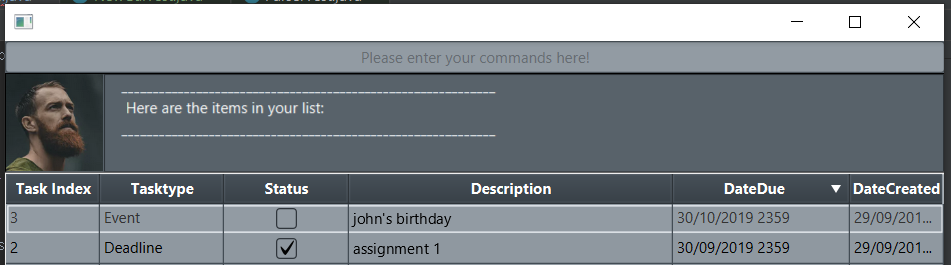

# Task Book - User Guide

## Table of contents
 1. [Introduction](#introduction)
 2. [Quick Start](#QuickStart)
 3. [Features](#Features)
    1. [Adding a Todo task](#31-adding--a-todo-task-a-nametodoa)
    2. [Adding a Deadline task](#32-adding-a-deadline-task-a-namedeadlinea)
    3. [Adding an Event task](#33-adding-a-event-task-a-nameeventa)
    4. [Adding a NoteBook](#34-adding-a-notebook)
    5. [Finding a task/notebook](#35-finding-a-tasknotebook)
    6. [Mark a task/notebook as completed](#36-mark-a-tasknotebook-as-completed)
    7. [Deleting a task/notebook](#37-deleting-a-tasknotebook)
    8. [Adding a note to a task/notebook](#38-adding-a-note-to-a-tasknotebook)
    9. [Finding a note from a task/notebook](#39-deleting-a-note-from-a-tasknotebook)
    10. [Finding a note](#310-finding-a-note)
    11. [Listing all task/notebooks](#311-listing-all-tasksnotebooks)
    12. [listing all notes from a task/notebook](#312-listing-all-notes-from-a-tasknotebook)
    13. [sorting the columns](#313-sorting-the-columns)
    14. [resizing the columns](#314-resizing-the-columns)
 4. [FAQ](#4-faq)
 5. [Command summary](#5-command-summary)
																																																																										 

## 1.Introduction <a name="introduction"></a>
Task Book is a simple scheduler with a built in note taking function. It features a command line interface and a helpful chatbot for those who like a more interactive experience. The table formatted data also provides an easy and intuitive way to sort and view the items.


## 2. Quick Start <a name="QuickStart"></a>
1.  Ensure you have Java 11 or above installed in your Computer.
2.  Download the latest ```TaskBook.jar``` [here]([https://github.com/lzw12345/duke/releases](https://github.com/lzw12345/duke/releases))
3.  Copy the file to the folder where you want to store Task book (note the save file will be store here too)
4.  Double-click the file to start the app. The GUI should appear in a few seconds.
5.  Some sample commands you can try 
	- ```list``` : lists all tasks and notebooks
	- ```todo meet john``` adds a to do task to the task list
	-  ```done [1] ``` marks the task with the index 1 as done

## 3. Features  <a name="Features"></a>

Command Format
 - the first phrase (with no space) is the command phrase e.g. ```findnotes test``` searches for notes with descriptions containing test.
 - numbers in square brackets [1] immediately after the command word indicate the task/notebook to be referenced. e.g. ``` addnotes [1] [1] | test 1 ``` creates a note for item 1 with category [1] and description test 1.
 - numbers in curly brackets immediately after the task reference are used to indicate the note to be referenced. e.g. ```deletenotes [1] {2}``` deletes the note with index 2 in the task/notebook with index 1  
 - Words in `UPPER_CASE` are the parameters to be supplied by the user e.g. in `todo DESCRIPTION`, `description` is a parameter which can be used as `todo meet with a friend`.
 - All DATE inputs should be input in this format: d/M/yyyy HHmm e.g. `2/2/2019 2345` or `02/02/2019 0945`

### 3.1 Adding  a Todo task <a name="Todo"></a>
Adds a to do task to the task list (note **DO NOT** use / characters in description) 
<br>Format: `todo DESCRIPTION`
<br>Examples:
 - `todo check the weather`
 - `todo wash dishes`
 
 
### 3.2 Adding a deadline task <a name="Deadline"></a>
Adds a deadline task to the task list (note **DO NOT** use / characters in description) 
<br>Format: `deadline DESCRIPTION /by DATE`
<br>Examples: 
 - `deadline hand up homework for CS2103 /by 22/2/2019 `
 - `deadline finish eating cereal before expiry /by 1/12/2019`


### 3.3 Adding a event task <a name="Event"></a>
Adds an event task to the task list (note **DO NOT** use / characters in description) 
<br>Format: `event DESCRIPTION /at DATE`
<br>Examples:
 - `event john's birthday /at 22/12/2019`
 - `event 9.9 lazada sale /at 9/9/2019 0000`

### 3.4 Adding a notebook
Adds a notebook to the list (note **DO NOT** use / characters in description) 
<br>Format: 'notebook DESCRIPTION'
<br>Examples:
 - `notebook weight management`
 - `notebook CS2103 lecture notes`

### 3.5 Finding a task/notebook
Finds a task/notebook with a description matching a keyword or phrase exactly
<br>Format: `find KEYWORD(S)`
<br>Examples 
 - `find test`
 - `find grocery list`

### 3.6 mark a task/notebook as completed
Marks a task/notebook as done 
<br>Format: `done [TASKINDEX]`
<br>Examples
 - `done [2]`

### 3.7 Deleting a task/notebook
Deletes a task/notebook from the list (inputting TASKINDEX as 0 will delete all tasks)
<br>Format: `delete [TASKINDEX]`
<br>Examples:
 - `delete [1]` 

### 3.8 Adding a note to a task/notebook
Adds a note to the indicated task/notebook
<br>Format: 
 - `addnotes [TASKINDEX] CATEGORY | DESCRIPTION `
 - `addnotes [TASKINDEX] CATEGORY | DESCRIPTION /by DATE`
 - `addnotes [TASKINDEX] CATEGORY | DESCRIPTION /at DATE`
<br>Examples:
 - `addnotes [1] addition |  a+x` 
 - `addnotes [2] new version was created /at 2/2/2019 2344`


### 3.9 Deleting a note from a task/notebook
Deletes a note from the indicated task/notebook (inputting NOTEINDEX as 0 will delete all notes)
<br> Format: `deletenotes [TASKINDEX] {NOTEINDEX}`
<br> Examples:
 - `deletenotes [1]{1}`
 
 
### 3.10 finding a note
Finds a note from all tasks/notebooks with a description matching a keyword or phrase exactly
<br> Format: `findnotes KEYWORD(S)`
<br> Examples:
 - `find mitochondria`
 - `find power house`

### 3.11 Listing all tasks/notebooks
lists all the tasks/notebooks 
<br> Format: `list`

### 3.12 Listing all notes from a task/notebook
lists all the notes in a indicated task/notebook
<br> Format: `shownotes [TASKINDEX]`
<br> Examples: 
 - `shownotes [1]`
 
### 3.13 Sorting the columns
Sort the columns in ascending or descending order by clicking the right corner of the column headers



### 3.14 Resizing the columns
Resize the columns by clicking and dragging the edges of the column headers


## 4 FAQ 
Q: Where is the save file stored?
<br>A: The save file is stored in the same folder as the program. It is called SaveFile.json

## 5 Command Summary
 - add todo `todo DESCRIPTION`
 <br> e.g. `todo check the fridge`
 - add deadline `deadline DESCRIPTION /by DATE`
 <br> e.g. `deadline assignment 1 /by 22/2/2222 22222`
 - add event `event DESCRIPTION /at DATE`
 <br>`event jame's birthday /at 22/12/2019 1111`
 - add notebook `notebook DESCRIPTION`
 <br> `notebook lecture notes`
 - find a task/notebook `find KEYWORD(S)`
 <br> `find biology`
 - mark a task as done `done [TASKINDEX]`
 <br> `done [1]`
 - delete