# User Guide

## Features 
* Add, show and delete tasks: Todo, Deadline and Event tasks
* Save and load past tasks
* Mark tasks as done
* Find tasks
* Add notes
### Feature 1 : Add, show and delete tasks
You can create tasks that are either todos, tasks with deadlines or events. Each task will have a brief description and whether it has been completed or not. Tasks can optionally have notes, which will be added later on after initial creation of the task. Created tasks can be listed.
When a task is no longer relevant, you can delete it as well, which removes it from memory and will not be retrievable.
### Feature 2 : Save and load past tasks
Eva will save your created data and load any available data when you start up Eva.
### Feature 3: Mark tasks as done
You can mark tasks as done and Eva will remember and indicate that it is completed.
### Feature 4: Find tasks
You can search for tasks using keywords and Eva will list out the matching tasks.
### Feature 5: Add notes
If you have additional notes you want to supplement to tasks, you can add them after creating those tasks. These task notes will be displayed together with the task.
Alternatively, if you wish to add general notes to remind you of general things not related to just a single task, you can add general notes as well.

## Usage

### `todo <task description>` - Create a todo task

Creates and adds to the list of tasks a todo task with the task description. Upon creation, the todo task is not completed and does not have any supplementary notes.

Example of usage: 

`todo relax and distress`

Expected outcome:

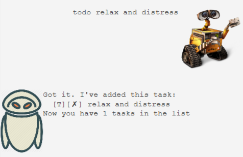
Format: 

### `deadline <task description> /by <date & time>` - Create a deadline task

Creates and adds to the list of tasks a deadline task with the task description and a deadline @ date time.
Do note that the date time has a specific format of `dd/MM/yyyy HHmm`, such as `18/09/2019 2359`.

Example usage:

`deadline iP w6 stuff /by 18/09/2019 2359`

Expected outcome:

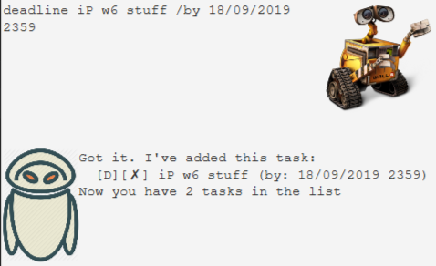
Format: 

### `event <task description> /at <date & time period>` - Create an event

Creates and adds to the list of tasks an event with the task description, and will occur at the given date & time period.
Do note that there is no specific format for the date and time for events.

Example of usage: 

`event cs2103t meeting /at 19/09/2019 1-2pm`

Expected outcome:

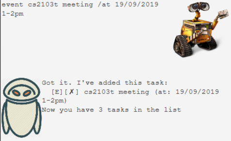
Format: 

### `list` - Show the list of tasks

Lists out the tasks in order of creation. Each task will be displayed in the following format:
`id.[task type][is completed] task description (any other information)`

Example of usage: 

`list`

Expected outcome:

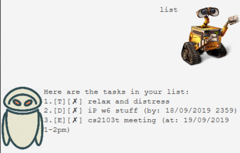
Format: 

### `done <id>` - Mark task as completed

Marks the task with the id as completed.

Example of usage: 

`done 2`

Expected outcome:

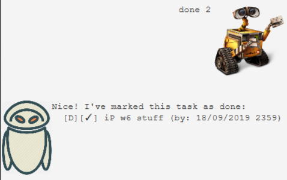
Format: 

### `find <keyword or phrase>` - Find tasks with matching keyword

Searches for tasks that contain the given keyword or phrase and lists all matching tasks out.

Example of usage: 

`find stress`

Expected outcome:

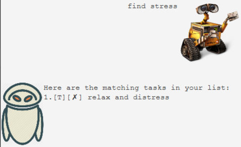
Format: 

### `setnotes (id) <note content>` - Set notes

If id is given, the note with note content will be set to the task with the id. This task note will be displayed together with the task it is attached to.
Otherwise, the note will be set as a general note. 

Example of usage 1 (set notes to task): 

`setnotes 1 i promise i will get there soon`

Expected outcome 1 (set notes to task):

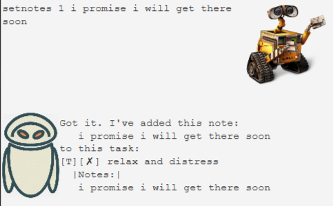
Format: 

Example of usage 2 (set general notes): 

`setnotes i will probably want to complete all these in 20min`

Expected outcome 2 (set general notes):

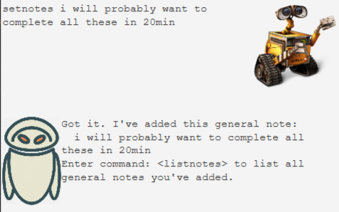
Format: 

### `listnotes` - List all general notes

Lists all general notes in order of creation.

Example of usage: 

`listnotes`

Expected outcome:

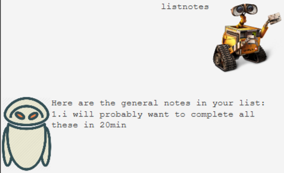
Format: 

### `deletenotes general <id>` - Delete a general note

Deletes the general note with the id amongst general notes (their numbers when listed with listnotes).

Example of usage: 

`deletenotes general 1`

Expected outcome:

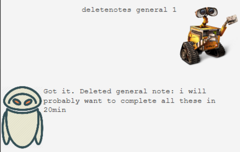
Format: 

### `deletenotes task <id>` - Delete a task's note

Deletes the note of task with the id.

Example of usage: 

`deletenotes task 1`

Expected outcome:

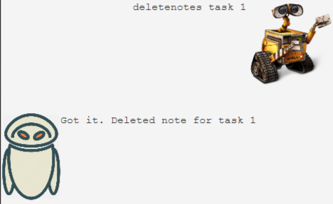
Format: 

### `delete <task id>` - Delete a task

Deletes the task with the id.

Example of usage: 

`delete 2`

Expected outcome:

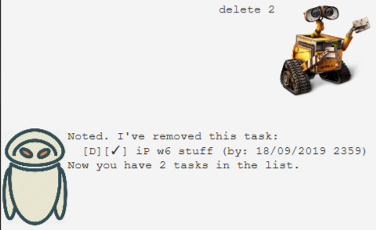
Format: 