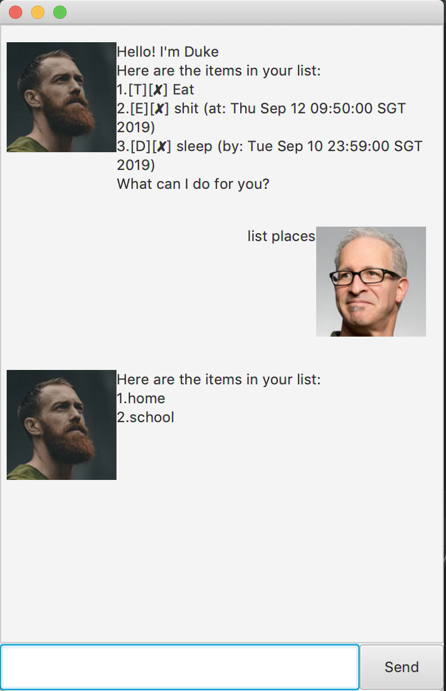

# Task Master Nezuko: User Guide

By: `Xiaoyu`      Since: `Aug 2019`      Licence: `MIT`

## Table of Contents

1. [Introduction](#introduction)
1. [Quick Start](#quick start)
1. [Features](#features)
    1. [Viewing help: `help`](#viewing-help--help)
    1. 
## Introduction

Task Master Nezuko(TMN) is a handy tool for you to manage you tasks on a PC. More importantly, it is *designed for Demon Slayer and Command Line App lovers* like you. Talk to Nezuko the Task Master through a few easy-to-remember commands, you can manage you tasks in anyway you want. Let us jump to the [Quic Start](#quick-start) to get started!

## Quick Start

1.  Ensure you have Java `11` or above installed in your Computer.
1.  Download the latest `taskmaster.jar` link:{repoURL}/releases[here].
1.  Copy the file to the folder you want to use as the home folder for your TM Nezuko.
1.  Double-click the file to start the app. The GUI should appear in a few seconds.

1.  Type the command in the command box and press kbd:[Enter] to execute it.
1.  Some example commands you can try:

* **`list`** : lists all tasks
* **`deadline`** `project meeting /by 20/09/2020 1800` : adds a task `project meeting` due at `6 PM` on `20th Sept, 2020` to the Task Manager.
* **`delete`** `3` : deletes the 3rd task in the full list
* **`done`** `2` : marks the 2nd task in the full list as done

1.  Refer to <<Features>> for details of each command.

## Features

####
*Command Format*

* Words in `<` `>` are the parameters to be supplied by the user. e.g. in `delete <index>`, `index` is a parameter which can be used as `delete 3`.

*Output Format*

* A task is formatted as follow: +
    `_index_. [type] [status] _task description_ (timing)` +
The following table summarises what each field means:
|###
|Field | Description

|Index | Index of task in the list
|Type | `[T]`: Todo task without timing information +
`[D]`: Deadline task with a deadline +
`[E]`: Event task with two timing information marking the start and end of the event
|Status | `[x]` Task is unfinished +
`[v]` Task is finished
|Task Description | User input task description
|Timing| `(by:` `_date_` `)`: Task due by `_date_` +
`(from:` `_starting date_` `to` `_ending date_` `)`: Task happening between `_starting_date_` and `_ending date_`
|###

* e.g. in `2. [D][x] assignment 1 (by: 21/09/2019 0900 PM)`, the task _assignment 1_ is the second task in the list; it is a unfinished deadline task due by 21st Sept, 2019 at 0900 PM.

### Viewing help : `help`

Format: `help`

### Adding a todo task: `todo`

`todo` allows you to add a task without any timing information. +
Format: `todo <task description>`

Examples:

* `todo repair my fridge`

### Adding a deadline task: `deadline`

Use this command if you have any task due before certain time or date that you want to specify. +
Format: `deadline <task description> /by <date> <time>` +
Format date: `<dd/MM/yyyy>` **or** `<dd/MM>` +
Format time: `<hhmm>`

[TIP]
Either `<date>` or `<time>` can be omitted. If so, the default date will be the current date, and the default time will be 1200AM.

Examples:

* `deadline Lecture 6 quiz /by 28/9` +
Adds the task `[D][x] Lecture 6 quiz (by: 28/09/2019 1200 AM)` to your task list.
* `deadline essay draft /by 2359` +
Adds the task `[D][x] essay draft (by: _current date_ 1159 PM)` to your task list.

### Adding an event task: `event`

Use this command if you have any activity that has a duration to happen. +
Format: `event <task description> /from <date> <time> to <date> <time>` +
Format date: `<dd/MM/yyyy>` **or** `<dd/MM>` +
Format time: `<hhmm>`

[TIP]
Either `<date>` or `<time>` can be omitted. If so, the default date will be the current date, and the default time will be 1200AM.

Examples:

* `event CCA interview /from 28/9 1930 to 28/9 1945` +
Adds the task `[E][x] CCA interview (from: 28/09/2019 0730 PM to 28/09/2019 0745 PM)` to your task list.

### Listing all tasks : `list`

Shows a list of all persons in the address book. +
Format: `list`

### Deleting a task : `delete`

Deletes a existing task from the task list. +
Format: `delete <index>`

Examples:

* `delete 1` +
Deletes the 1st task in the task list.

### Marking a task as done: `done`

Marks a task as done in the task list. +
Format: `done <index>`

Examples:

* `done 1` +
Marks the 1st task in the task list as done.

### Finding tasks by description: `find`

Finds tasks whose description contain the given keyword/phrase. +
Format: `find <keyword>`

****
* The search is case insensitive. e.g `lecture` will match `Lecture`.
* Only one exact keyword or phrase can be searched at one time. e.g. `do homework` will not match `do laundry` or `do coding homework`, but will match `do homework with Ben`.
* Only the description is searched.
* Partial words will be matched. e.g. `CS` will match `CS2103` and `CS2101`.
****

Examples:

* `find meetings` +
Returns `Project Meeting` and `meeting at U Town`.
* `find to buy:` +
Returns `to buy: shoes` and `to buy: notepad`.

### Sending a greeting : `hi`

Sends a greeting to Nezuko and see what she replies!

### Clearing all entries : `clear`

Clears all entries from the task list. +
Format: `clear`

### Exiting the program : `bye`

Exits the program. +
Format: `bye`

### Saving the data

Task Master data are saved in the hard disk automatically after any command that changes the data. +
There is no need to save manually.

### Notifying on close deadlines

Nezuko will sort and find a few most urgent unfinished tasks for you and alert you on the matter at the start of the programme. +
Todo tasks have the lowest priority.

## FAQ

*Q*: What is the default number of tasks that I will be reminded of at the start of the programme? +
*A*: The default number is 5. We are sorry that the number of tasks to remind cannot be modified in this version of TM Nezuko. We welcome you to look out for future updates.

## Command Summary

* *Todo* `todo <task description>` +
e.g. `todo watch a movie`
* *Deadline* `deadline <task description> /by <date> <time>`
e.g. `deadline Lecture 6 quiz /by 28/9 0900`
* *Event* `event <task description> /from <date> <time> to <date> <time>
e.g. `event CCA interview /from 28/9 1930 to 28/9 1945`
* *Clear* : `clear`
* *Delete* : `delete <index>` +
e.g. `delete 3`
* *Done* : `done <index>` +
e.g. `done 5`
* *Find* : `find <keyword>` +
e.g. `find assignment`
* *List* : `list`
* *Hi*: `hi`
* *Help* : `help`
