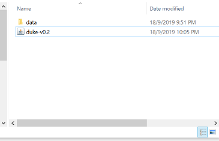

# User Guide

[1. Introduction](#1-introduction)

[2. Quick Start](#2-quick-start)

[3. Features](#3-features)
    
- [3.1. Adding a todo task: ](#31-adding-a-todo-task-todo) todo

- [3.2. Adding a deadline task: ](#32-adding-a-deadline-task-deadline) deadline

- [3.3. Adding an event task: ](#33-adding-an-event-task-event) event

- [3.4. Listing all tasks: ](#34-listing-all-tasks-list) list

- [3.5. Locating tasks by name: ](#35-locating-tasks-by-name-find) find

- [3.6. Deleting a task: ](#36-deleting-a-task-delete) delete

- [3.7. Exiting the program: ](#37-exiting-the-program-bye) bye

- [3.8. Loading and saving tasks](#38-loading-and-saving-tasks)

## 1. Introduction

Duke application is a personal assistant chat bot for managing tasks. It is designed for people who prefer to work with
a Command Line Interface (CLI) while still having the benefits of a Graphical User Interface (GUI). 
 
## 2. Quick Start

1. Ensure you have Java `11` or above installed in your local machine.

2. Download duke-v0.2.jar [here](https://github.com/jun-ha0/duke/releases/tag/A-Release).

3. Copy the file to the folder you want to use as the folder for your Duke application.

4. Double-click the file to run the app. The GUI should appear in a few seconds. A new folder named `data` will be 
created within the current folder if there is no existing `data` folder. This folder contains `tasks.txt`.
    
    
    
    If unable to run, type `java -jar duke-v0.2.jar` in the terminal / command line.

    

5. Type the command in the text box and press Enter to execute it.

6. Some sample commands you can try:

    `list` : lists all tasks.

    `deadline return book /by 2/1/2019 2359`: adds a deadline task to the task list.

    `event project meeting /at 2/12/2019 1800`: adds an event task to the task list.

    `delete 3` : deletes the 3rd task shown in the current list.

    `bye` : exits the application.

## 3. Features 

### 3.1 Adding a todo task: `todo`
Adds a todo task to the task list.

Example `todo homework`: adds a todo task to the task list

### 3.2 Adding a deadline task: `deadline`
Adds a deadline task to the task list. Note that deadlines must have `/by` followed by a date and time in 
d/M/yyyy HHmm format.

Example
    `deadline return book /by 2/1/2019 2359`: adds a deadline task to the task list.

### 3.3 Adding an event task: `event`
Adds an event task to the task list. Note that events must have `/at` followed by a date and time in 
d/M/yyyy HHmm format.

Example
    `event project meeting /at 2/12/2019 1800`: adds an event task to the task list.

### 3.4 Listing all tasks: `list`
Shows the list of all tasks in the current task list.

Example
    `list` : lists all tasks.

### 3.5 Locating tasks by name: `find`
Finds the tasks with specified keyword.

Example
    `find project` : finds all task with keyword 'project' in the current list.

### 3.6 Deleting a task: `delete`
Deletes specified task from the current task list.

Example
    `delete 3` : deletes the 3rd task shown in the current list.

### 3.7 Exiting the program: `bye`
Exits the application.

Example
    `bye` : exits the application.

### 3.8 Loading and saving tasks. 
Task list is saved in the file `tasks.txt` which is within the folder named `data`.
Upon running the application, the data from `tasks.txt` is automatically loaded into the current task list. 
Note that if there is no `tasks.txt` file, a new empty `tasks.txt` (representing empty task list) will be created.

