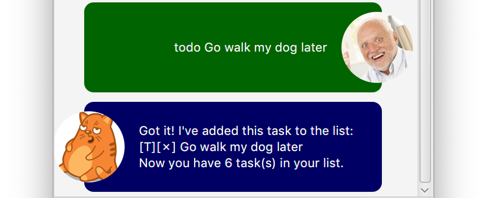
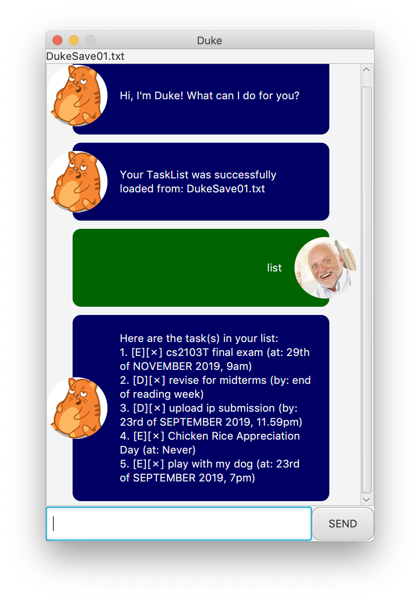
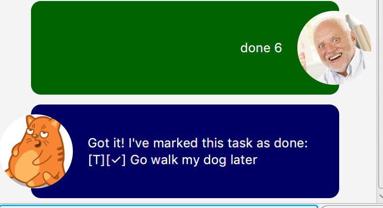
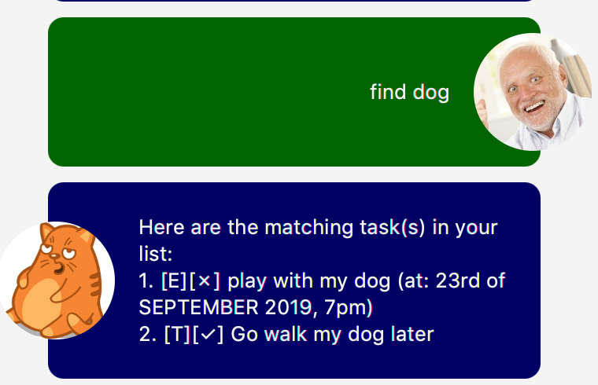
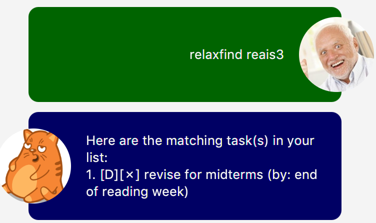
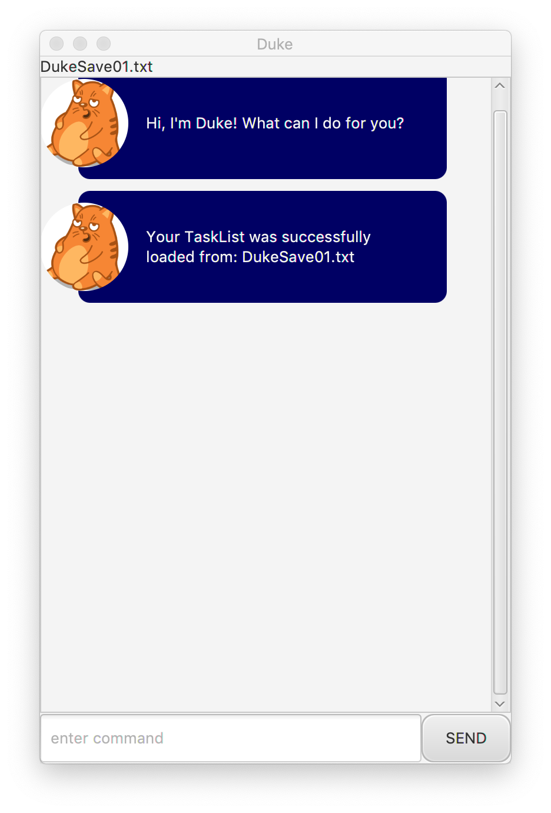

# User Guide


## Quick Glimpse


### List of all commands:
- [`todo`](#11-adding-a-todo-task-to-the-current-task-list----todo)
- [`deadline`](#12-adding-a-deadline-task-to-the-current-task-list----deadline)
- [`event`](#13-adding-an-event-task-to-the-current-task-list----event)
- [`list`](#2-listing-the-tasks-in-the-current-task-list----list)
- [`done`](#3-completing-a-task-in-the-current-task-list----done)
- [`delete`](#4-removing-a-task-from-the-current-task-list----delete)
- [`find`](#51-searching-for-a-task-in-the-current-task-list-with-keyword----find)
- [`relaxfind`](#52-searching-for-a-task-in-the-current-task-list-with-similar-keyword----relaxfind)
- [`save`](#61-loading-a-task-list-from-another-save-file----load)
- [`load`](#62-saving-the-current-task-list-to-a-specified-file----save)
- [`bye`](#7-closing-duke----bye)

## Features 

### 1. Adding a Task to the Current Task List.
The following Features will allow you to add Tasks to the current Task List.


#### 1.1 Adding a ToDo Task to the Current Task List -- `todo` 
Adds basic ToDo Task which only contains a `description` and a `completion status` to the current Task List.

**Syntax**:<br>
`todo` `DESCRIPTION`

**Example**:<br>
`todo walk the dog`<br>
**Outcome**:<br>
An `incomplete` ToDo Task with the `DESCRIPTION` `walk the dog` is added to the current TaskList.

#### 1.2 Adding a Deadline Task to the Current Task List -- `deadline`

Adds a Deadline Task which contains a `description` and a `date-time to complete by` to the current Task List.

**Syntax**:<br>
`deadline` `DESCRIPTION` `/by` `DATETIME_TO_COMPLETE`

**Example**:<br>
`deadline Walk the dog /by 3pm`<br>
**Outcome**:<br>
An `incomplete` Deadline Task with the `DESCRIPTION` `Walk the dog`, and `DATETIME_TO_COMEPLETE` of `3pm` is added to the current Task List`

> #### **Formatted date and time**:
> If `DATETIME_TO_COMPLETE` is entered in the `dd/MM/yyyy hhmm` format, it will automatically be converted to a more readable format.
>
>**Example**:<br>
>`deadline Walk the dog /by 11/11/1111 1111`
>**Outcome**:<br>
>An `incomplete` Deadline Task with the `DESCRIPTION` `Walk the dog` and `DATETIME_TO_COMEPLETE` of `11th of NOVEMBER 2019, 11.11am` is added to the current Task List.

#### 1.3 Adding an Event Task to the Current Task List -- `event`

Adds an Event Task which contains a `description` and a `date-time of event` to the current Task List.

**Syntax**:<br>
`event` `DESCRIPTION` `/by` `DATETIME_OF_EVENT`


**Example**:<br>
`deadline Walk the dog /at 3pm`<br>
**Outcome**:<br>
An `incomplete` Deadline Task with the `DESCRIPTION` `Walk the dog` and `DATETIME_OF_EVENT` of `3pm` is added to the current Task List.


>### **Formatted date and time**:
> If `DATETIME_TO_COMPLETE` is entered in the `dd/MM/yyyy hhmm` format, it will automatically be converted to a more readable format.
>
>**Example**:<br>
`event Walk the dog /at 11/11/1111 1111`<br>
**Outcome**:<br>
An `incomplete` Event Task with the `DESCRIPTION` `Walk the dog` and `DATETIME_OF_EVENT` of `11th of NOVEMBER 2019, 11.11am` is added to the current Task List.

### 2. Listing the Tasks in the current Task List -- `list`
Displays all the current tasks in your current Task List. 


**Command**:<br>
`list`

**Outcome**:<br>
All the tasks in the current Task List will be displayed.


### 3. Completing a Task in the Current Task List -- `done`
Marks a Task in the current Task List which corresponds to the given `INDEX`.

**Syntax**:<br>
`done` `INDEX`

**Example**:<br>
`done` `4`<br>
**Outcome**:<br>
The `4th` task in the current Task List will have it's `completion status` to set `complete`.



### 4. Removing a Task from the Current Task List -- `delete`
Removes a Task in the current Task List which corresponds to the given `INDEX`.

**Syntax**:<br>
`delete` `INDEX`

**Example**:<br>
`delete` `4`<br>
**Outcome**:<br>
The `4th` task in the current Task List will be removed from it.

### 5. Searching for Tasks in the Current Task List.
If you want to search for a task in the Current Task List there are two option. The first `find` is more strict, while the second `relaxfind` is less strict.


#### 5.1 Searching for a Task in the Current Task List with Keyword -- `find`
Lists all tasks in the current Task List which contain the given `KEYWORD` in their `descriptions`.



**Syntax**:<br>
`find` `KEYWORD`

**Example**:<br>
`find` `dog`<br>
**Outcome**:<br>
All tasks in the current Task List which contain the word `dog` in their `descriptions`.


>**Not case sensitive**:<br>
> Tasks with `dog` and `DOG` in their description will both be included in the result list.

#### 5.2 Searching for a Task in the Current Task List with Similar Keyword -- `relaxfind`
Lists all tasks in the current Task List whose `description` contains a word whose Levenshtein distance from the `KEYWORD` is less than or equal to `3`.



**Syntax**:<br>
`relaxfind` `KEYWORD`

**Example**:<br>
`relaxfind` `dog`<br>
**Outcome**:<br>
All tasks in the current Task List which contain contain a word whose Levenshtein distance from `dog` is less than or equal to `3`.

>#### **Levenshtein distance**:
>In information theory, linguistics and computer science, the Levenshtein distance is a string metric for measuring the difference between two sequences. Informally, the Levenshtein distance between two words is the minimum number of single-character edits (insertions, deletions or substitutions) required to change one word into the other.
> **[- Wikipedia](https://en.wikipedia.org/wiki/Levenshtein_distance)**

### 6. Saving and Loading a Task List from a File. 

Changes to your current Task List are automatically saved to the current Task List save file. Whenever you start Duke, the Task List will be loaded from the `DukeSave01.txt` file.


#### 6.1 Loading a Task List from another Save File -- `load`
Sets the current Task List to the Task List loaded from a Save File with the specified `FILE_NAME` in the `DukeSaveFiles` directory. <br>

>
>The save file which the current task list will save to it is shown in the top left of the window.

**Syntax**: <br>
`load` `FILE_NAME`

**Example**: <br>
`load DukeSave01` 
**Outcome**: <br>
The current Task List will be set to the Task List as saved in the `DukeSave01.txt` file under the `DukeSaveFiles` directory.

>**Warning**: <br>
>The file must be properly formatted for the Task List to be loaded.

>**Valid naming format**:<br>
>File names can only contain alphanumeric characters. e.g. `SavEfIle01` is valid but ``$@\/f|le01`` is not.

>**Loading is optional**: <br>
> Duke will load the default TaskList saved at `DukeSave01.txt`
>

>**Note**: <br>
>If the file does not already exist in the directory, it will be created for you.

#### 6.2 Saving the Current Task List to a specified File -- `save`
Saves the current TaskList to a Save File with the specified `FILE_NAME` in the `DukeSaveFiles` directory.

**Syntax**: <br>
`save` `FILE_NAME`


**Example**: <br>
`save` `MySaveFile01` <br>
**Outcome**: <br>
The tasks in the current Task List will be saved to the `MySaveFile01.txt` in the `DukeSaveFiles` directory.

>**Warning**: <br>
>This will overwrite whatever data is in the existing file.

>**Note**:<br>
>If the file does not already exist in the directory, it will be created for you.

#### 6.3. Where is the DukeSaveFiles Directory Located?
If you are running from Duke from the `.jar`, the `DukeSaveFiles` directory will be created within the same directory where your `duke-x.x.x.jar` file is located, if it does not already exist.
```
downloads
L duke-0.1.1.jar <------- .jar file
L DukeSaveFiles    <----- DukeSaveFiles directory
   L SaveFile02.txt   <-- save file
```

If you are running Duke directly from the `duke.gui.DukeLauncher` `.class` file, the `DukeSaveFiles` directory will be created within the same directory as the `main` file. 
```
 downloads
 L duke
   L build
     L classes
       L java
         L DukeSaveFiles  < ------------- DukeSaveFiles directory
           L SaveFile02.txt    <--------- save file
         L main     <-------------------- main file
            L duke
             L gui
               L DukeLauncher.class   <-- .class file
```

#### 6.4 How are the Save Files Formatted?
If you want to edit the save files directly ensure they are formatted in the following way:

1. The first line of the file should contain the number of tasks that are in the task list

2. The subsequent lines will contain the data to create each task to populate the Task List. Tasks which require a date/time in the 4th line, otherwise only 3 lines are used. 
```
 number of tasks
 type of task               T = ToDo, D = Dealine, E = Event
 completion status of task  0 = incomplete, 1 = complete
 description of task       
 date/time of the task
 ...
 ...
 ...
```

**Example**
``` 
 2
 T
 0
 Walk the Dog 
 D
 1 
 Walk the Cat 
 Yesterday 
```

This creates a Task List with 2 Tasks:
1. an `incomplete` `ToDo` task with the description `Walk the Dog`. 
2. a `complete` `Deadline` Task with the description `Walk the Cat` and a time of `Yesterday`.

### 7. Closing Duke -- `bye`
Closing Duke.

**Command**: <br>
`bye`

**Outcome**: <br>
Duke will show a goodbye popup which you can click, or press `Enter` to close Duke.

> **Alternatively**<br>
> You may simply press the close button for the window.

