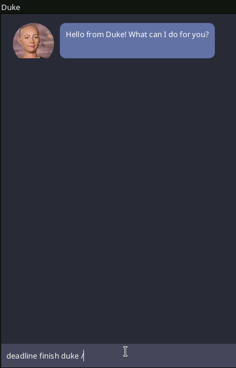
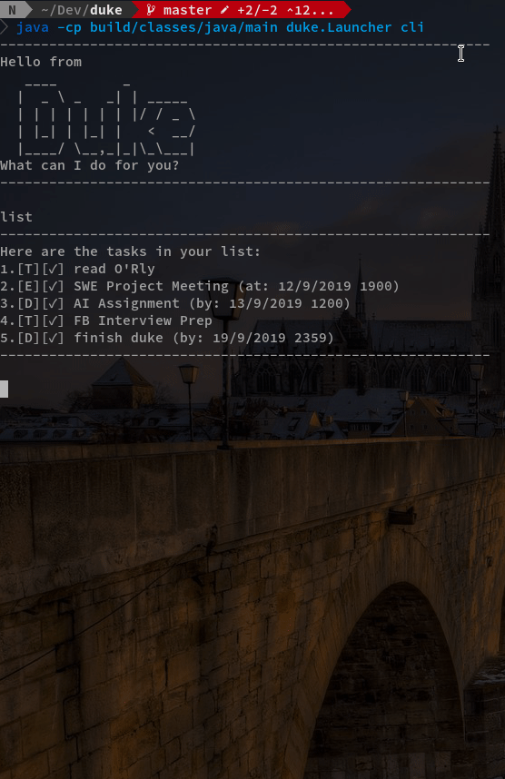

# Duke User Guide

## Introduction
Duke is a personal task manager that helps you track your todos, events, and
deadlines. It is in the form of a chatbot and can be used on the command line
as well as from a GUI.

## Quick Start
1. Ensure you have Java 11 or above installed in your Computer.
2. Download the latest `duke.jar` [here](https://github.com/gary-lgy/duke/releases).
4. Double-click the file to start the app. The GUI should appear in a few seconds.
5. Type the command in the command box and press Enter to execute it.  
   e.g. typing `help` and pressing Enter will open the help window.
6. Some example commands you can try:
    - `list` : lists all tasks
    - `todo learn to use Duke` : adds a todo
    - `done 1` : mark the first task as done
    - `bye` : exits the app

Details of the commands are explained below.

## Features 

### Available in both CLI and GUI
GUI:



CLI:



While the GUI may be more intuitive to use, the CLI version provides a simpler
and distraction-free environment for you to focus on managing your tasks.

The command syntax is the same in both GUI and CLI.

Duke launches in GUI by default, the CLI version can be launched with the following command
```
java -jar duke.jar cli
```

### Responsive UI
Resize and position the window however you like, and Duke will still work as
expected for you.

### Easily migratable
All your tasks are stored in a plaintext file, in a human-readable format.
Depending on your platform, the file can be found at one of the following
locations:
- Linux: `/home/USERNAME/.local/share/Duke/duke.txt`
- MacOS: `/Users/USERNAME/Library/Application Support/Duke/duke.txt`
- Windows: `C:\Users\USERNAME\AppData\Roaming\Duke\duke.txt`

where `USERNAME` refers to your OS username.  
Migrating to a different machine and want to take all your tasks with you?
Simple copy the file over and you're set.

### Intuitive `find` command
The `find` command finds any task that either fully or partially matches one or
more keywords. Try `find school work` and you'll get all the tasks that
contains `school`, `work`, or both.

### (For developers aka. myself) Easily extensible
The code is written in a modular manner and adding new functionalities is
very easy. Example functions that I wanted but did not implement: fuzzy
find, natural language data time format, JSON storage, etc.

## Usage

### Viewing help: `help`
__Format__: `help`

### Adding a todo: `todo`
Adds a `todo` to Duke.  
__Format__: `todo DESCRIPTION`  
__Example__: `todo Read book`

### Adding an event: `event`
Adds an `event` to Duke. An `event` is something that happens at the specific time.  
__Format__: `event DESCRIPTION /at dd/MM/yyyy HHmm`  
__Example__: `event job interview /at 1/9/2018 1330`

### Adding a deadline: `deadline`
Adds a `deadline` to Duke. A deadline is a task that should be done by a certain time.  
__Format__: `deadline DESCRIPTION /by dd/MM/yyyy HHmm`  
__Example__: `deadline return book /by 18/2/2019 0900`

### Listing all tasks: `list`
Shows a list of all tasks(`todo`s, `event`s, `deadline`s) in Duke.  
__Format__: `list`

### Locating tasks by keywords: `find`
Finds tasks whose descriptions contain any of the given keywords.  
__Format__: `find KEYWORD...`  
__Example__: `find school project`

### Marking a task as done: `done`
Marks the specified task as done.  
__Format__: `done TASK_NUMBER`  
__Example__: `done 2`

### Deleting a task: `delete`
Deletes the specified task from Duke.  
__Format__: `delete TASK_NUMBER`  
__Example__: `delete 2`

### Exiting Duke: `bye`
Exits Duke.  
__Format__: `bye`

## Command Summary
- List all tasks: `list`
- Add a todo with the given description: `todo DESC`
- Add an event that starts at DATETIME and have the given description: `event DESC /at DATETIME`,
- Add deadline that ends at DEADLINE and have the given description: `deadline DESC /by DEADLINE`,
- Delete the task with the given task number: `delete TASK_NUMBER`
- Mark the task with the given task number as done: `done TASK_NUMBER`
- Find all tasks that match at least one KEYWORD: `find KEYWORD...`
- Display this help message: `help`
- Exit Duke: `bye`
