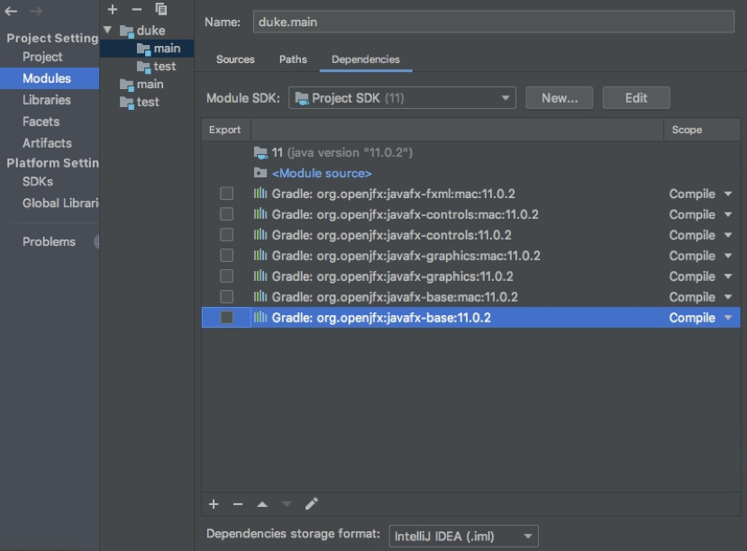

# User Guide

## Introduction
John task assistant aims to make it easy and convenient for recording tasks at hand without the need of having to remember them. Dates set to deadlines and events will also be used
for reminders for tasks that will happen in a week's time.

## Features

* Easily record tasks
* Assign dates to deadlines and events
* Reminders

## Getting started

Download `JohnTaskAssistant.jar` file from [here](https://github.com/Russell-Loh-NUS/duke/releases/tag/v0.2) and double click on it. If double clicking does not work, follow the instructions below.

### Running jar file (Cross Platform)
1. Open terminal/command prompt
2. Type java -jar JohnTaskAssistant.jar

*If the above does not work, download the platform dependent jar files from [here](https://github.com/Russell-Loh-NUS/duke/releases/tag/v0.2) and follow the instructions below*

### Running jar file (Windows)
1. Open command prompt
2. Type java -jar JohnTaskAssistant-Win.jar

### Running jar file (Mac)
1. Open terminal
2. Type java -jar JohnTaskAssistant-Mac.jar

### Importing project and run on Intellij IDE
1. Pull the repository [https://github.com/Russell-Loh-NUS/duke](https://github.com/Russell-Loh-NUS/duke)
2. Import the project into Intellij
  1. Select `Import Project`
  2. Select the repository you just clone. Select Ok.
  3. Select `Create project from existing sources`. Select `Next`.
  4. Select `Next` all the way and finally select `Finish`.
3. On the left side bar, expand the directories `Duke > src > main > java > duke` and right click on Duke.java and select `Run Duke.main()`.

*Note: Ensure you have JDK 11 setup and installed*

## Usage

### Commands

`todo [description]` - Sets a todo task

Example of usage:
`todo make a sandwich`

`deadline [description]` - Sets a deadline task and assign a date

Example of usage:
`deadline make a sandwich /by 29/09/2019 1400`

`event [description]` - Sets a event task and assign a date

Example of usage:
`event sandwich eating competition /at 01/10/2019 1200`

`done [task number]` - Checks a task. *Note: task number is take from the `list` command*

Example of usage:
`done 2`

`delete [task number]` - Deletes a task. *Note: task number is take from the `list` command*

Example of usage:
`done 2`

`find [description]` - Find all tasks that matches a description.

Example of usage:
`find sandwich`

`list` - List all tasks.

Example of usage:
`list`

`upcoming` - List deadlines or events happening in a week's time.

Example of usage:
`upcoming`

`help` - Show all commands

Example of usage:
`help`

`bye` - Exit the application.

Example of usage:
`bye`

## FAQ

#### 1. IDE underlining syntax in red stating “Cannot access javafx.event.eventTarget”

Solution: Navigate to the module settings either by ‘right clicking the Project > Open Module settings’ or ‘File > Project Structure’ and select ‘Modules’. Remove the main and test module by selecting the module and clicking on the ‘Minus’ button on the top.

#### 2. @FXML annotation highlighted in red

Solution: Select ‘Alt + Enter/Option + Enter’ and select ‘import org.gradle….’
