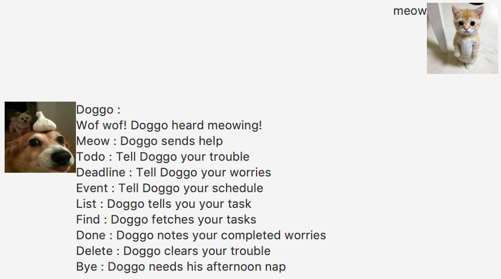
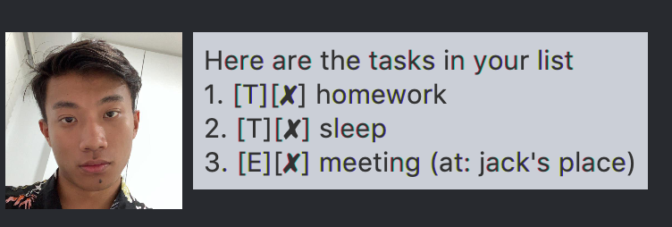
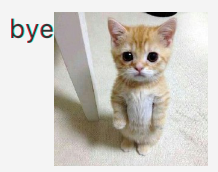

# Doggo

# User Guide
Ever wanted a dog? Doggo is a virtual dog that does things for you at your command!  
You dont even need to feed it or provide a home for it. He provides unconditionally.
 
## Features 
1. Help
    1. [`meow`](#meow)
1. Add task
   1. [`todo`](#markdown-header-todo)
   1. [`deadline`](#markdown-header3-deadline)
   1. [`event`](#markdown-header-event)
1. Show task
   1. [`list`](#markdown-header-list)
   1. [`find`](#markdown-header-find)
1. Update task
    1. [`done`](#markdown-header-done)
    1. [`delete`](#markdown-header-delete)
1. Quit
    1. [`bye`](#markdown-header-bye)

## Usage

### meow
Ask doggo what he can do for you.

Example of usage: `meow`

Expected outcome:

### todo
Tell Doggo your troubles.

Example of usage: `todo (description)`

Expected outcome:

### deadline
Tell Doggo your worries.

Example of usage: `deadline (description) /by (MM/dd/yy HH:mm)`

Expected outcome:

### event
Tell Doggo your schedule.

Example of usage: `event (description) /at (MM/dd/yy HH:mm)`

Expected outcome:

### list
Doggo lists your task for you.

Example of usage: `list`

Expected outcome:

### find
Doggo fetches your tasks.

Example of usage: `find (description)`

Expected outcome:

### done
Doggo notes your completed worries.

Example of usage: `done (number in the list)`

Expected outcome:

### delete
Doggo clears your trouble.

Example of usage: `delete (number in the list)`

Expected outcome:

### bye {#bye}
Doggo needs his afternoon nap.

Example of usage: `bye`

Expected outcome:

