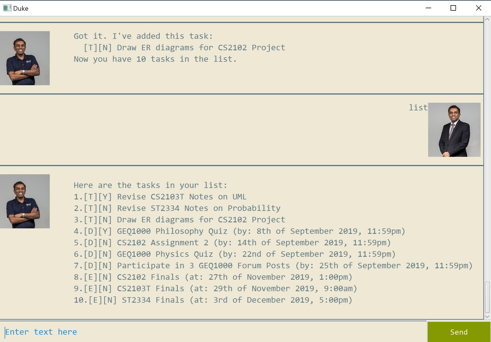
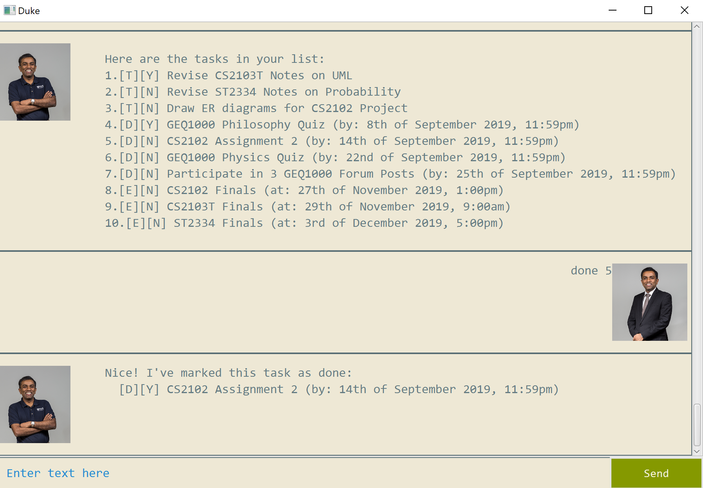
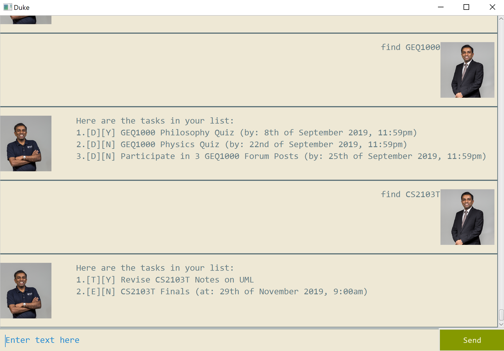
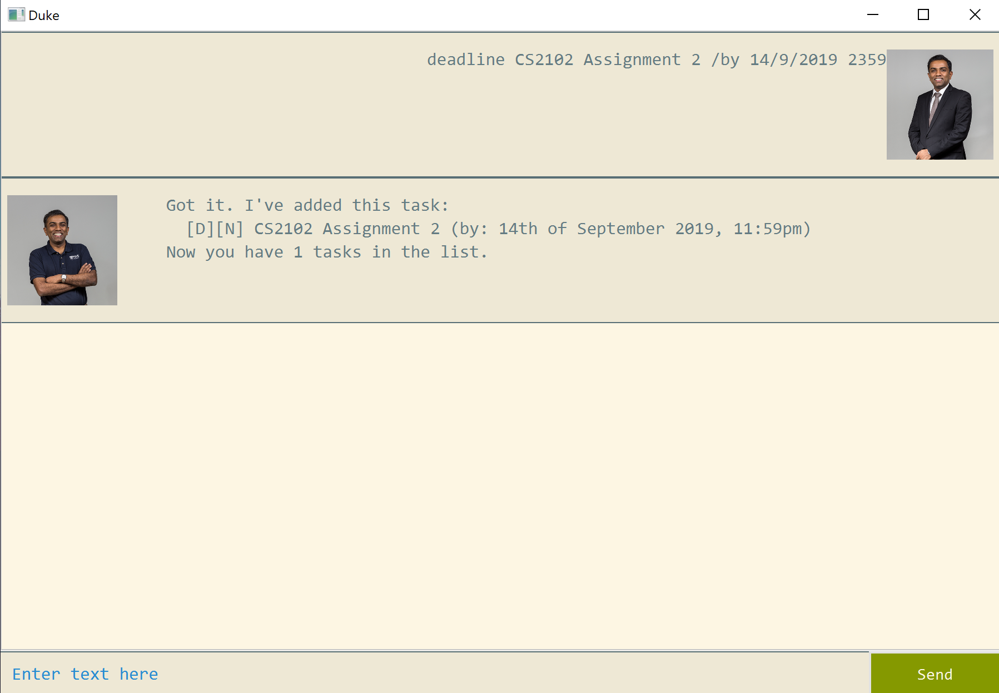
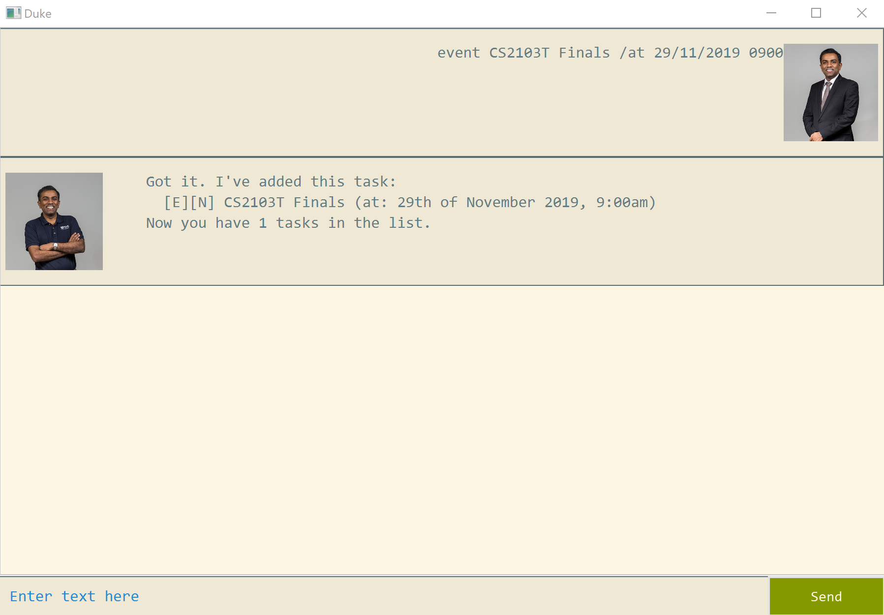
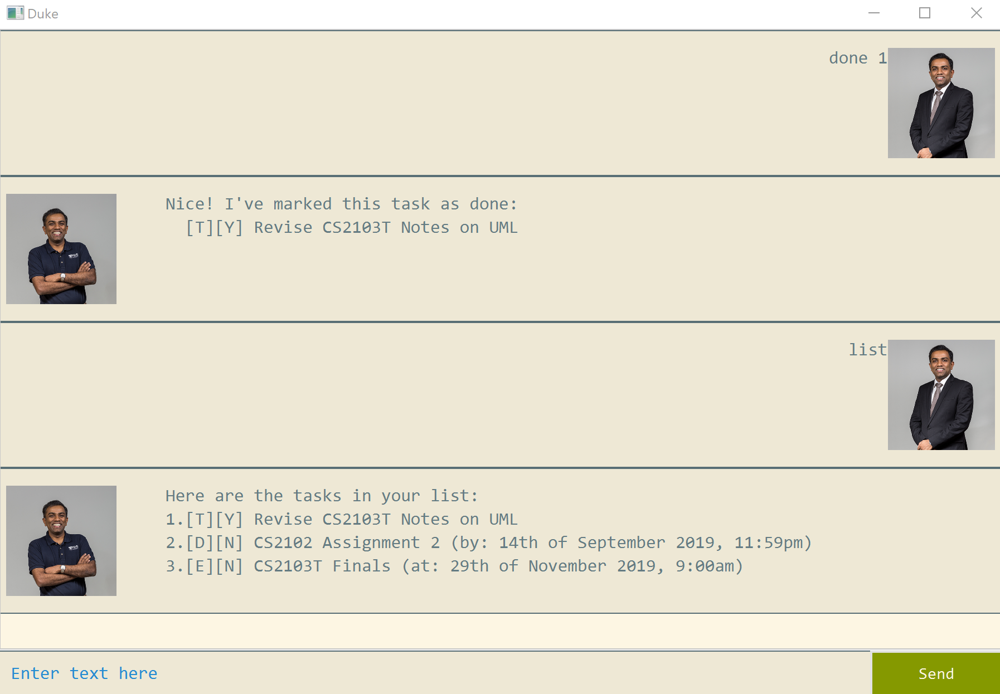
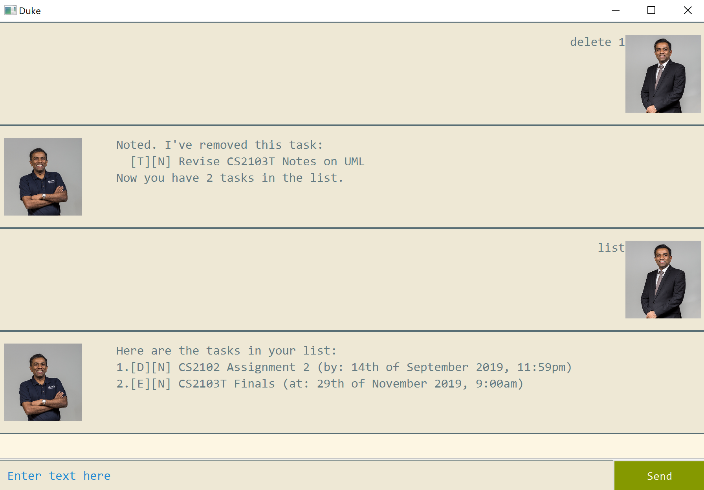
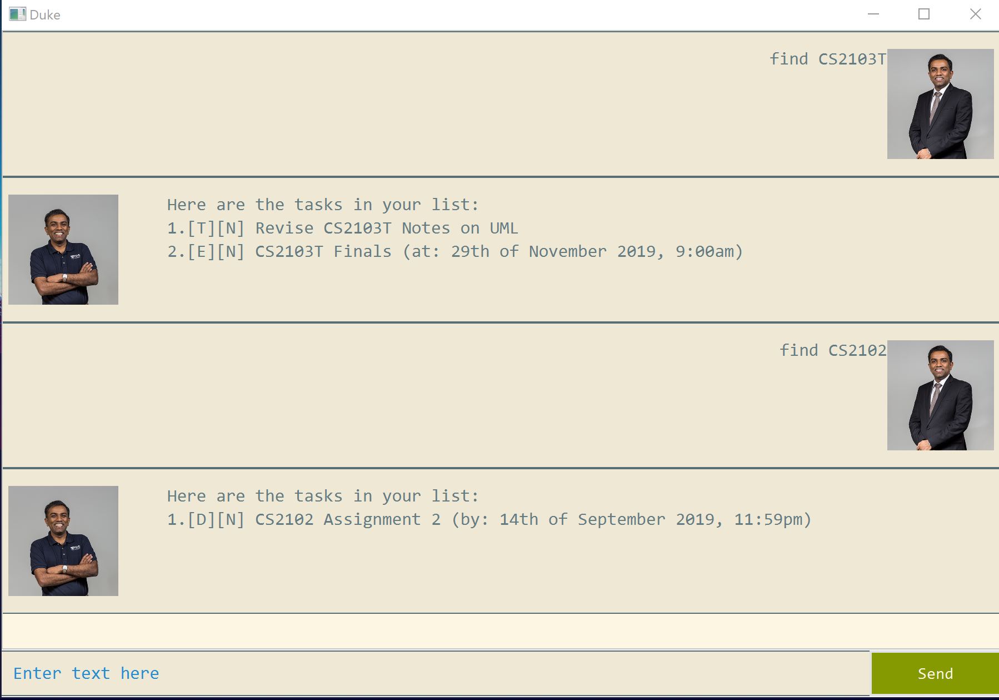
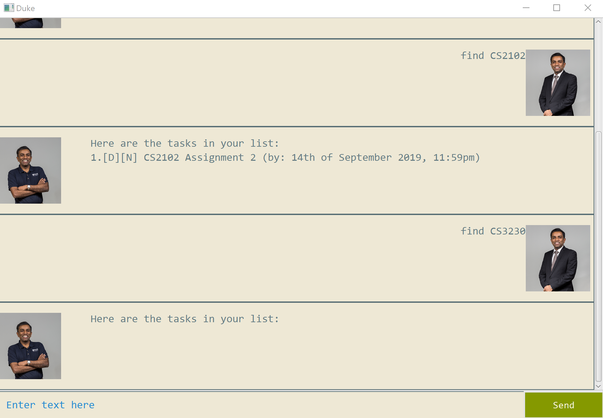
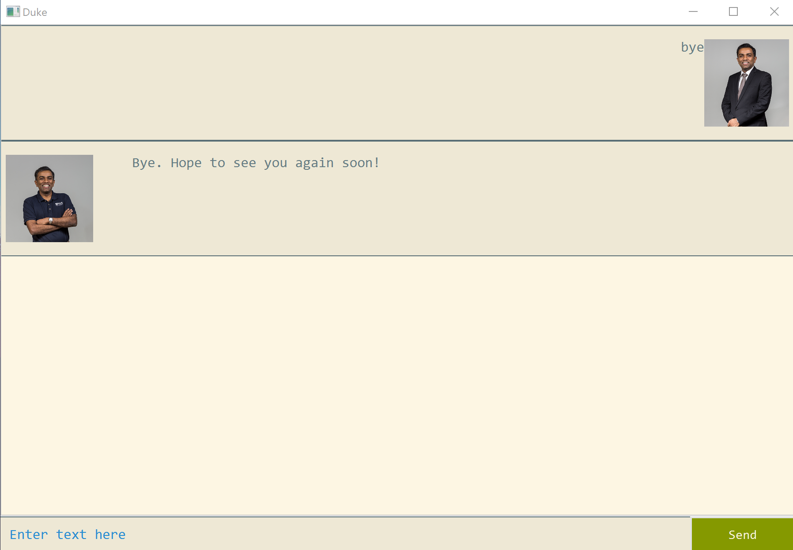

# User Guide

Duke is a offline java application that helps you track and manage various tasks.  
Tasks that you can track are `ToDos`, `Deadlines` and `Events`.  
Duke also utilises of local storage, remembering your tasks even after the application has been closed.  

## Overview
- [<b>Features</b>](#features)
- [<b>Commands</b>](#commands)
- [<b>Usage</b>](#usage)





## <a name="features"></a>Features 

### List of Features:
1. [Tracks various types of tasks](#track-tasks)
2. [Text search through your saved tasks](#text-search)
3. [View your tasks chronologically by time](#view-tasks)
4. [Interact with chatbot](#chatbot)
5. [Tasks are saved on local storage](#save-tasks)

### <a name="track-tasks"></a>Tracks various types of tasks
Duke can manage your pending tasks such as [todos](#todo), [deadlines](#deadline), and [events](#event). 
Tasks can be given a text description. 
Tasks such as [todos](#todo) only has a text description while tasks such as [deadlines](#deadline) and [events](#event) must be supplied with a Date and Time as well.  

<a name="todo"></a>`Todos` are pending tasks that you may want to save to duke that does not have any time restriction.  
Examples of such tasks could be revision sessions, movies to watch, etc.


<a name="deadline"></a>`Deadlines` are pending tasks that you may want to save to duke that are to be completed by a certain date or time.  
Examples of such tasks could be assignments, house chores, etc.  


<a name="event"></a>`Events` are pending tasks that you may want to save to duke that are going to be available at a certain date or time.  
Examples of such tasks could be examinations, driving lessons, etc.  


These tasks can be added, marked as done, or deleted by our list of available commands found [here](#commands).  
For a more detailed description and guide of our commands, you can find it [here](#usage).

### <a name="text-search"></a>Text search through your saved tasks
Duke allows the user to quickly look up tasks by matching text.
Since you may have many types of tasks saved into duke, you may be overwhelmed when searchin for particular tasks due to the sheer size of tasks being tracked by duke.
Therefore, with duke's search capabilities, you will be able to filter out only the relevant tasks that you want to look up.  

The relevant command can be found [here](#commands).  
For a more detailed description, you can find it [here](#usage).

### <a name="view-tasks"></a>View your tasks chronologically by time
Duke automatically sorts your tasks in chronological order, allowing you to view your tracked tasks sorted by date and time.
Our tasks that we track of for ourselves are rarely given chronologically by their date, be it as a deadline or as a scheduled event.
Therefore we automatically sort your tasks by date so that you can get the best picture of their urgency and their relation with one another.  

This feature is done automatically and do not require any specific commands.  

### <a name="chatbot"></a>Interact with chatbot
You interact with duke in a chatbot fashion, allowing you to 'talk' to your application, breaking off from a monotonous interaction with Duke.

### <a name="save-tasks"></a>Tasks are saved on local storage
Duke saves your tasks to your machine's local storage. 
That means that you do not need to keep your application running!  
Duke will remember what tasks you are tracking even when you close the application.

## <a name="commands"></a>Commands

### List of commands
- `todo <todo description>`
- `deadline <deadline description> /by <date d/m/yyyy> <time 24 hour clock>`
- `event <event description> /at <date d/m/yyyy> <time 24 hour clock>`
- `done <index of task>`
- `delete <index of task>`
- `find <text match>`
- `list`
- `bye`

## <a name="usage"></a>Usage

- [`todo` - Adds a todo task to Duke](#todo-usage)
- [`deadline` - Adds a deadline task to Duke](#deadline-usage)
- [`event` - Adds an event task to Duke](#event-usage)
- [`list` - Lists out all tracked tasks](#list-usage)
- [`done` - Mark a task as done](#done-usage)
- [`delete` - Deletes a task from Duke](#delete-usage)
- [`find` - Finds tasks matching a specific text](#find-usage)
- [`bye` - Tells Duke bye](#bye-usage)

### <a name="todo-usage"></a>`todo` - Adds a todo task to Duke
Adds a todo task for duke to track.  
The format for adding a todo is `todo <todo description>`.
- `<todo description>` can be any text.
    - Examples: Revise CS2103T Lecture Notes on Git Commands.

```
// user input
todo Revise CS2103T Lecture Notes on UML 

// response
    ____________________________________________________________
     Got it. I've added this task:
       [T][N] Revise CS2103T Lecture Notes on UML
     Now you have 1 tasks in the list.
    ____________________________________________________________
```


### <a name="deadline-usage"></a>`deadline` - Adds a deadline task to Duke
Adds a deadline task for duke to track.  
The format for adding a deadline is `deadline <deadline description> /by <date d/m/yyyy> <time 24 hour clock>`.
- `<deadline description>` can be any text.
    - Examples: CS2102 Assignment 2.
- `<date d/m/yyyy>` is the format of the date. Take note that `d/m/yyyy`, `dd/mm/yyyy`, `d/mm/yyyy` and `dd/m/yyyy` are all acceptable formats.
    - Examples: 14/9/2019.
- `<time 24 hour clock>` is the format of the time.
    - Examples: 2359

```
// user input
deadline CS2102 Assignment 2 /by 14/9/2019 2359

// response
    ____________________________________________________________
     Got it. I've added this task:
       [D][N] CS2102 Assignment 2 (by: 14th of September 2019 11:59pm)
     Now you have 1 tasks in the list.
    ____________________________________________________________
```


### <a name="event-usage"></a>`event` - Adds an event task to Duke
Adds a event task for duke to track.  
The format for adding a event is `event <event description> /by <date d/m/yyyy> <time 24 hour clock>`.
- `<event description>` can be any text.
    - Examples: CS2103T Finals.
- `<date d/m/yyyy>` is the format of the date. Take note that `d/m/yyyy`, `dd/mm/yyyy`, `d/mm/yyyy` and `dd/m/yyyy` are all acceptable formats.
    - Examples: 29/11/2019.
- `<time 24 hour clock>` is the format of the time.
    - Examplee: 0900
    
```
// user input
event CS2103T Finals /at 29/11/2019 0900

// response
    ____________________________________________________________
     Got it. I've added this task:
       [E][N] CS2103T Finals (at: 29th of November 2019, 9:00am)
     Now you have 1 tasks in the list.
    ___________________________________________________________e
```


### <a name="list-usage"></a>`list` - Lists out all tracked tasks
Lists out all tasks being tracked by duke.  
Tasks are sorted according to their dates and times, with todo tasks being displayed first since they do not have dates and times.  
The format for listing out all tasks is `list`.

Suppose the following commands are keyed in sequence.  
1. `event CS2103T Finals /at 29/11/2019 0900`
2. `deadline CS2102 Assignment 2 /by 14/9/2019 2359`
3. `todo Revise CS2103T Lecture Notes on UML`

```
// user input
list

// response
    ____________________________________________________________
     Here are the tasks in your list:
     1.[T][N] Revise CS2103T Lecture Notes on UML
     2.[D][N] CS2102 Assignment 2 (by: 14th of September 2019 11:59pm)
     3.[E][N] CS2103T Finals (at: 29th of November 2019, 9:00am)
    ___________________________________________________________e
```


### <a name="done-usage"></a>`done` - Mark a task as done

Marks a task as done.  
Tasks that are done are marked with `Y`, while undone tasks are marked with `N`.  
The format for marking a task as done is `done <index>`.
- `<index>` is the index of the task to be done.

Suppose the following commands are keyed in sequence.  
1. `event CS2103T Finals /at 29/11/2019 0900`
2. `deadline CS2102 Assignment 2 /by 14/9/2019 2359`
3. `todo Revise CS2103T Lecture Notes on UML`

```
// user input
done 1

// response
    ____________________________________________________________
     Nice! I've marked this task as done:
       [T][Y] Revise CS2103T Lecture Notes on UML
    ____________________________________________________________

// user input
list

// response
    ____________________________________________________________
     Here are the tasks in your list:
     1.[T][Y] Revise CS2103T Lecture Notes on UML 
     2.[D][N] CS2102 Assignment 2 (by: 14th of September 2019 11:59pm)
     3.[E][N] CS2103T Finals (at: 29th of November 2019, 9:00am)
    ____________________________________________________________
```


### <a name="delete-usage"></a>`delete` - Deletes a task from Duke  
The format for deleting a task is `delete <index>`.
- `delete <index>` is the index of the task to be deleted.

Suppose the following commands are keyed in sequence.  
1. `event CS2103T Finals /at 29/11/2019 0900`
2. `deadline CS2102 Assignment 2 /by 14/9/2019 2359`
3. `todo Revise CS2103T Lecture Notes on UML`

```
// user input
delete 1

// response
    ____________________________________________________________
     Noted. I've removed this task:
       [T][N] Revise CS2103T Lecture Notes on UML
     Now you have 2 tasks in the list.
    ____________________________________________________________

// user input
list

// response
    ____________________________________________________________
     Here are the tasks in your list:
     1.[D][N] CS2102 Assignment 2 (by: 14th of September 2019 11:59pm)
     2.[E][N] CS2103T Finals (at: 29th of November 2019, 9:00am)
    ____________________________________________________________
```


### <a name="find-usage"></a>`find` - Finds tasks matching a specific text
Searches and retrieves tasks that match a certain text.  
The format for searching for tasks by a given matching text is `find <text match>`.
- `<text match>` can be any text.

Suppose the following commands are keyed in sequence.  
1. `event CS2103T Finals /at 29/11/2019 0900`
2. `deadline CS2102 Assignment 2 /by 14/9/2019 2359`
3. `todo Revise CS2103T Lecture Notes on UML`

```
// user input
find CS2103T

// response
    ____________________________________________________________
     Here are the tasks in your list:
     1.[T][N] Revise CS2103T Lecture Notes on UML
     2.[E][N] CS2103T Finals (at: 29th of November 2019, 9:00am)
    ____________________________________________________________
// user input
find CS2102

// response
    ____________________________________________________________
     Here are the tasks in your list:
     1.[D][N] CS2102 Assignment 2 (by: 14th of September 2019 11:59pm)
    ____________________________________________________________

// user input
find CS3230

// response
    ____________________________________________________________
     Here are the tasks in your list:

    ____________________________________________________________
```



### <a name="bye-usage"></a>`bye` - Tells Duke bye
Tells Duke bye.  
Format of telling duke bye is `bye`.

```
// user input
bye

// response
    ____________________________________________________________
     Bye. Hope to see you again soon!
    ____________________________________________________________
```

