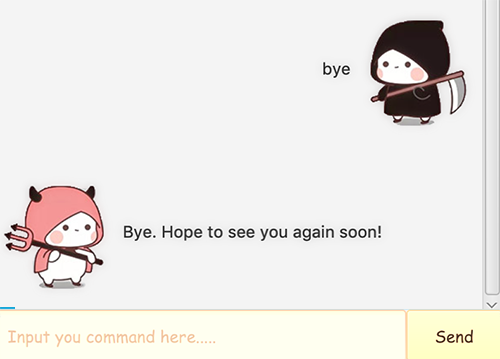

# User Guide

## Features 
* Help the user keep track of various type of tasks
* Show what are the task on the list
* Mark the task as completed
* Delete a task from the list
* Search the key through all existing task
* Show help on the command format

## Usage

### `todo` - Create a new todo task 

Creates a new todo task with given description.

Example of usage: 

`todo [description]`

Expected outcome:

### `deadline` - Create a new deadline task 

Creates a new deadline task with given discription.

Example of usage: 

`dealine [description] /by [dd/mm/yyyy xx:xx(24hr)]/[dd/mm/yyyy]`

Expected outcome:

### `event` - Create a new event task 

Creates a new event task with given description.

Example of usage: 

`event [description] /at [dd/mm/yyyy xx:xx(24hr)]/[dd/mm/yyyy]`

Expected outcome:

### `done` - Mark task as done 

Mark the task on the list corresponding to
Example of usage: 

`done [number]`

Expected outcome:

### `delete` -  Delete a task

Delete the task on the list corresponding to the given number in the tasks

Example of usage: 

`delete [number]`

Expected outcome:

### `find` - Find keyword through the list 

Find the task that matches the keyword
Example of usage: 

`find [keyword]`

Expected outcome:

### `list` - List all the tasks in the list 
list all the tasks in the list, arranged according to the time added.

Example of usage:
`list`

Expected outcome:

### `bye` - Exit the program 

Exit the program and update local file
`todo [description]`

Expected outcome:

### `help` - Create a new todo task 

Creates a new todo task with given discription.

Example of usage: 

`todo [description]`

Expected outcome:

