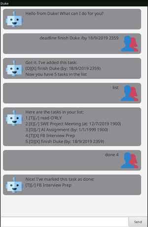
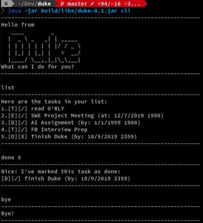

# Duke User Guide

## Introduction
Duke is a personal task manager that helps you track your todos, events, and
deadlines. It is in the form of a chatbot and can be used on the command line
as well as from a GUI.

## Features 

### Available in both CLI and GUI
GUI:  
  
CLI:  
  
While the GUI may be more intuitive to use, the CLI version provides a simpler
and distraction-free environment for you to focus on managing your tasks.  
The command syntax is the same in both GUI and CLI.  
Duke launches in GUI by default, the CLI version can be launched by running
`java -jar duke-x.x.jar cli` in your terminal, where `duke-x.x.jar` is the
name of the jar file you have downloaded.

### Easily migratable
All your tasks are stored in a plaintext file, in a human-readable format.
Depending on your platform, the file can be found at one of the following
locations:
- Linux: `/home/USERNAME/.local/share/Duke/duke.txt`
- MacOS: `/Users/USERNAME/Library/Application Support/Duke/duke.txt`
- Windows: `C:\Users\USERNAME\AppData\Roaming\Duke\duke.txt`

where `USERNAME` refers to your OS username.  
Migrating to a different machine and want to take all your tasks with you?
Simple copy the file over and you're set.

### Intuitive `find` command
The `find` command finds any task that either fully or partially matches one or
more keywords. Try `find school work` and you'll get all the tasks that
contains `school`, `work`, or both.

### (For developers aka. myself) Easily extensible
The code is written in a modular manner and adding new functionalities is
very easy. Example functions that I wanted but did not implement: fuzzy
find, natural language data time format, JSON storage, etc.

## Usage

### Viewing help: `help`
Format: `help`

### Adding a todo: `todo`
Adds a `todo` to Duke.  
Format: `todo DESCRIPTION`  
Example:
- `todo Read book`

### Adding an event: `event`
Adds an `event` to Duke. An `event` is something that happens at the specific time.  
Format: `event DESCRIPTION /at dd/MM/yyyy HHmm`  
Example:
- `event job interview /at 1/9/2018 1330`

### Adding a deadline: `deadline`
Adds a `deadline` to Duke. A deadline is a task that should be done by a certain time.  
Format: `deadline DESCRIPTION /by dd/MM/yyyy HHmm`  
Example:
- `deadline return book /by 18/2/2019 0900`

### Listing all tasks: `list`
Shows a list of all tasks(`todo`s, `event`s, `deadline`s)in Duke.  
Format: `list`

### Locating tasks by keywords: `find`
Finds tasks whose descriptions contain any of the given keywords.  
Format: `find KEYWORD...`  
Example: `find school project`

### Deleting a task: `delete`
Deletes the specified task from Duke.  
Format: `delete TASK_NUMBER`  
Example:
```
list
delete 2
```

### Exiting Duke: `bye`
Exits Duke.  
Format: `bye`
