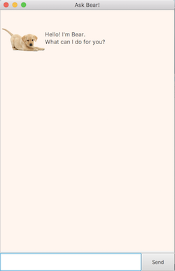

# WoofPlanner

WoofPlanner is a desktop application that helps you to manage your tasks. It is optimized for users who 
are more comfortable with the Command Line Interface (CLI) while still having the benefits of a 
Graphical User Interface (GUI).

## 1. Quick Start
1. Ensure you have Java `11` or above installed in your computer.
2. Download the latest `planner.jar` [here](https://github.com/junhuplim/duke/releases/tag/A-Release).
3. Copy the file to the folder you want to use as the home folder for your list of tasks.
4. Double click the file to start the app. The GUI should appear in a few seconds.
  

## 2. Features
Words in `UPPER_CASE` are the task names to be filled in by the user. 

#### 2.1 `todo`
Adds a task to be done to the task list.

Format: `todo TASK_NAME`

Example: 
* `todo work`
* `todo project`

#### 2.2 `deadline`
Adds a deadline to be done to the task list.

Format: `deadline TASK_NAME /by DD/MM/YYYY HH:MM`

Example:
* `deadline CS2103 homework /by 20/09/2019 10:00`
* `deadline project slides /by 12/10/2019 20:30`

  

#### 2.3 `event`
Adds an event to be done to the task list.

Format: `event TASK_NAME /at DD/MM/YYYY HH:MM`

Example:
* `event project meeting /at 22/09/2019 13:00`
* `event family dinner /at 23/09/2019 20:00`

  

#### 2.4 `list`
Lists out all the tasks in the task list.

  * 

Format: `list`

#### 2.5 `delete`
Deletes a task with the index from the task list.

Format: `delete INDEX`

Example:
* `delete 2` deletes the second task from the task list.

  

#### 2.6 `done`
Completes a task with the index from the task list.

Format: `done INDEX`

Example: 
* `done 3` completes the third task from the task list.

  

#### 2.7 `find`
Find a task whose name contains the input keyword from the task list.

Format: `find KEYWORD`

Example:
* `find dinner` finds tasks with the word `dinner` from the task lists.

  

#### 2.8 `bye`
Exits the program after a short delay.

Format: `bye`

## 3. FAQ
Q: Where will my task list with all the tasks be saved? 

A: The task list will be automatically saved to the same directory as the .jar file 
each time you exit the program.

## 4. Bug Reports
* If you have bugs to report, please post in my github [issue tracker](https://github.com/junhuplim/duke/issues).

## 5. License

## 6. Command Summary
* Add
  * Todo: `todo TASK_NAME`
  * Deadline: `deadline TASK_NAME /by DD/MM/YYYY HH:MM`
  * Event: `event TASK_NAME /at DD/MM/YYYY HH:MM`
* List: `list`
* Delete: `delete INDEX`
* Done: `done INDEX`
* Find: `find KEYWORD`
* Exit: `bye`