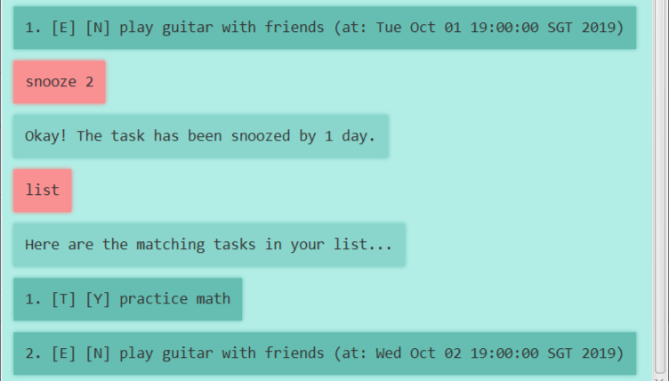

# User Guide
**Dose** is a customisable personal assistant for managing your deadlines, events and todos. 
Made for users who are comfortable with Command-Line based interactions, 
Dose helps you get your tasks out of your head as quickly as possible without getting in the way.
Stop fiddling with bells and whistles of other todo-list apps -- Dose's pretty GUI is just a bonus!

Experiencing a caffeinated rush and needing a dose of calm?
Stuck in a rut and wishing for a dose of motivation? Dose has your back. 
Put your tasks in Dose and never forget about them ever again!

## Features 

### Add todos, events and deadlines
To add a todo, event or deadline to Dose, simply type the type of the task,
followed by its description and deadline (if any). Dose will update your list of tasks accordingly.

### View tasks in task list
Keep track of the tasks you've added. 
See each task's description, deadline, priority and tags (if any) in a compact list view.

### Save task list to disk
Dose is capable of saving your list of tasks to a small, portable text file. 
Upon the next startup of Dose, your tasks will be instantly re-imported -- no sweat!

### Complete and delete tasks
Done with a task? Mistakenly added a task you no longer need? Dose will take care of it. 

### Tag and prioritise tasks
Need some organisation for your tasks? Dose is here to help.
(Sorting tasks by tag and priority is coming soon!)

### Find tasks matching your query
Looking for a specific task? Simply search for it.

### Snooze a task
Too many deadlines at your back? Have yourself a dose of calm by postponing non-urgent tasks.

## Commands
1. [todo](#todo)
2. [deadline](#deadline)
3. [event](#event)
4. [list](#list)
5. [save](#save)
6. [done](#done)
7. [delete](#delete)
8. [tag](#tag)
9. [priority](#priority)
10. [find](#find)
11. [snooze](#snooze)
12. [bye](#bye)

### `todo`
Creates a new todo.

**Usage:** `todo [description]`

**Parameters:** 

`[description]` Description of the todo (required).

**Expected outcome:**
A new todo with the provided description is created.

### `deadline`
Creates a new task with a deadline.

**Usage:** `deadline [description] /by [deadline]`

**Parameters:**

`[description]` Description of the task (required).

`[deadline]` Deadline of the task, in ISO format.

**Expected outcome:**
A new deadline task with the provided description and deadline is created.

### `event`
Creates a new event at a specified time.

**Usage:** `event [description] /at [time]`

**Parameters:** 

`[description]` Description of the event (required).

`[time]` Time of the event, in ISO format.

**Expected outcome:**
A new event with the provided description and date is created.

### `list`
Displays the tasks in the task list.

**Usage:** `list`

**Expected outcome**: The current state of the task list is displayed.

### `save`
Saves the tasks in the task list to the disk.

**Usage:** `save`

**Expected outcome:** The current state of the task list is saved to the disk.

### `done`
Marks the task as complete.

**Usage:** `done [taskId]`

**Parameters:**
`[taskId]` ID of the task in the list (required). Use `list` to get this, if need be.

### `delete`
Deletes the task.

**Usage:** `delete [taskId]`

**Parameters:**
`[taskId]` ID of the task in the list (required). Use `list` to get this, if need be.

**Expected outcome:** The task is deleted from the list.

### `tag`
Adds a tag to a task.

**Usage:** `tag [taskId] [tag]`

**Parameters:**
`[taskId]` ID of the task in the list (required). Use `list` to get this, if need be.
`[tag]` Tag to be added to the task.

**Expected outcome:** The tag is added to the task.

### `priority`
Adds a priority to a task.

**Usage:** `priority [taskId] [priority]`

**Parameters:**
`[taskId]` ID of the task in the list (required). Use `list` to get this, if need be.
`[priority]` Priority to be added to the task. Can be `low`, `medium` or `high`.

**Expected outcome:** The tag is added to the task.

### `find`
Find tasks matching a query.

**Usage:** `find [keyword]`

**Parameters:**
`[keyword]` Keyword to be used in searching for tasks.

**Expected outcome:** Displays the list of tasks matching the query, if any.

### `snooze`
Snoozes a given task. That is, postpones its deadline by one day.

**Usage:** `snooze [taskId]`

**Parameters:**
`[taskId]` ID of the task in the list (required). Use `list` to get this, if need be.

**Expected outcome:** The deadline (of tasks with deadlines) or time (of events) is postponed by one day.

### `bye`
Saves the tasks in the task list to the disk, then exits Dose.

**Usage:** `bye`

**Expected outcome:** The current state of the task list is saved to the disk. Duke can be safely exited.
