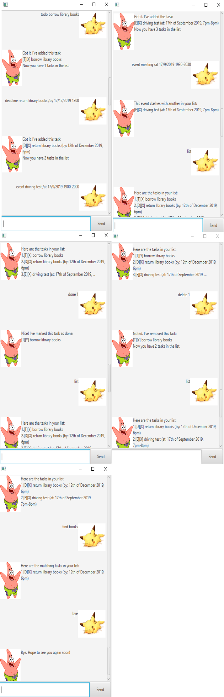

# Duke - User Guide
Duke is a personal assistant chatbot that helps you keep track of various tasks, which are saved as `ToDo`s, 
`Deadline`s, and `Event`s.  
Duke makes use of local storage so that previously entered tasks will be remembered even after the application closes.

## Contents
- [<b>Features</b>](#features)
- [<b>Commands</b>](#commands)
- [<b>Usage</b>](#usage)



## <a name="features"></a>Features 
### 1. Keep track of various types of tasks
Duke manages and helps you keep track of your tasks which can be either [ToDos](#todo), [Deadlines](#deadline), or 
[Events](#event).  
Each task will contain a text description. In addition, [Deadlines](#deadline) and [Events](#event) will also contain
a date and time, which is the deadline and the event timing respectively.  
All tasks can be added, marked as done or 
deleted using Duke's [commands](#commands).

<a name="todo"></a>`ToDo`  
Tasks that you have yet to complete but do not have a time restriction on. (e.g. books you want to read).

<a name="deadline"></a>`Deadline`  
Tasks that you have yet to complete but must do so within a certain date and time (e.g. submission of assignments).  

<a name="event"></a>`Event`  
Tasks that you have to be available for during a certain date and time (e.g. driving test, project meetings).  

### 2. Avoid clashes in events
When you add a new event to Duke, Duke will help you check through all your previously entered events to ensure that 
there is no clash in timing with the newly added event. In the event that there is a clash, Duke will prompt you with
the existing event that clashes with the new event. Since you might have many commitments, Duke helps you ensure that you do not double book yourself to different 
commitments at the same time and save you the stress of having to choose in the last minute.

The command for this feature is [`event`](#event-usage).

### 3. Search through saved tasks
Duke allows you to search through your saved tasks by looking up matching texts with the keyword that you have entered.
This allows you to filter through your tasks of interests instead of having to scroll through the entire list just to
find what you are looking for.

The command for this feature is [`find`](#find-usage).

### 4. View all your tasks 
Duke allows you to view all the tasks that you have added previously before in a list containing all necessary details, 
such as the type of task, the description, and the date and time (if applicable). The clean organisation of information
is pleasing to read and easy to understand.

The command for this feature is [`list`](#list-usage).

### 5. Saves tasks on local storage
Duke stores all entered tasks onto local storage so that these tasks will not disappear even after you close the 
chatbot and return at a later time. This also means you do not need to keep Duke running to save your tasks.


## <a name="commands"></a>Commands
### List of commands
- [`todo <todo description>`](#todo-usage)
- [`deadline <deadline description> /by <dd/mm/yyyy> <24h time>`](#deadline-usage)
- [`event <event description> /at <dd/mm/yyyy> <24h time start>-<24h time end>`](#event-usage)
- [`list`](#list-usage)
- [`done <task number>`](#done-usage)
- [`delete <task number>`](#delete-usage)
- [`find <keyword>`](#find-usage)
- [`bye`](#bye-usage)

## <a name="usage"></a>Usage
### <a name="todo-usage"></a>`todo` - Adds a ToDo task to Duke
Adds a ToDo task into the list of tasks for Duke to track.  
The format for adding a ToDo task is `todo <todo description>`.  
- `<todo description>` contains information about the ToDo 
    - e.g. borrow library books
 
Example:
```
//input command
todo borrow library books

//Duke's reponse
    _________________________________________________________________________
        Got it. I've added this task:
            [T][X] borrow library books
        Now you have 1 tasks in your list.
    _________________________________________________________________________
```

### <a name="deadline-usage"></a>`deadline` - Adds a Deadline task to Duke
Adds a Deadline task into the ist of tasks for Duke to track.  
The format for adding a Deadline task is `deadline <deadline description> /by <dd/mm/yyyy> <24h time>`.
- `<deadline description>` contains information about the deadline
    - e.g. return library books
- `<dd/mm/yyyy>` is the date of the deadline (note that dd/mm/yyyy, d/mm/yyyy, dd/m/yyyy and d/m/yyyy are all acceptable
date formats)
    - e.g. 12/12/2019
- `<24h time>` is the time of the deadline 
    - e.g. 1800

Example:
```
//input command
deadline return library books /by 12/12/2019 1800

//Duke's reponse
    _________________________________________________________________________
        Got it. I've added this task:
            [D][X] return library books (by: 12th December 2019, 6pm)
        Now you have 2 tasks in your list.
    _________________________________________________________________________
```

### <a name="event-usage"></a>`event` - Adds a Event task to Duke
Adds an Event task into the list of tasks for Duke to track.  
If there are clashes between an existing event and the newly input event, the user will be prompted of the clashing 
event.  
The format for adding an Event task is `event <event description> /at <dd/mm/yyyy> <24h time start>-<24h time end>`.    
- `<event description>` contains information about the event
    - e.g. driving test
- `<dd/mm/yyyy>` is the date of the event (note that dd/mm/yyyy, d/mm/yyyy, dd/m/yyyy and d/m/yyyy are all acceptable
date formats)
    - e.g. 17/9/2019
- `<24h time start>-<24h time end>` is the start time of the event 
    - e.g. 1900-2000

Example (without clashes):
```
//input command
event driving test /at 17/9/2019 1900-2000

//Duke's reponse
    _________________________________________________________________________
        Got it. I've added this task:
            [E][X] driving test (at: 17th September 2019, 7pm-8pm)
        Now you have 3 tasks in your list.
    _________________________________________________________________________
```

Example (with clashes):
```
//input command
event meeting /at 17/9/2019 1930-2100

//Duke's reponse
    _________________________________________________________________________
        This event clashes with another on your list:
            [E][X] driving test (at: 17th September 2019, 7pm-8pm)
    _________________________________________________________________________
```

### <a name="list-usage"></a>`list` - Lists all stored tasks
Lists all tasks that are currently stored by Duke.  
The format for listing all tasks is `list`.

Example:  
Suppose the above mentioned example commands have been keyed.
```
//input command
list

//Duke's reponse
    _________________________________________________________________________
        Here are the tasks in your list: 
            1. [T][X] borrow library books
            2. [D][X] return library books (by: 12th December 2019, 6pm)
            3. [E][X] driving test (at: 17th September 2019, 7pm-8pm)
    _________________________________________________________________________
```

### <a name="done-usage"></a>`done` - Marks task as done
Marks a specified task as done.  
Tasks that are not done will be marked with a `X`, while tasks that are completed will be marked with a `Y`.  
If the task number does not exist, the user will be prompted as such.  
The format for marking a task as done is `done <task number>`.  
- `<task number>` specifies the task that is to be marked done (the index follows that of the list stored by Duke, which
the user can view using [`list`](#list-usage))

Example:  
Suppose the current list of tasks stored followed that showed in `list`.
```
//input command
done 2

//Duke's reponse
    _________________________________________________________________________
        Nice! I've marked this task as done:
            [D][Y] return library books (by: 12th December 2019, 6pm)
    _________________________________________________________________________

//input command
list

//Duke's reponse
    _________________________________________________________________________
        Here are the tasks in your list: 
            1. [T][X] borrow library books
            2. [D][Y] return library books (by: 12th December 2019, 6pm)
            3. [E][X] driving test (at: 17th September 2019, 7pm-8pm)
    _________________________________________________________________________
```

### <a name="delete-usage"></a>`delete` - Deletes a task
Deletes a specific task from the list stored by Duke.  
If the task number does not exist, the user will be prompted as such.
The format for marking a task as done is `delete <task number>`.  
- `<task number>` specifies the task that is to be deleted (the index follows that of the list stored by Duke, which
the user can view using [`list`](#list-usage))

Example:
```
//input command
delete 2

//Duke's reponse
    _________________________________________________________________________
        Noted. I've removed this task:
            [D][Y] return library books (by: 12th December 2019, 6pm)
        Now you have 2 tasks in your list.
    _________________________________________________________________________

//input command
list

//Duke's reponse
    _________________________________________________________________________
        Here are the tasks in your list: 
            1. [T][X] borrow library books
            2. [E][X] driving test (at: 17th September 2019, 7pm-8pm)
    _________________________________________________________________________
```


### <a name="find-usage"></a>`find` - Searches for tasks
Searches for tasks in the list that match the keyword input by the user.   
If there are no matching tasks with the input word, the user will be prompted as such.   
The format for searching tasks through a keyword is `find <word or phrase>`.  
- `<word or phrase>` will be used for Duke to search through the existing list for matching tasks

Example (with existing matches):  
Suppose the current list of tasks stored followed that showed in `list`.
```
//input command
find books

//Duke's reponse
    _________________________________________________________________________
        Here are the matching tasks in your list:
            1. [T][X] borrow library books
            2. [D][Y] return library books (by: 12th December 2019, 6pm)
    _________________________________________________________________________
```

Example (without existing matches):  
Suppose the current list of tasks stored followed that showed in `list`.
```
//input command
find car

//Duke's reponse
    _________________________________________________________________________
        Oops, there are no tasks with that keyword!
    _________________________________________________________________________
```

### <a name="bye-usage"></a>`bye` - Tells Duke bye
Tells Duke bye.  
The format to tell Duke bye is `bye`.

Example:
```
//input command
bye

//Duke's reponse
    _________________________________________________________________________
        Bye. Hope to see you again soon!
    _________________________________________________________________________
```