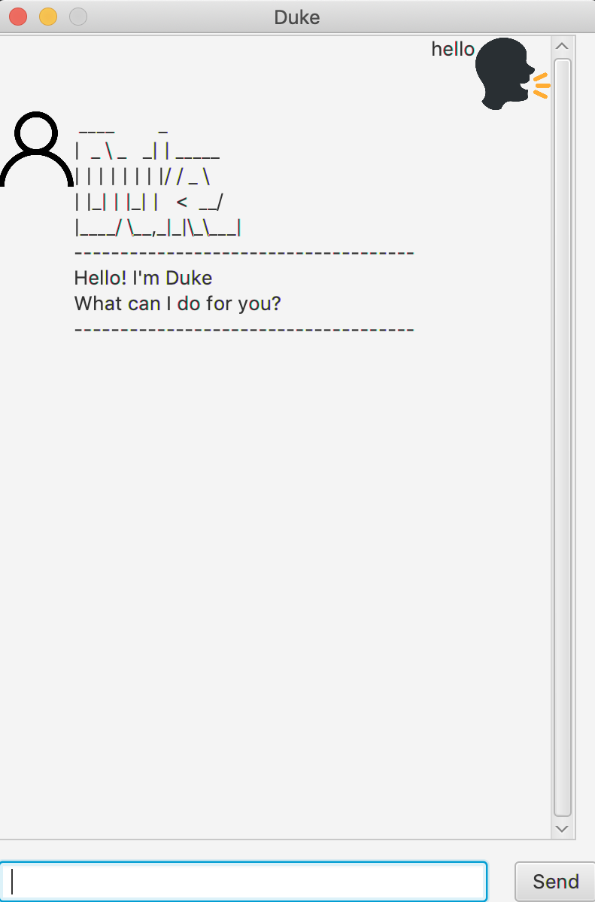

# User Guide

## 1. Introduction
Duke is a product for those who prefer to have a simple interface to note down their schedule.
Duke is optimised for those who prefer to work with a Command Line Interface(CLI) while still having a basic GUI.

## 2. Quick Start
1. Ensure that you have Java 11 or above installed in your Computer.
1. Download the latest Duke.zip [here!](https://github.com/JunHongT/duke/releases/tag/A-Release)
1. Copy the file to the folder you want to use as the home folder for your Duke.
1. Double-click the file to start the app. The GUI should appear in a few seconds.

1. Some example of the commands are:
    * list : List all saved task
    * todo : Add a task 
    * deadline : Add a task with a deadline of date and time
    * event : Add a task with date and duration
    * delete : Delete a task
    * done : Mark a task as done
    * bye : exit program

## 3. Features 
### 3.1 Adding a Task
Adding a task to Duke.
#### 3.1.1 Todo Task
Format : `todo {description}`
#### 3.1.2 Deadline Task
Format : `deadline {description} /by {dd/mm/yyyy hh:mm}`
#### 3.1.3 Event Task
Format : `event {description} /at {dd/mm/yyyy hh:mm - hh:mm}`
### 3.2 List
Show a list of all tasks added by user.
Format : `list`
### 3.3 Delete
Delete a task that is saved in Duke.
Format : `delete {index of task}`
### 3.4 Done
Mark a task as done. Default value for task is undone.
Format : `done {index of task}`
### 3.5 Find
Display all task that contained search term.
Format : `fine {search term}`
### 3.6 Bye
Exiting from the program and save added task to local file.
Format : `bye`

## Additional Information
1. Type `hello` to receive a greeting from Duke.
1. Added tasks will only be saved if program is exited by `bye` commands
