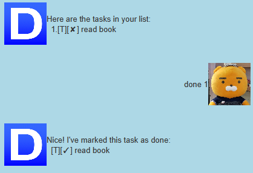
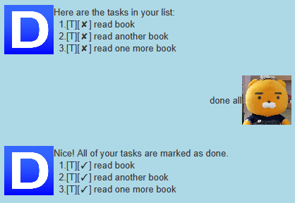
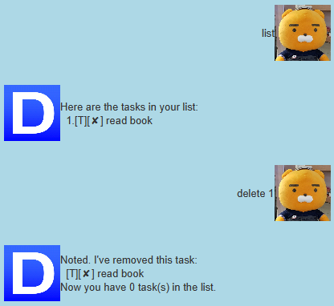
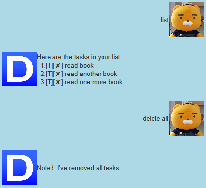
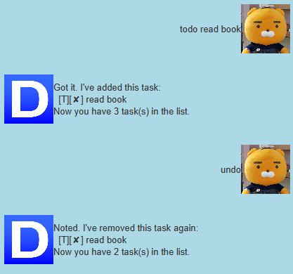
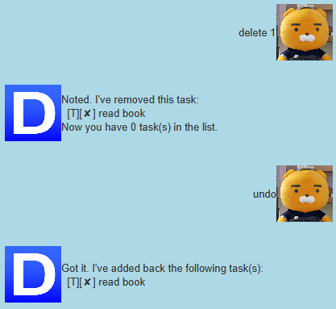
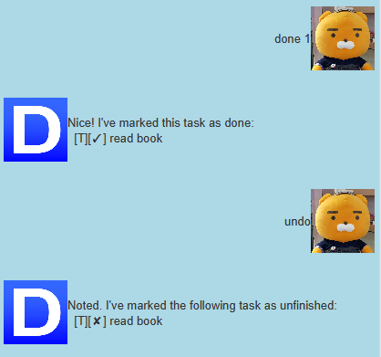
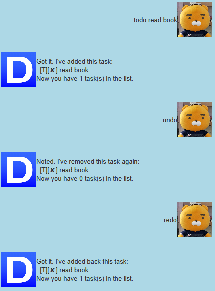

# User Guide

---

## Features

---

### Add your tasks

You can add the following tasks!
* Todo Task
* Deadline Task
* Event Task

### Complete tasks

You can mark each task as complete!

### Delete tasks

You can delete tasks from your Duke!

### List all your tasks

You can list all your tasks to get an overview of what you have to do!

### Find your tasks

With a keyword, you can search which of your tasks contain the keyword.

### Automatically saves all of your tasks

It is saved in a file named `tasks.txt` in your home directory.

**See usage of each feature down below**

---

## Usage

### `todo` - Adds a Todo task

* **Example of usage:** `todo <brief description of the task>`
* **Expected outcome:**

### `deadline` - Adds a Deadline task

* **Example of usage:** `deadline <brief description of the task> /by MM/DD/YYYY HHMM`
  * MM   - month
  * DD   - day
  * YYYY - year
  * HHMM - time in 24-hour format
* **Expected outcome:**

### `event` - Adds an Event task

* **Example of usage:** `event <brief description of the task> /at MM/DD/YYYY HHMM`
  * MM   - month
  * DD   - day
  * YYYY - year
  * HHMM - time in 24-hour format
* **Expected outcome:**

### `list` - Lists all tasks

* **Example of usage:** `list`
* **Expected outcome:**

### `done` - Marks a task as done

* **Example of usage #1:** `done <index of task>`
  * Index starts from 1  
* **Expected outcome #1:**

* **Example of usage #2:** `done all`
* **Expected outcome #2:**

### `delete` - Deletes a task

* **Example of usage #1:** `delete <index of task>`
  * Index starts from 1
* **Expected outcome #1:**

* **Example of usage #2:** `delete all`
* **Expected outcome #2:**

### `find` - Finds a task with a given keyword

* **Example of usage:** `find <keyword>`
  * `find` command will search the exact keyword (whitespaces and cases of letters matter)
* **Expected outcome:**

### `undo` - Undoes the last command

* **List of undoable commands**
    1. todo - deletes the added task
    1. deadline - deletes the added task
    1. event - deletes the added task
    1. done - marks the appropriate task(s) as unfinished
    1. delete - adds back the deleted task(s)
    
* **Example of usage:** `undo`
  
* **Expected outcome:**
  ##### `undo add task`
  
  ##### `undo delete`
  
  ##### `undo done`
  
  
### `redo` - Redoes the last undone command

* **List of redoable commands**
    1. todo
    1. deadline
    1. event
    1. done
    1. delete
    
* **Example of usage:** `redo`
  
* **Expected outcome:**
  ##### `redo add task`
  
  
### `bye` - Exits the program

* **Example of usage:** `bye`
  
* **Expected outcome:**

  
