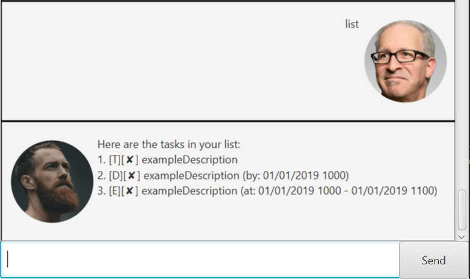

# Christopher v0.2.0 User Guide

## Christopher's Amazing Features 

### Task Management
* Christopher can store and manage tasks by categorizing the tasks into 3 types;
    * `Todo` is a type of task which you do not need a specific time limit.
    * `Deadline` is a type of task where you need to complete by a specific time.
    * `Event` is a type of task which is happening in the future at a specific time.
* Christopher allows the user to display the list of all tasks that the user have inserted inside the program.
It both temporarily stores the task list in the program while running, and also updating the task list in a text file.
* Christopher will also load the tasks from the text file which contains all the saved tasks in the beginning of the program.

### CLI (Command Line Interface) Structure
* Christopher handles all commands by a formatted sentence structure. Following are the legal commands that are available in Christopher.
    1. **Inserting** a task: `[task_type] [task_description] /[time_regex] [dd/MM/YY HH:MM]`
    1. **Displaying** the list of tasks `list`
    1. **Marking** the task as 'Done' `done [task_list_index]`
    1. **Deleting** a specific task from the task list. `delete [task_list_index]`
    1. **Searching** a specific task(s) from the task list by providing single or multiple keyword(s).
        `find [task_key_word]`
    1. **Updating** a certain task from the task list by providing a new task description, time and task list index.
    `update [task_list_index] [new_task_description] [new_time_specified]` (User must at least specify either new task description
    or new time).

## Usage

### `Add task` - Inserting a task(Todo, Event, Deadline) into the task list
When creating a 'Todo' task, user must only specify the task description whereas when creating 'Deadline' and 'Event' type tasks,
user must specify both task description and time (dd/MM/YY HH:MM). 

`[task_type] [task_description] /[time_regex] [dd/MM/YY HH:MM]`

**Example of usage**: 
`Todo Buy bread`, `Event project meeting /at 18/09/19 12:00`, `deadline submit report /by 19/09/19 11:59`

**Expected outcome**:

Christopher will return the formatted task once saving is complete. [E] represents that the task is an Event type.
[✘] shows that the task has not been marked as completed.

### `Delete task` - Inserting a task(Todo, Event, Deadline) into the task list

User must specify the task list index within the bound of the list size. If index that is out of list bound,
Christopher will return an error statement.

`delete [task_list_index]`

**Example of usage**: 
`delete 2`

**Expected outcome**:

Christopher returns the full detail of the deleted task once deletion is complete.

If user enters an task list index which is out of the list size, 
Christopher will return an error statement with an exception.

### `Update task` - Updating a task(Todo, Event, Deadline) from the task list
User can update the task which is stored inside the task list.
1. If user wants to update a 'Todo' type task, user can only specify the task description.
   `update [task_list_index] [new_task_description]`
1. For updating 'Event' and 'Deadline' type tasks, user must update either 1; task description or
time or both.
    `update [task_list_index] [new_task_description] [new_time]`

**Example of usage**: 
`update 2 report 2 test`

**Expected outcome**:

### `Display Task` - Displaying the list of task
User can use 'list' command to display all tasks that are stored in the text file.
Syntax: `list`
**Example of usage**: 
`list`

**Expected outcome**:

### `Marking Task as Done` - Marking the task as done/completed
User can mark the task as done if the task is completed for reference. Christopher will 
display a 'tick' icon if the task is marked as done. ([✓] if task is completed. [✘] by default)
Syntax: `done [task_list_index]`

**Example of usage**:
`done 2`

**Expected outcome**:

### `Searching a specific task` - Searching a task from the Task List
User can search for a specific task from the task list by providing a specific keyword. Keyword can be single or multiple. (Minumum 1 keyword for search)

Syntax: `find [...keyword]`

**Example of usage**:
`find 2`

**Expected of usage**:

Christopher displays task that contains a keyword '2'.

If user provides a keyword that does not include in any of the task list, Christopher will
return empty list message.