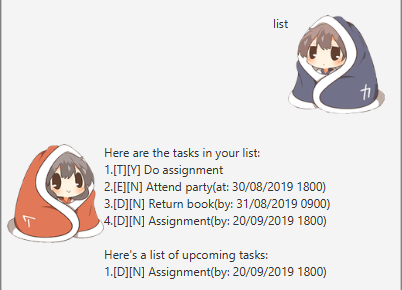

#GoodMorning

GoodMorning is a chat bot that can assist you in your daily tasks.
# User Guide
###Outline
1. Features
1. Usage
1. Command list
## Features 
1. Task management
1. Display upcoming tasks

### Task management
GoodMorning can do these following commands to manage your tasks.

1. Adding tasks
1. Deleting tasks
1. Listing tasks
1. Finding tasks
1. Marking tasks as done

### Display upcoming tasks
GoodMorning is able to remind you on upcoming tasks that has yet to be completed.

## Usage

### `todo` - Adding task
Adds a task.

Syntax:

`todo [description of task]`

Example of usage: 

`todo Homework`

Expected outcome:

### `deadline` - Adding deadline task
Adds a task with a deadline. `[date]` format in: `dd/MM/yyyy HHmm`

Syntax:

`deadline [description of task] /by [date]`

Example of usage:

`deadline Submission /by 11/01/2001 1111`

Expected outcome:

### `event` - Adding event task
Adds a task with an event date. `[date]` format in: `dd/MM/yyyy HHmm`

Syntax:

`event [description of task] /by [date]`

Example of usage:

`event Exam /at 11/01/2001 1111`

Expected outcome:

### `delete` - Deleting tasks
Deletes specified task

Syntax:

`delete [task number]`

Example of usage:

`delete 3`

Expected outcome:

### `list` - Listing events
Lists all events in GoodMorning.

Syntax:

`list`

Expected outcome:

### `find` - Finding task
Find tasks that match `description`.

Syntax:

`find [description]`

Example of usage:

`find Homework`

Expected outcome:

### `done` - Marking task as done
Marks specified task as done.

Syntax:

`done [task number]`

Example of usage:

`done 3`

Expected outcome:

##Command list

Command | Syntax
------- | ------
Adding task | todo [description]
Adding deadline task | deadline [description] /by [date]
Adding event task | event [description] /at [date]
Deleting task | delete [task number]
Listing tasks | list
Finding tasks | find [description]
Marking task as done | done [task number]