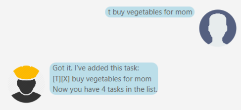
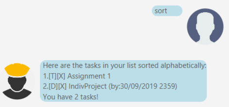

 1. [Introduction](#introduction)
 2. [Quickstart](#quickstart)
 3. [Features](#features)
 4. [Command List](#commands)
 
  

##Introduction:
Are you a struggling student simply swamped by the overwhelming amount of work, deadlines and events happening around you? Or are you an adult with many things on your plate? Regardless, if you want to organise your life, then Duke is for YOU!

## Quickstart
 1. Ensure Java 11 is downloaded on your computer. To check if you have Java installed, type `java  --version` into your
  command line.
 2. Download the `.jar` file from here.
 3. Move the file into your desired folder.
 4. Double click the file to run.
 
 
##Features:
Duke supports the addition of three types of tasks: `ToDos`, `Deadlines` as well as `Events`. 

###Starting Off:

Upon starting up the app, you will be greeted by the friendly Duke! Now here's the many things that you can do with Duke!

###Adding Tasks:

Get Duke to help add tasks to your list of tasks. Simply begin your command with `t` for ToDos, `d` for deadlines and `e` for events. Refer to the command list for full syntax.

###Completing Tasks:

Duke is able to keep track of which tasks you have done and which tasks that you have yet to do! 

###Displaying Your List:

Need to see everything on your list? Simply type `list` for a nice concise view!

###Delete Your Tasks:

Delete your tasks with ease with a single command.

###Search For Tasks By Name:

Look through all your tasks by name easily! Duke is well-equipped to go through all your tasks for you. 

###Sort It Out!

Easily sort your tasks by alphabetical order so that it is easier on the eyes!

##Command List:
###t - add todo
> Adds a new ToDo to your Task List

Usage:

`todo [taskname]`

Parameters:

`taskname` : the name of your new ToDo

###d - add deadline
> Adds a new Deadline to your Task List

Usage:

`d [taskname] /by [date]`

Parameters:

`taskname` : the name of your new Deadline

`date` : Date and Time in the format `dd/mm/yyyy hhmm` 

###e - add event
> Adds a new Event to your Task List

Usage:

`d [taskname] /at [date]`

Parameters:

`taskname` : the name of your new Event

`date` : Date and Time in the format `dd/mm/yyyy hhmm`

###list - display your task list
> Displays your entire Task List

Usage:

`list`

Parameters: None

###delete - delete a task
> Removes a task from your Task List

Usage:

`delete [index]`

Parameters:

`index` : the position of the task in your Task List 

###done - complete a task
> Marks a task as done on your Task List, represented by a tick.

Usage:

`done [index]`

Parameters:

`index` : the position of the task in your Task List

###find - search for a task by name
> Searches through your tasks for tasks containing a certain word/ part of word

Usage:

`find [query]`

Parameters:

`query` : the keyword/letters that you want to search your tasks for

###sort - sort all your tasks
> Rearranges your tasks according to alphabetical order.

Usage:

`sort`

Parameters: None
