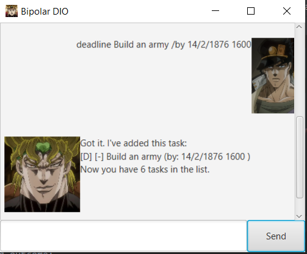
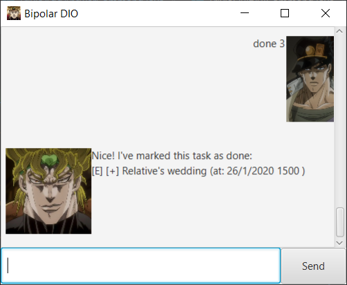

# Bipolar DIO

## Introduction
To all JoJo fans out there, DIO needs no introduction, but for all the confused users out there, have you always wanted
to have a bipolar super villain who is great at keeping records but turns nasty once you ask him questions? Then this
is the app for you!

## Features 
1. Base Mode
    1. Adding Tasks
        1.  - To add a todo task.
        2.  - To add a deadline task.
        3.  - To add an event task.
    2. Viewing Tasks
        1.  - To list out all the tasks.
        2.  - To find a task.
    3. Modifying Tasks
        1.  - To mark a task as done.
        2.  - To remove a task from the list.
    4.  - Enter Trivia Mode.
2. Trivia Mode
    1. Adding Items
        1.  - To add a question.
        2.  - To add an answer to a question.
    2. Deleting Items
        1.  - To delete questions and answers.
    3. Viewing Items
        1.  - To view all questions and answers.
    4. Quiz Time
        1.  - To start quiz.
    5.  - Exit Trivia Mode.
3.  - Closes the Application.
     
## Usage

### `todo`
####  Adds a todo task to the list.

User types in `todo <description of task>` to add a todo task with the description provided.

Example of usage: 

`todo Hire some minions`

Expected outcome:

### `deadline`
#### Adds a deadline task to the list with date and time.

User types in `deadline <description of task> /by <date> <time>` to add a deadline task with the description provided.
Take note that date must be in **dd/mm/yyyy** format and time must be in **24hr** format.

Example of usage: 

`deadline Build an army /by 14/02/1876 1600`

Expected outcome:

### `event`
####  Adds an event task to the list with date and time.

User types in `event <description of task> /at <date> <time>` to add a event task with the description provided.
Take note that date must be in **dd/mm/yyyy** format and time must be in **24hr** format.

Example of usage: 

`event Giorno's birthday /at 17/10/2009 0000`

Expected outcome:

### `list`
####  Lists all tasks currently in the list.

User types in `list` to display all the tasks he has logged so far. Also displays done status as well as date and time
for event and deadline.

Example of usage: 

`list`

Expected outcome:

### `find`
####  Finds all tasks with specified character sequence.

User types in `find <character sequence>` to display all the tasks with the specified character sequence be it an actual
word or not.

Example of usage: 

`find (by:`

Expected outcome:

### `done`
#### Marks the specified task as **done**.

User types in `done <task number>` to mark the task with the corresponding task number in the list as done. Undone tasks
will be marked with a **[-]** and done tasks will be marked with a **[+]**.

Example of usage: 

`done 3`

Expected outcome:

    
### `deletebase`
#### Removes the specified task from the list.

User types in `delete <task number>` to remove the task with the corresponding task number from the list.

Example of usage: 

`delete 6`

Expected outcome:

### `trivia`
#### Enters Trivia Mode.

User types in `trivia` to enter trivia mode. Commands in this mode are different and DIO will not respond to any
commands listed above. Likewise, none of the commands below can be used if not in trivia mode.

Example of usage: 

`trivia`

Expected outcome:

### `add`
#### Adds a question to the trivia list.

User types in `add <question>` to add a question he wants to the trivia list.

Example of usage: 

`add What colour is the sky?`

Expected outcome:

### `add-ans`
#### Adds an answer to a question in the trivia list.

User types in `add-ans <question number> <answer>` to add an answer to a question he wants to the trivia list. Do note
that it is possible to add multiple answers to a single question for leniency or questions with multiple answers.

Example of usage: 

`add-ans 1 Red`  
`add-ans 1 Blue`

Expected outcome:

### `deldeletetrivia`
#### Delete either an answer to a question or a whole question in the trivia list.

User types in `delete (question || answer) <question> [<answer>]` to first choose whether to delete a question or an
answer. Subsequently, if the user wants to delete a question, the question number is specified. If he wishes to delete
an answer, first the question number needs to be specified, followed by the answer number.

Example of usage: 

`delete answer 1 2`  
`delete question 1`

Expected outcome:

.PNG)

### `view-all`
#### View all the current questions and answers in the trivia list so far.

User types in `view-all` to view all the questions and answers the user has put into the trivia list.

Example of usage: 

`view-all`

Expected outcome:

### `quiz-all`
#### Quizzes the user on all the questions he put into the trivia list, only accepting answers he put in himself.

User types in `quiz-all` to start the quiz. These are the things that can happen during a quiz:
* The user can type in a correct answer.
* The user can type in a wrong answer.
* At any point in the quiz, the user can type /quit to finish the quiz early.

Example of usage: 

`quiz-all`  
`Red`  
`/quit`

Expected outcome:

### `exit`
#### Exits Trivia mode to go back to the base mode.

User types in `exit` to go back to the base mode with the regular commands.

Example of usage: 

`exit`

Expected outcome:

### `bye`
#### Closes the application.

User types in `bye` to close the application

Example of usage:

`bye`

Expected outcome:

