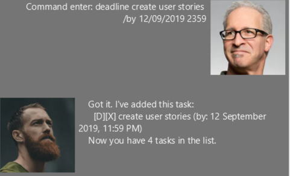

# Table of contents
1. [Duke](#Duke)
2. [Features](#Features)

	2.1. [Adds todo tasks: `todo`](#Todo)
	
	2.2. [Adds deadline tasks: `deadline`](#Deadline)
	
	2.3. [Adds event tasks: `event`](#Event)
	
	2.4. [Mark task as complete: `done`](#Done)
	
	2.5. [Finds task: `find`](#Find)
	
	2.6. [Delete task: `delete`](#Delete)
	
	2.7. [Undo your previous command: `undo`](#Undo)

	2.8. [List all task items: `list`](#List)

	2.9. [Exit the program: `bye`](#Bye)

3. [Command summary](#summary)
	

	
## 1. Duke 
Duke is a task tracker desktop application which allows user to manage their own tasks. It uses Command-Line Interface (CLI), so user can perform operations by typing the commands into the textfield. 

## 2. Features 
Command Format
* Words within <> are to be supplied by the user. For example, `todo <task>`, `<task>` requires user to filled in their own task. 

### 2.1. Adds todo task: `todo` 
Format: `todo <task>`

Example of usage:  
`todo create user stories`

Expected outcome:  

### 2.2. Adds deadline task: `deadline` 
Format: `deadline <task> /by <date>`

NOTE: `<date>` must be in the format of dd/MM/yyyy HHmm. Example: 02/12/2019 1800

Example of usage:  
`deadline create user stories /by 12/09/2019 2359`

Expected outcome:  

### 2.3. Adds event task: `event` 
Format: `event <task> /at <location>`

Example of usage:  
`event hackathon /at COM1`

Expected outcome:  

### 2.4. Mark task as complete: `done` 
Format: `done <index>`

NOTE: `<index>` must be a valid task list item.

Example of usage:  
`done 5`

Expected outcome:  

### 2.5. Finds task: `find` 
Show task that contains at least one of the user specified words.  
Format: `find <words to search>`

Example of usage:  
`find stories hackathon`

Expected outcome:  

### 2.6. Delete task: `delete` 
Format: `delete <index>`

NOTE: `<index>` must be a valid task list item.

Example of usage:  
`delete 5`

Expected outcome:  

### 2.7. Undo your previous command: `undo` 
Format: `undo`

### 2.8. List all task items: `list` 
Format: `list`

### 2.9. Exit the program: `bye` 
Format: `bye`

## 3. Command summary 
* **Todo**: `todo <task>`  
Example: `todo create user stories` 
* **Deadline**: `deadline <task> /by <date>`  
Example: `deadline create user stories /by 12/09/2019 2359`
* **Event**: `event <task> /at <location>`  
Example: `event hackathon /at COM1`
* **Done**: `done <index>`  
Example: `done 5`
* **Find**: `find <words to search>`  
Example: `find stories hackathon`
* **Delete**: `delete <index>`
Example: `delete 5`
* **Undo**: `undo`
* **List**: `list`
* **Bye**: `bye`
