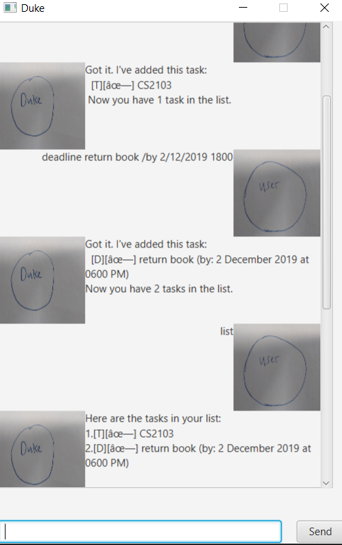

# User Guide
Duke is a **task manager chatbot** which helps you to manage and track your to-dos, deadlines and events.
 


## 1. Features 

- **Chat**: Interact with Duke via a chat interface.
- **Track tasks**: keep track of tasks. Duke understands 3 types of tasks: to-dos, deadlines and events.
- **Search**: search for tasks by keywords in the description.
- **Persistence**: tasks are saved in a text file which can be reloaded each time Duke starts.   
- **Aliasing**: rename your favorite commands with custom aliases to command Duke in the way you want to!
 

## 2. Usage

### 2.1 Quickstart
1. Ensure you have Java `11` or above installed on your computer.
2. Download the latest `duke.jar` [here](https://github.com/marqueurs404/duke/releases).
3. Copy the file to the folder you want to use as the home folder for Duke.
4. Double-click the file to start the app. The GUI should appear in a few seconds. 
5. Start typing commands in the command box! 

### 2.2 Commands

Duke understands you through commands. These are the commands which Duke currently supports. 
Each command has a specific format which has to be followed for Duke to respond correctly. 

Note that all `<datetime>` parameters have the format `DD/MM/YYYY HHMM`.

#### `todo` - Add a todo

Adds a todo to Duke's tasks list.

Format: `todo <description>`

Example usage: `todo Read an article on world peace`

Expected outcome: 
```
Got it mate. I've added this task:
[T][x] Read an article on world peace
Now you have 1 tasks in the list mate.
```

#### `event` - Add an event

Adds an event to Duke's tasks list. It is optional to include times. 
It is also optional to include both start and end datetimes, e.g. for single day events.  

Format: `event <description> /at <start datetime> - <end datetime>`

Example usage: `event World Hackathon /at 16/09/2019 - 18/09/2019`

Expected outcome: 
```
Got it mate. I've added this task:
[E][x] World Hackathon (at: Sep 16, 2019 - Sep 18, 2019)
Now you have 2 tasks in the list mate.
```

#### `deadline` - Add a deadline

Adds a deadline to Duke's tasks list. It is optional to include a time.   

Format: `deadline <description> /by <datetime>`

Example usage: `deadline tP Submission /by 01/01/2050`

Expected outcome: 
```
Got it mate. I've added this task:
[D][x] tP Submission (by: Jan 1, 2050)
Now you have 3 tasks in the list mate.
```

#### `done` - Mark a task as done

Marks a task in Duke's tasks list as complete given the index of the task on the list.

Format: `done <index>`

Example usage: `done 1`

Expected outcome: 
```
Nice one mate! I've marked this task as done:
[T][+] Read an article on world peace
```

#### `list` - List all tasks

List all tasks in Duke's tasks list.    

Format: `list`

Example usage: `list`

Expected outcome: 
```
Here are the tasks in your list:
1. [T][+] Read an article on world peace
2. [E][x] World Hackathon (at: Sep 16, 2019 - Sep 18, 2019)
3. [D][x] tP Submission (by: Jan 1, 2050)
```

#### `delete` - Remove a task 

Removes a task in Duke's tasks list given the index of the task on the list.

Format: `delete <index>`

Example usage: `delete 1`

Expected outcome: 
```
Noted mate! I've removed the task:
[T][+] Read an article on world peace
Now you have 2 tasks in the list mate.
```

#### `find` - Find tasks 

Searches Duke's tasks list for all tasks 
that contains the search string in its description.

Format: `find <search string>`

Example usage: `find tp`

Expected outcome: 
```
Here are the matching tasks in your list:
[D][x] tP Submission (by: Jan 1, 2050)
```

#### `bye` - Exit Duke 

Turns off the Duke chatbot.

Format: `bye`

Example usage: `bye`

Expected outcome: 
```
Here are the matching tasks in your list:
[D][x] tP Submission (by: Jan 1, 2050)
```

### 2.3 Advanced Commands

#### Aliasing
Duke supports aliasing of commands. 
You can add new aliases to call any commands however you want!

#### `list-alias` - List all aliases

List all command aliases which Duke can understand. 
Each command has a unique ID and a list of corresponding aliases to call the command.  

Format: `list-alias`

Example usage: `list-alias`

Expected outcome: 
```
Here are the aliases for all commands:
ID: Aliases
-----------
addAlias: add-alias, alias
deleteAlias: delete-alias, del-alias
listAliases: list-alias, list-aliases
addDeadline: deadline, dead
addEvent: event, ev
addTodo: todo, td
deleteTask: delete, del
doneTask: done
exit: bye,exit,logout
findTask: find, search
listTasks: list, tasks
```

#### `add-alias` - Add aliases

Add aliases for a command.  

Format: `add-alias <alias_1,alias_2,alias_3,...> /type <command id>`

Example usage: `add-alias complete /type doneTask`

Expected outcome: 
```
I've added the following aliases for doneTask:
complete
```

#### `delete-alias` - Delete aliases

Delete aliases for a command.  

Format: `delete-alias <alias_1,alias_2,alias_3,...> /type <command id>`

Example usage: `delete-alias dead /type addDeadline`

Expected outcome: 
```
I've deleted the following aliases for addDeadline:
dead 
```

## 3. Command Summary

- Add a todo: `todo <description>`
- Add an event: `event <description> /at <start datetime> - <end datetime>`
- Add a deadline: `deadline <description> /by <datetime>`  
- Mark a task as done: `done <index>`
- List all tasks: `list`
- Remove a task: `delete <index>`
- Find tasks: `find <search string>`
- Exit: `bye`
- List all aliases: `list-alias`
- Add aliases: `add-alias <alias_1,alias_2,alias_3,...> /type <command id>`
- Remove aliases: `delete-alias <alias_1,alias_2,alias_3,...> /type <command id>`


