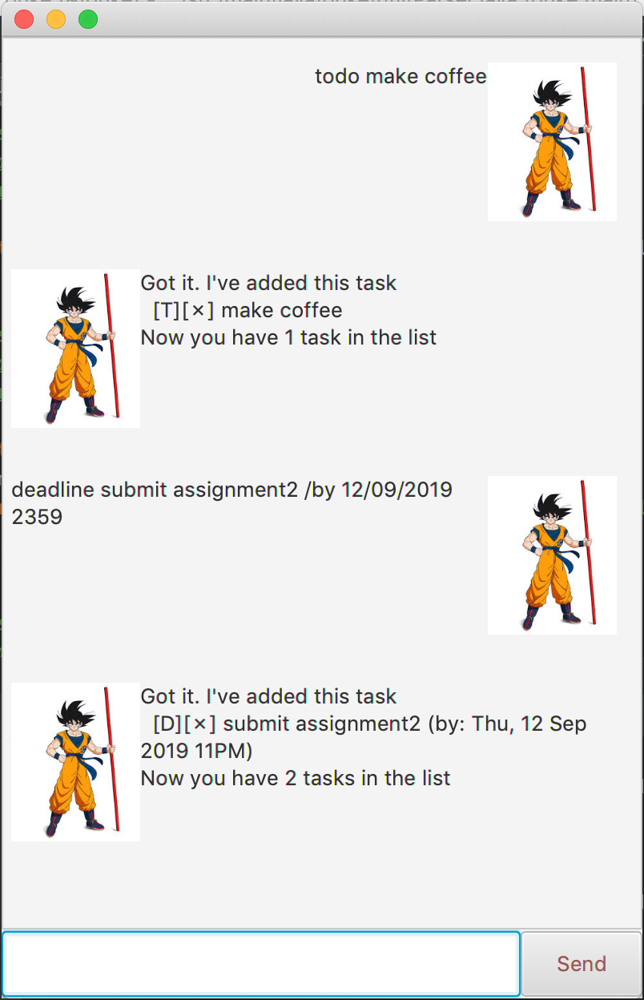
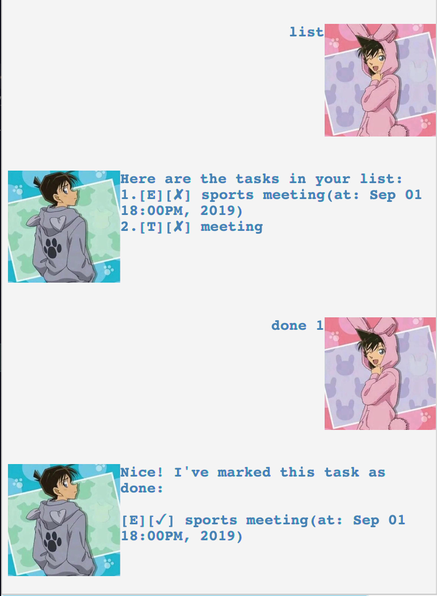

# User Guide
Duke is a java interactive console application which aims to help the user to
 better manage his tasks. It stores the description, date and the status(whether it is done)
 of a task in a local txt file for the user to track all these tasks.

## List of features
1. [Add a task](#add-task)
2. [Delete a task](#delete-task)
3. [Mark a task as done](#done-task)
4. [Find a task](#find-task)
5. [List all tasks](#list-tasks)
6. [Reschedule a task](#reschedule-task)
7. [Exit duke](#exit)

## Add a task
Add either a todo task, deadline task or event task.

## Usage

### `Keyword` - todo/deadline/event

The keyword is indicating the type of task and a description is required after the keyword. If no description is given an error will be thrown. 
In the case of event task or deadline task, a date and time is required which is 
separated by /at and /by respectively. The date and time should follow the format
dd/mm/yyyy HHmm, hour is in 24 hour format. If there is nothing wrong with the
command, a success message will be shown and the given task is added to the list
of tasks.

Example of usage: 

`deadline submit assignment2 /by 12/09/2019 2359`

Expected outcome:

`Got it, I've added this task:`

`[D][✗] submit assignment2 (by: Thu, 12 Sep 2019 11PM)`

`Now you have #{number of task in the list} tasks in the list`

## Delete a task

## Usage

### `Keyword` - delete

Remove a task from the list of tasks. Delete command takes in an integer which
is the index of the task that you wish to delete. You can do a list command 
first to see where is the task you wish to delete and input the index for delete command.

Example of usage: 

`delete 1`

Expected outcome:

`Noted. I've' removed this task:`

`[T][✗] make coffee`

`Now you have #{number of task in the list} tasks in the list`

## Mark a task as done

## Usage

### `Keyword` - done

Mark a task as done. This task will be listed with a ✓ to show that it is done.
Done command takes in an integer which
is the index of the task that you wish to mark as done.

Example of usage: 

`done 1`

Expected outcome:

`Nice! I've marked this task as done:`

`[T][✓] make coffee`

## Find a task
Find a task based on description.
## Usage

### `Keyword` - find
Find takes an argument that is part of the description of a task if that task 
exists. 

Example of usage: 

`find submit`

Expected outcome:

`Here are the matching tasks in your list:`

`1 [D][✗] submit assignment2 (by: Thu, 12 Sep 2019 11PM)`

## List all tasks
List all tasks that have been recorded.
## Usage

### `Keyword` - list
List all tasks, if there is not any, nothing will be shown.

Example of usage: 

`list`

Expected outcome:

`Here are the tasks in your list:`

`1 [D][✗] submit assignment2 (by: Thu, 12 Sep 2019 11PM)`

## Reschedule a task
Change the date and time for a task.
## Usage

### `Keyword` - reschedule
Reschedule takes in 2 arguments. The first argument is the index of the 
task in the list that you wish to reschedule. The second argument is the 
new date and time you wish the task to have. Same as addition, the date and
 time need to follow the format dd/mm/yyyy HHmm.

Example of usage: 

`reschedule 1 13/09/2019 2359`

Expected outcome:

`Nice! I've rescheduled this task:`

`1 [D][✗] submit assignment2 (by: Thu, 13 Sep 2019 11PM)`

## Exit duke
Quit the application.
## Usage

### `Keyword` - bye

Example of usage: 

`bye`

Expected outcome:

`Good bye!`