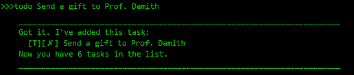
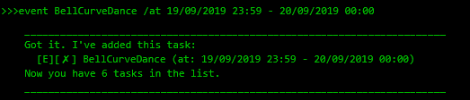

# Duke - User Guide
By: `Poh Jia Hao`  
Since: `Sep 2019`  
License: `MIT`

## 1. Introduction
Duke is for those who wish to have a personal assistant that will track
all of their tasks in a central location. Duke is able to recite the tasks
that you need to clear with just a simple command! If you would like a
personal assistant that will remember your deadlines, events and general
todo tasks, look no further than Duke!

## 2. Quick Start
1. Ensure that you have Java `11` installed in your Computer.
2. Download the latest `duke.jar` [here](https://github.com/limerencee/duke/releases)
3. Copy the file to the folder you want to use as your home folder for Duke.
4. Double-click the file to start the application. The GUI should appear
almost immediately. 
5. Type the command in the command box and press `Enter` to execute it.
Alternatively, press the `Send` button to execute the command as well.
6. Some example commands you can try:
    * `list`: lists all of your tasks
    * `todo TASK_DESCRIPTION`:  adds a To-Do task with the description
`TASK_DESCRIPTION` to Duke
    * `deadline DEADLINE_DESCRIPTION /by 19/2/2019 1300`: adds a Deadline task
with the description `DEADLINE_DESCRIPTION` and the deadline set to
`19/2/2019 1300` to Duke.
    * `event EVENT_DESCRIPTION /at i3 Auditorium`: adds an Event task with the
description `EVENT_DESCRIPTION` and the venue set to `i3 Auditorium` to Duke.
    * `bye`: exits the application
    
7. Refer to Section 3, "Features" for details of each command.

## 3. Features
Command format
* Commands are case-insensitive, but the task description is.
* Multi-word parameters do not have to be surrounded in quotation marks.
* Parameters must be added only after the task description
e.g. `event Party /at innovation 4.0`

### 3.1 Adding a To-Do Task: `todo`
Adds a `ToDo` task into Duke.  
Format: `todo TASK_DESCRIPTION`

Examples:  
* `todo Buy groceries`
* `todo Complete CS3235 lab 3`

Expected outcome:  

### 3.2 Adding a Deadline: `deadline`
Adds a `Deadline` task into Duke.  
Format: `deadline DEADLINE_DESCRIPTION /by DD/MM/YYYY HHMM`

Examples:  
* `deadline Upload CS3235 lab 3 answers /by 19/9/2019 1200`
* `deadline Pay school fees for semester 2 /by 23/10/2019 2359`

Expected outcome:  

### 3.3 Adding an Event: `event`
Adds an `Event` task into Duke.  
Format: `event EVENT_DESCRIPTION /at EVENT_LOCATION`

Examples:  
* `event SoC Career Fair /at COM1`
* `event Orbital Splashdown /at SR1`

Expected outcome:  

### 3.4 List tasks: `list`
Lists out all tasks in Duke.  
Format: `list`

Expected outcome:  

### 3.5 Find tasks: `find`
Finds all of the tasks in Duke that matches the search term.  
Format: `find SEARCH_TERM`

Examples:  
* `find CS3235`
* `find Career`

Expected outcome:  

### 3.6 List upcoming deadlines: `reminders`
Lists out deadlines that are within 3 days from current date.  
Format: `reminders`

Expected outcome:  

### 3.7 Clear the window: `clear`
Clears the output area of any text.  
Format: `clear`

Expected outcome:  

### 3.8 Mark task as complete: `done`
Marks a specified task as completed. If the task is an approaching
deadline, it will be removed from the `reminders` list.  
Format: `done TASK_NUMBER`

Examples:  
* `done 1`

Expected outcome:  

### 3.9 Delete task: `delete`
Deletes a specified task. If the task is an approaching deadline,
it will be removed from the `reminders` list.  
Format: `delete TASK_NUMBER`

Examples:  
* `delete 1`

Expected outcome:  

### 3.10 Exit Duke: `bye`
Exits the Duke application gracefully.  
Format: `bye`

Expected outcome:  

## 4. FAQ
**Q**: How do I transfer my data to another Computer?
**A**: Install the application in the other Computer and
overwrite the empty `PATH_TO_YOUR_DUKE_INSTALLATION\data\duke.txt`
data file it creates with the file that contains your previous Duke
application.