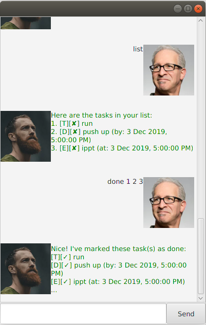

# Duke: User Guide

## 1. Introduction
 
Duke tracks ones' current tasks, deadlines and events. Simply enter a command to record them down.

## 2. Usage

### 2.1 Add Commands
### 2.1.1 `todo` - Add a todo task to your list.

This adds a todo task to your list. It is marked as undone by default.
 
Example of usage: 

`todo make the bed`

Expected outcome:

`Got it. I've added this task:`   `[T][✘] make the bed`   `Now you have 8 tasks in the list.`

### 2.1.2 `deadline` - Add an upcoming deadline task to your list.

This adds a deadline task to your list with the due date specified. It is marked as undone by default.  
If any natural dates are used, e.g. "today", "tomorrow", "sunday", "next tuesday", the time is set to be
the end of the day, i.e. 11.59pm by default.

Example of usage: 

`deadline hand in homework /by tomorrow`

Expected outcome:

`Got it. I've added this task:`   `[D][✘] hand in homework`   `(by: Wed, 18 Sept 2019, 11:59PM)`   `Now you have 8 tasks in the list.`

### 2.1.3 `event` - Add an upcoming event task to your list.

This adds a event task to your list with the starting and ending dates specified. It is marked as undone by default.  
If any natural dates are used, e.g. "today", "tomorrow", "sunday", "next tuesday", the time is set to be
the end of the day, i.e. 11.59pm by default.

Example of usage: 

`event gala dinner /at today - 1/12/2019 2000`

Expected outcome:

`Got it. I've added this task:`   `[E][✘] gala dinner`   `(from: Wed, 18 Sept 2019, 11:59PM,`
  `to: Sun, 1 Dec 2019 , 08:00PM)`   `Now you have 8 tasks in the list.`

### 2.2 Delete Command
### 2.2.1 `delete` - Delete a task from your list.

This deletes a task from your list. The task to be deleted is specified by the task index.  
The task index has to be positive and within the size of your list for the deletion to be successful. 
 
Example of usage: 

`delete 3`

Expected outcome:

`Noted. I've removed this task:`  
`[T][✘] make breakfast` 
`Now you have 10 tasks in the list.` 

### 2.3 Done Command
### 2.3.1 `done` - Marks a task as done in your list.

This marks a task as done in your list. The task to be marked as done is specified by the task index.  
The task index has to be positive and within the size of your list for the marking to be successful. 
 
Example of usage: 

`done 5`

Expected outcome:

`Nice! I've marked this task as done:`  
`[T][✓] pick up groceries` 

### 2.4 Find Command
### 2.4.1 `find` - Finds tasks in your list based on a keyword.

This finds relevant tasks in your list based on the specified keyword.   It matches to any tasks that contain the keyword,  
either partially or entirely.
 
Example of usage: 

`find work`

Expected outcome:

`Here are the matching tasks in your list:`  
`[D][✘] hand in homework` 
`(by: Wed, 18 Sep 2019, 11:59 PM)` 

Example of usage: 

`find webcast`

Expected outcome:

`No matching tasks found.`

### 2.5 List Command
### 2.5.1 `list` - Lists all the tasks in your list.

This lists out all the tasks currently stored in your list.
 
Example of usage: 

`list`

Expected outcome:

`Here are the tasks in your list:`  
`1. [D][✘] hand in homework` 
`(by: Wed, 18 Sep 2019, 11:59 PM)` 
`2. [D][✘] complete assignment 1` 
`(by: Mon, 16 Sep 2019, 11:59 PM)` 
`3. [E][✘] gala dinner`   
`(from: Wed, 18 Sept 2019, 11:59PM,`  
`to: Sun, 1 Dec 2019 , 08:00PM)`   

### 2.6 Sort Command
### 2.6.1 `sort` - Sorts all the tasks in your list.

This sorts the tasks in your list. You can specify Duke to sort your list for you in one of two ways,  
either by task name or task date. The starting date of 

Example of usage: 

`sort name`

Expected outcome:

`Sorted list by name:`  
`2. [D][✘] complete assignment 1` 
`(by: Mon, 16 Sep 2019, 11:59 PM)` 
`3. [E][✘] gala dinner`   
`(from: Wed, 18 Sept 2019, 11:59PM,`  
`to: Sun, 1 Dec 2019 , 08:00PM)`   
`1. [D][✘] hand in homework` 
`(by: Wed, 18 Sep 2019, 11:59 PM)` 
`4. [T][✘] make the bed` 

Example of usage: 

`sort date`

Expected outcome:

`Sorted list by date:`  
`4. [T][✘] make the bed` 
`2. [D][✘] complete assignment 1` 
`(by: Mon, 16 Sep 2019, 11:59 PM)` 
`3. [E][✘] gala dinner`   
`(from: Wed, 18 Sept 2019, 11:59PM,`  
`to: Sun, 1 Dec 2019 , 08:00PM)`   
`1. [D][✘] hand in homework` 
`(by: Wed, 18 Sep 2019, 11:59 PM)` 

### 2.7 Exit Command
### 2.7.1 `bye` - Exits from the program.

This quits Duke and allows you to exit from the program.

Example of usage: 

`bye`

Expected outcome:

`Bye. Hope to see you again soon!`  

### 2.8 Saving The Data

Previously saved tasks can be loaded up as the program boots up. Your task list is also automatically altered 
after any command that modifies the list.

## 3. Command Summary

Command Type        | Usage            |   Example       |          
------------        | -------------    | ---------------|
AddCommand   | todo <$description> | todo assignment 1                      |
AddCommand   | deadline <$description> /by <$date> <$time> | deadline Duke Milestone /by 2/2/2019 2359 |
AddCommand   | event <$description> /at <$starting_date> <$starting_time> - <$ending_date> <$ending_time>| event gala dinner /at today - tomorrow |
DeleteCommand | delete <$task_index> | delete 4|
DoneCommand | done <$task_index> | done 3 |
FindCommand | find <$keyword> | find homework | 
SortCommand | sort <$method> | sort name or sort date |
ExitCommand | bye |

