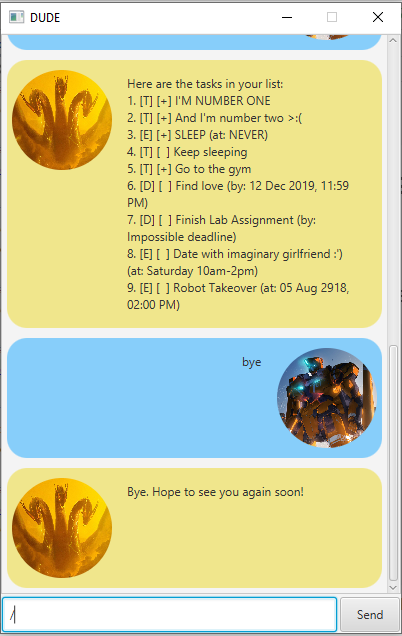

# DUDE User Guide
###### by Lye Jian Wen

## Introduction 
Welcome to DUDE, a simple and intuitive personal assistant! DUDE helps you maintain a list of various types of tasks (To-dos, Deadlines and Events) to boost your time management and productivity. DUDE engages you in a personalised manner; you give it short requests, and it responds conversationally.

## Starting Out
1. Double-click on `dude-0.2.jar` to start the application.
2. You should see the following screen:

   
3. To enter commands, key them into the bar at the bottom and click `Send`.
4. If you're transferring the app from another device and want to keep an existing task list from that device, copy the `data` folder from the old install directory to the new one.

## Features and Command Usage
!!! *Note: All **(single-word) commands** are case-sensitive, but their **details are case-insensitive***

### 1. Add a To-do: `todo`
- Adds a `Todo` task to the list.
- Format: `todo TODO_DESCRIPTION`

#### Example:
`todo Go to the gym`

#### Expected outcome:

### 2. Add a Deadline: `deadline`
- Adds a `Deadline` task to the list.
- Format: `deadline DEADLINE_DESCRIPTION /by END_TIME`
        where `END_TIME` can be a date and time or a phrase like `next week` that specifies the Deadline's end time

#### Example:
- `deadline Find love /by 12/12/2019 2359`
- `deadline Finish Lab Assignment /by Impossible deadline`

#### Expected outcome:

### 3. Add an Event: `event`
- Adds an Event task to the list.
- Format: `event EVENT_DESCRIPTION /at EVENT_PERIOD`
        where `EVENT_PERIOD` can be a date and time or a phrase like `Sunday 2-4pm` that specifies the period of the Event

#### Example:
- `event Date with imaginary girlfriend :') /at Saturday 10am-2pm`
- `event Robot Takeover /at 05.08.2918 2 PM`

#### Expected outcome:

### 4. Update Task: `update`
- Updates a task's details (description or time for Deadline and Event).
- Format: `update TASK_NUMBER | UPDATE_FIELD UPDATE_VALUE`
        where `UPDATE_FIELD` is `desc` or `time`
#### Example:
- `update 4 | desc:Keep sleeping`
- `update 3 | time:NEVER`

#### Expected outcome:

### 5. List All Tasks: `list`
- Lists all current tasks.
- Format: `list`

#### Expected outcome:

### 6. Clone Task: `clone`
- Clones (creates duplicate of) a task.
- Format: `clone TASK_NUMBER`

#### Example:
- `clone 9`

#### Expected outcome:

### 7. Mark Tasks as Done: `done`
- Sets a task status to `done` (`[ ]` to `[+]`)
- Format: `done TASK_NUMBER`

#### Example:
- `done 5`

#### Expected outcome:

### 8. Delete Task: `delete`
- Deletes a task from the list.
- Format: `delete TASK_NUMBER`

#### Example:
- `delete 10`

#### Expected outcome:

### 9. Find (Search For) Task: `task`
- Displays a list of tasks containing a keyword (not case-sensitive).
- Format: `find KEYWORD`

#### Example:
- `find sleep`

#### Expected outcome:

### 10. Exit: `bye`
- Exits the application.
- Format: `bye`

#### Expected outcome:

After the above response from DUDE, the window closes.