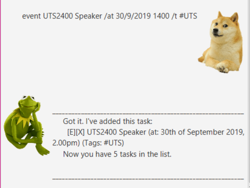

# Kappa - User Guide

## Brief Overview

Kappa is a CLI-based application on your Desktop with GUI-like features to help you track your tasks. This application is for people who prefers keep tracking of tasks on their Desktops using a Command-Line Interface.

## Features

#### 1. Keep track of your tasks

Kappa helps you to keep track of various kinds of tasks which includes ToDos, Deadlines and Events and display them.

#### 2. Marking your tasks as done

Kappa can help you mark your tasks as Done through the Done Command so that you can keep track of what tasks are completed.

#### 3. Tagging your tasks

Your tasks can also be tagged which helps you to customise your own task categories which makes tracking much easier!

#### 4. View all your tasks

The list command that Kappa provides can display all the tasks that you are currently tracking.

#### 5. Auto-save and store your tasks

Kappa has an auto-save feature which stores your tasks every time you add or modify them. With the storage feature, you can always close the application and come back another time, and your currently tracking tasks will still be there.

## Commands
* [ToDo](#todo-commands)
* [Deadline](#deadline-commands)
* [Event](#event-commands)
* [List](#list-commands)
* [Delete](#delete-commands)
* [Find](#find-commands)
* [Clear](#clear-commands)
* [Done](#done-commands)
* [Exit](#exit-commands)
* [Help](#help-commands)

## Command Format
Words that are enclosed with `<` and `>` are the parameters to be supplied by you.
Words that are enclosed with `[` and `]` are optional parameters to be supplied by you.
`...` represents one or more argument
Other keywords stated are compulsory and they should be included.
E.g. in `todo <Task Description> /t [#Tag1...]`, a valid input would be `todo Maths Homework /t #School #Maths`

`<Task Description>` is the description of the task to be supplied by you.
`[#Tag1...]` represents optional arguments to be supplied by you.

## Usage

### `todo` - Add a ToDo task to your list

Syntax:

`todo <Task Description> /t [#Tag1...>`

Example:

`todo CS2103T Project /t #CS2103 #School` (With Tags)

`todo Laundry` (Without Tags)

Expected outcome:

`Adds a ToDo Task to your list.`

### `deadline` - Add a Deadline task to your list

Syntax:

`deadline <Task Description> /by <Date> /t [#Tag1...]`

`<Date>` must be in `DD/MM/YYYY HHMM` format for Kappa to read it properly.

Else, the customised date is taken and not parsed.

Example:

`deadline CS2103 Quiz /by 29/9/2019 1300 /t #CS2103 #School` (With Valid Date and Tags)

`deadline CS2103 Quiz /by Friday` (Without Valid Date)

Expected outcome:

`Adds a Deadline Task to your list.`

### `event` - Add an Event task to your list

Syntax:

`event <Task Description> /at <Date> /t [#Tag1...]`

`<Date>` must be in `DD/MM/YYYY HHMM` format for Kappa to read it properly.

Else, the customised date is taken and not parsed.

Example:

`event F1 Concert /at 24/9/2019 1800 /t #Social` (With Valid Date and Tags)

`event Birthday Party /at 5pm Thurs` (Without Valid Date)

Expected outcome:

`Adds an Event Task to your list.`

### `list` - Display your tasks

Syntax:

`list`

Expected outcome:

`Displays all your tasks stored thurs far.`

### `delete` - Delete your task

Syntax:

`delete <index>`

Example:

`delete 3`

Expected outcome:

`Deletes task based on specified index.`

### `find` - Find your task

Syntax:

`find <search term>`

Example:

`find school`

Expected outcome:

`Finds task by searching description based on specified search term.`

### `clear` - Clear your tasks

Syntax:

`clear`

Expected outcome:

`Clears storage of all tasks.`

### `done` - Mark your task as done

Syntax:

`done <index>`

Example:

`done 4`

Expected outcome:

`Marks the task at specified index as done.`

### `exit` - Exit application

Syntax:

`bye`

Expected outcome:

`Terminates application with a goodbye popup message.`

### `help` - Shows list of commands

Syntax:

`help`

Expected outcome:

`Gives an overview of all the commands in Kappa.`

