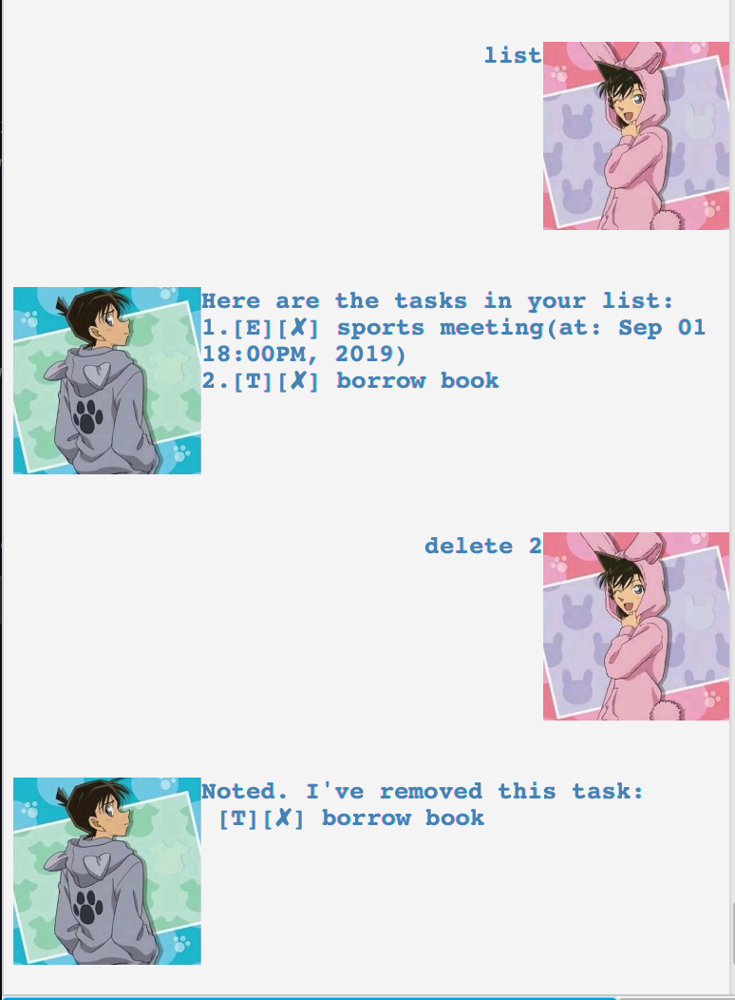

# User Guide

## Features 

### Feature 1 
Displaying the list of current tasks.

## Usage

### `list` - Lists out the tasks.

`list` displays the current list of tasks you have stored.

Format: 
`list`

Expected outcome:

### Feature 2
Adding a todo task.

## Usage

### `todo [description]` - Adds a todo task to your list.

Format: 
`todo DESCRIPTION`

Example: 
`todo read book`

Expected outcome:

### Feature 3
Adding a event task.

## Usage

### `event [description] /at DD/MM/YYYY HHMM` - Adds a event task to your list with its date.

Format: 
`event DESCRIPTION /at DATE`

Example: 
`event project meeting /at 30/9/2019 1400`

Expected outcome:

### Feature 4
Adding a deadline task.

## Usage

### `deadline [description] /at DD/MM/YYYY HHMM` - Adds a deadline task to your list with its date.

Format: 
`deadline DESCRIPTION /by DATE`

Example: 
`deadline finish homework /by 30/9/2019 2359`

Expected outcome:

### Feature 5
Marking a task as done.

## Usage

### `done [task_index]` - Marks the task at task_index as done

Format: 
`done TASK_INDEX`

Example: 
`done 1`

Expected outcome:

### Feature 6
Deleting a task.

## Usage

### `delete [task_index]` - Deletes the task at task_index.

Format: 
`delete TASK_INDEX`

Example: 
`delete 1`

Expected outcome:

