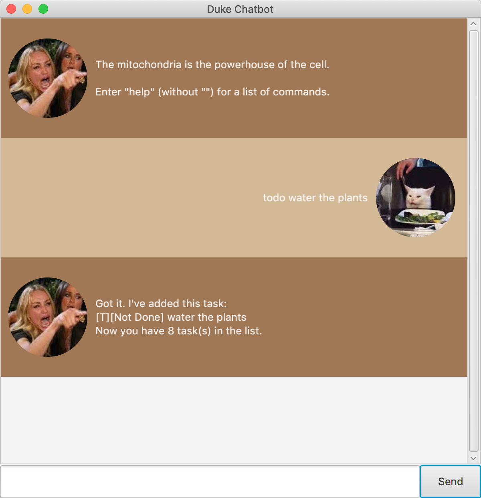
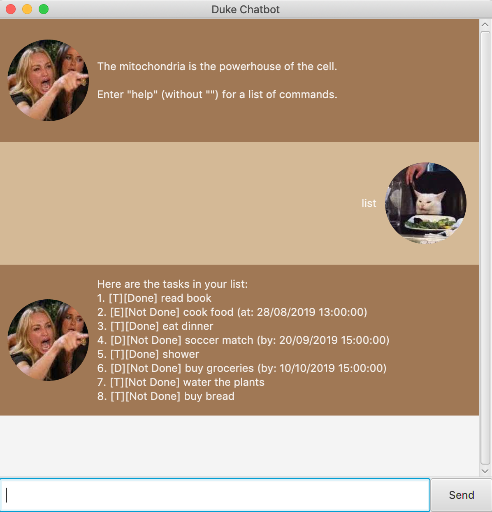
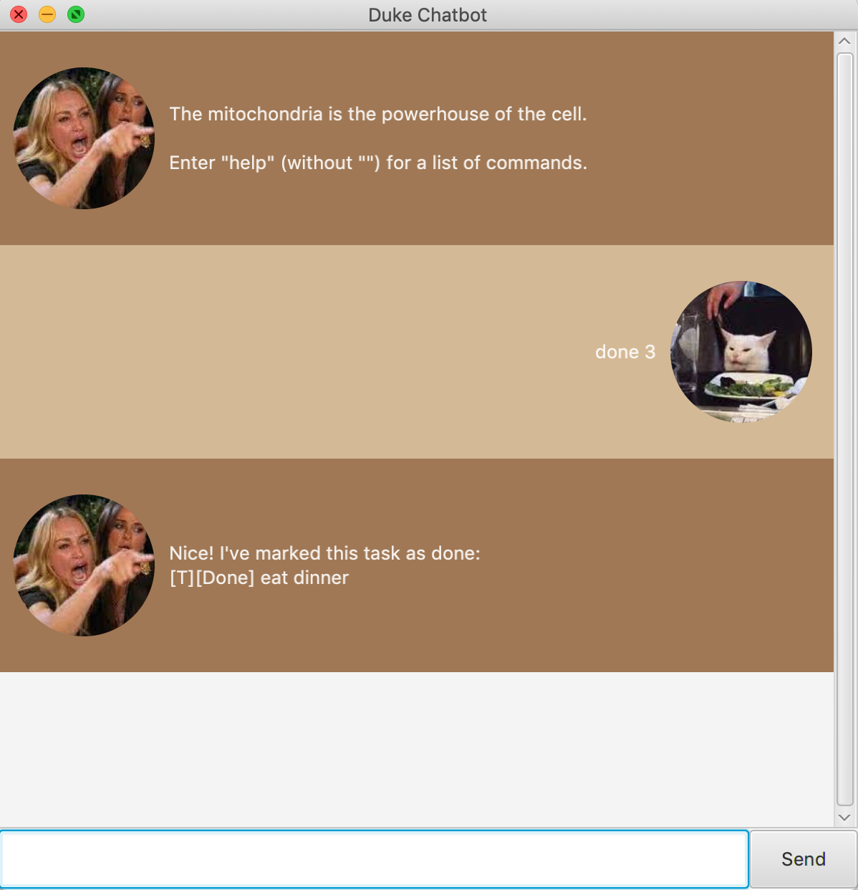

# User Guide

## What is Duke
Duke is a Personal Assistant Chatbot that helps you keep track of different tasks as you go about your daily activities.

## Features 

### Add and Delete Tasks 
You can add and delete different types of tasks to the chatbot task manager.
Currently, there are four types of tasks supported by Duke. These are the tasks you can input into the chatbot, to track your schedule.

* **Todo**:
The Todo task is a task with no date / time attached to it. 
(Eg. Visit a new theme park)

* **Deadline**:
The Deadline task is a task that needs to be done before a specific date / time.
(Eg. Submit project report by 11/09/2019 1200)

* **Event**:
The Event task is a task that starts at a specific time and ends at a specific time. 
(Eg. Team project meeting at 11/09/2019 1200-1400)

* **Fixed Duration Task**:
The Fixed Duration Task is an unscheduled task that takes a fixed amount of time.  
(Eg. Reading the sales report needs 2 hours)

### Mark Tasks as Done 
Any tasks initilly added into the task list will be marked as incomplete. Upon completion, the tasks can easily be marked as done.

### List Tasks
Displays the task list with all the tasks you previously added.

### Sort Tasks
Sorts the task list according to type or date of completion (if any).

## Usage
### `Keyword` - Describe action
### `todo` - Adds a TODO task to the chatbot's tasklist 

Example of usage:
'todo Borrow books'

Expected outcome: 

### `deadline` - Adds a DEADLINE task to the chatbot's tasklist

Example of usage:
'deadline Submit CS2100 report /by 02/12/2019 1900'

Expected outcome: 

### `event` - Adds an EVENT task to the chatbot's tasklist

Example of usage:
'event CS2103T team meeting /at 15/09/2019 1500-1800'

Expected outcome: 

### `fixed` - Adds a FIXED DURATION TASK to the chatbot's tasklist

Example of usage:
'fixed Do my laundry /needs 2 hours

Expected outcome:

### `list` - Lists all the tasks added to the tasklist

Example of usage:
'list'

Expected Outcome:

### `done` - Marks the task corresponding to inputted task number as 'done'

Example of usage:
'done 1'

Expected outcome: 

### `delete` - Deletes the task corresponding to inputted task number

Example of usage:
'delete 1'

Expected outcome: 

### `sort` - Sorts the task in the tasklist either according to date / type (as inputted)

Example of usage:
'sort date'

Expected outcome: 

