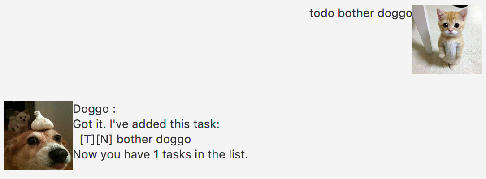
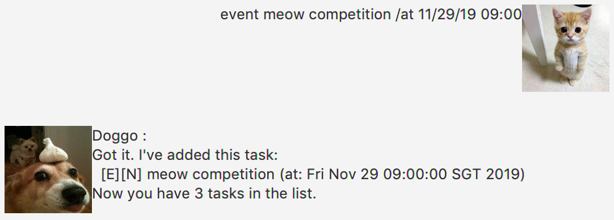
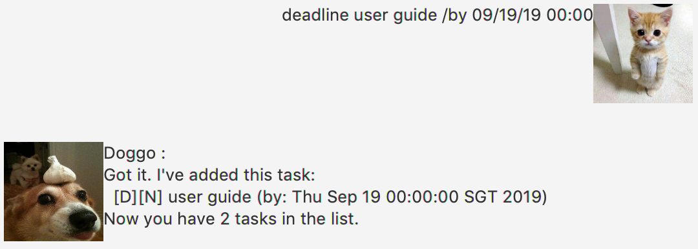
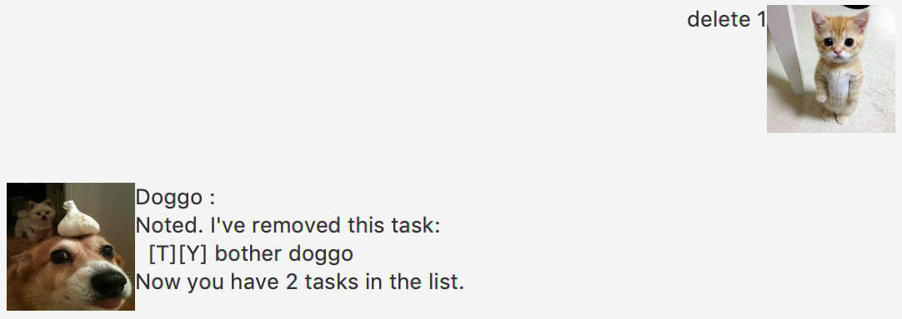
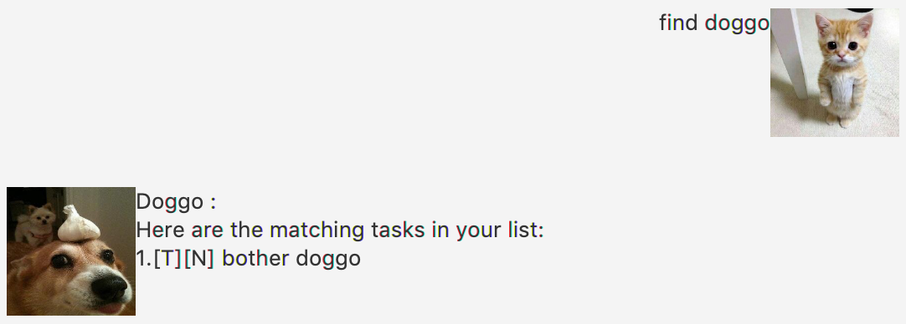

# User Guide

### Your Personal Planner!

## Features of Currents

#### Todo: `todo`
Allows you to track tasks that needs to be done and adds it to a list.

#### Deadline: `deadline`
Reminds you of your upcoming deadlines and adds it to a list with the deadline date and time.

#### Event: `event`
Remind you of your upcoming events and adds it to a list with the date and time of the event.

#### Done: `done`
Allows you to tick off todo/event/deadline tasks that have been completed.

#### Delete: `delete`
Allows you to delete finished tasks or wrong tasks that was inputted.

#### Delete: `deleteAll`
Allows you to delete multiple finished tasks or wrong tasks that was inputted at one go.

#### Find: `find`
Prints out matching words that you have inputted from the list.

#### List: `list`
Prints out the entire list as of then.

#### Bye: `bye`
Closes the application.

## Usage of Currents

Command | Example | Description
---------------|---------------|---------------
`todo <task>` | todo eat | Adds a new to do task.
`event <description> /at <dd/MM/yyyy> <hhmm>` | event meeting /at 20/06/2021 1700 | Add a new meeting event.
`deadline <description> /by <dd/MM/yyyy> <hhmm>` | deadline homework /by 30/05/2023 2359 | Add a new homework deadline.
`done <taskNumber>` | done 1 | Ticks off the first todo/event/deadline task.
`delete <taskNumber>` | delete 2 | Deletes the second task off the list
`deleteAll <taskNumbers>` | delete 1 3 5 6 | Deletes the first, third, fifth and sixth task off the list
`find <keyword>` | find homework | Find the tasks with "homework" and prints out them out in a list.
`list` | list | Prints out everything in your list at that current point of time.
`<command> *` | todo eat * | Prioritises this task and enters the task at the top of the list.

#### Todo: `todo`
Expected Outcome:

#### Event: `event`
Expected Outcome:

#### Deadline: `deadline`
Expected Outcome:

#### Done: `done`
Expected Outcome:

#### Delete: `delete`
Expected Outcome:

#### DeleteAll: `deleteAll`
Expected Outcome:

#### Find: `find`
Expected Outcome:

#### List: `list`
Expected Outcome:

#### <command> *: `<command> *`
Expected Outcome:

