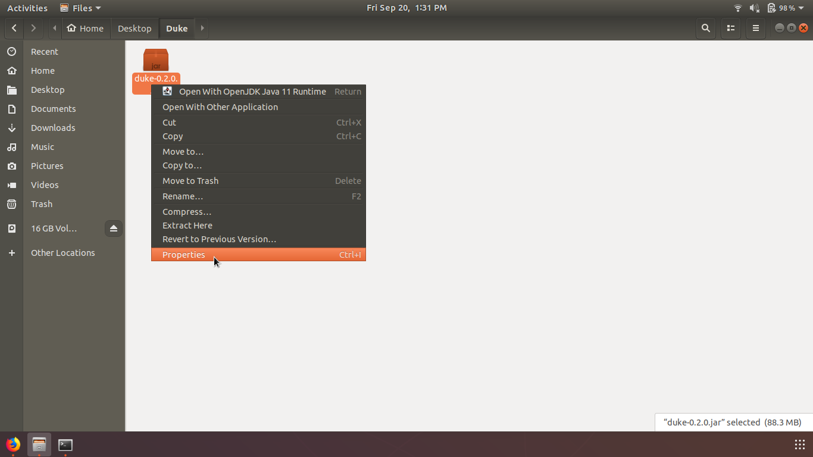
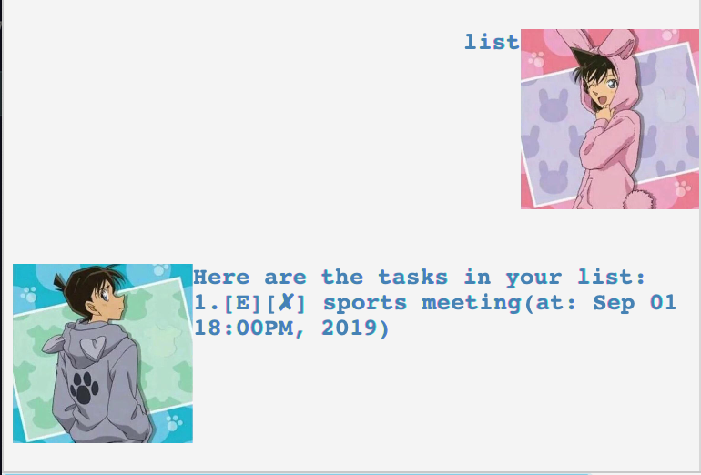
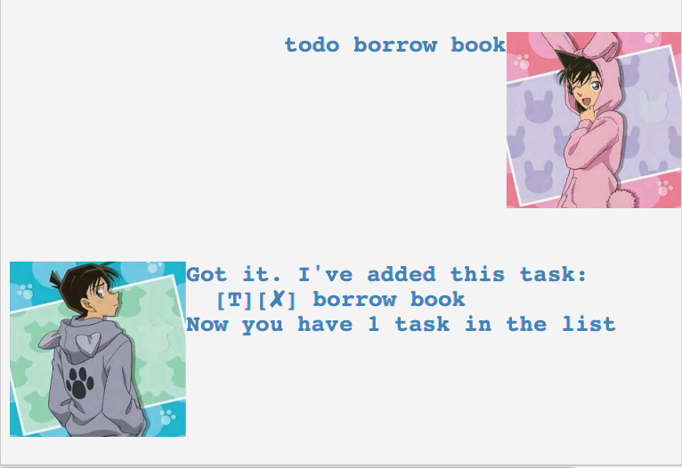
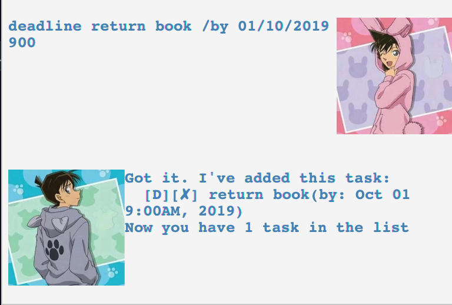

# User Guide

Duke is a personal chat bot that uses the CLI to manage daily tasks. It is a case insensitve CLI application. 

## Quick Start

### Computing Environment

Duke GUI has been tested and possible to run on Windows and Linux given the following computing environment
* openjdk 11.0.4
* OpenJDK Runtime Environment Build 11.0.4

For Linux, please enter `java --version` to check if the minimum Java requirement is met before running the GUI application.
For Windows, please enter `java --version` to check if the minimum Java requirement is met before running the GUI application.

#### Start Duke Helpbot

* Download the Duke Helpbot from [release page](https://github.com/huiminlim/duke/releases/tag/A-Release).

#### For Linux, 
* Go to the download location folder. You will see the `duke-0.2.0.jar` file. 
* Right click the `duke-0.2.0.jar` file and click on `properties`. 

* Check the `Allow executing file as program` box.

* Double click the `duke-0.2.0.jar` file to execute the Duke Helpbot GUI. 

Alternatively, a command can be issued in the command terminal: `java -jar duke-0.2.0.jar`.

#### For Windows,
* Go to the download location folder. You will see the `duke-0.2.0.jar` file. 
* Double click the `duke-0.2.0.jar` file to execute the Duke Helpbot GUI. 

Alternatively, a command can be issued in the command terminal: `java -jar duke-0.2.0.jar`.


## Features 

Duke allows you to track three types of task - To Do, Deadline and Events. In addition, there are also various utility functions to allow you to manage your task list. These functions include `list`, `delete`, `done`, `bye`, `help`, `find`.

For all To Do, Deadline and Events, a task description is shown in chronological order in which they were added. The classification of the To Do, Deadline and Events are denoted by a task icon, as shown in table below.

Task | Task icon
------------ | -------------
To Do | T
Deadline | D
Event | E

The completion status is also denoted by a completion icon, as shown in the table below.

Completion Status | Completion icon
------------ | -------------
Completed | Y
Incomplete | N


A sample list with the Task Icon and Completion Status is show below


## Usage

### `list` - List out all tasks 

A list of all the To Do, Deadline and Events are shown to the you.

Format: `list`

For Deadlines, the date and time in which the task is due is included in the same line after the task description.
For Events, the date and time in which the task is happening is included in the same line after the task description.

Example of usage: 

`list`
  

Example of expected outcome:

```
Here are the tasks in your list:
1.[E][N] project meeting (by: 02/12/2019 1420)
2.[D][N] return book (by: 02/12/2019 1420)
3.[T][N] read book
```

A sample Duke Helpbot response can be seen below.




  
### `help` - Show help page to assist user in commands available

Help shows you the various commands that the Duke chat bot uses in the application. 
  
Format: `help`
  
Example of usage: 

`help`
  
Example of expected outcome:
```
Welcome to help page!
Here are some commands you can use:
list, todo, event, deadline, done, delete, find, bye
```

A sample Duke Helpbot response can be seen below.


  
You can further check the syntax required of each command to use it, by supplying the command interested.
  
Example of usage: 

`help todo`
  
Example of expected outcome:

```
Here is what I found!
todo <task description>
```
A sample Duke Helpbot response can be seen below.


  
### `todo` - Adds a To Do task to the task list.

You can add a To Do task that has no deadline to the task list.

Format: `todo TASK_DESCRIPTION`
where 
* `TASK_DESCRIPTION` refers to the task item that you wish to add into the task list. 

Example of usage: 
  
`todo Homework`
  
Example of expected outcome:

```
Got it. I've added this task:
  [T] Homework
Now you have 5 tasks in the list.
```
A sample Duke Helpbot response can be seen below.



  
### `event` - Adds an Event to the task list.

You can add an Event to the task list to track any event that you may have in your schedule. The event requires a date and time to be furnished with the event description.


Format: `event EVENT_DESCRIPTION /at DD/MM/YYYY HHHH`
where 
* `EVENT_DESCRIPTION`: The description of the event you wish to add to the task list.
* `DD/MM/YYYY HHHH`: The date and time format of the event. The time is strictly in 24-hours format.

Example of usage: 
  
`event Birthday celebration /at 12/10/2019 1503`
  
Example of expected outcome:
```
Got it. I've added this task:
  [E] Birthday celebration
Now you have 5 tasks in the list.
```

A sample Duke Helpbot response can be seen below.


### `deadline` - Adds an task with deadline to the task list.

You can add a task with a deadline to the task list to track any deadlines you have. The deadline requires a date and time to be furnished with the deadline task description.


Format: `deadline DEADLINE_DESCRIPTION /at DD/MM/YYYY HHHH`
where 
* `DEADLINE_DESCRIPTION`: The description of the deadline you wish to add to the task list.
* `DD/MM/YYYY HHHH`: The date and time format of the event. The time is strictly in 24-hours format.


Example of usage:  

`deadline CS2103 IP /by 12/10/2019 1503`

Example of expected outcome:

```
Got it. I've added this task:
  [D] CS2103 IP
Now you have 5 tasks in the list.
```

A sample Duke Helpbot response can be seen below.




### `done` - Sets a task as completed.

You can update the completion status of the task to done. You need to identify the task to be set as done with the task number, by checking the task list.


Format: `done INDEX_TASK`
where `INDEX_TASK`: Index of the task in your task list. To check the index, you can use the `list` command to refer to the index.

Example of usage: 

`done 4`

Example of expected outcome:

```
Nice! I've marked this task as done:
  [D][Y] CS2103 IP (by: 12/10/2019 1123)
```
A sample Duke Helpbot response can be seen below.


### `delete` - Deletes a task in task list.

You can delete a specific task from the task list. You need to identify the task to be deleted with the task number, by checking the task list.

Format: `delete INDEX_TASK`
where `INDEX_TASK`: Index of the task in your task list. To check the index, you can use the `list` command to refer to the index.

Example of usage: 

`delete 1`

Example of expected outcome:

```
Noted. I've removed this task:
  [E][N] CS2103 IP (by: 12/10/2019 1123)
```

A sample Duke Helpbot response can be seen below.


### `find` - Finds all the task with the matching keyword in the task description.

You can find all the task entries in the task list, in which the task description contains the specified keyword. 

Format: `find KEYWORD`
where `KEYWORD`: Keyword to search for in tasks in task list.


Example of usage: 

`find book`

Example of expected outcome:

```
Here are the matching tasks in your list:
  1.[D][N] return book (by: 12/10/2019 1123)
  2.[Y][N] read book
```

A sample Duke Helpbot response can be seen below.


### `bye` - To exit and stop Duke.

To stop the session with Duke, you can specify `bye` to end the session with Duke.

Format: `bye`

Example of usage: 

`bye`

Example of expected outcome:

```
Bye. Hope to see you again soon!
```

A sample Duke Helpbot response can be seen below.


