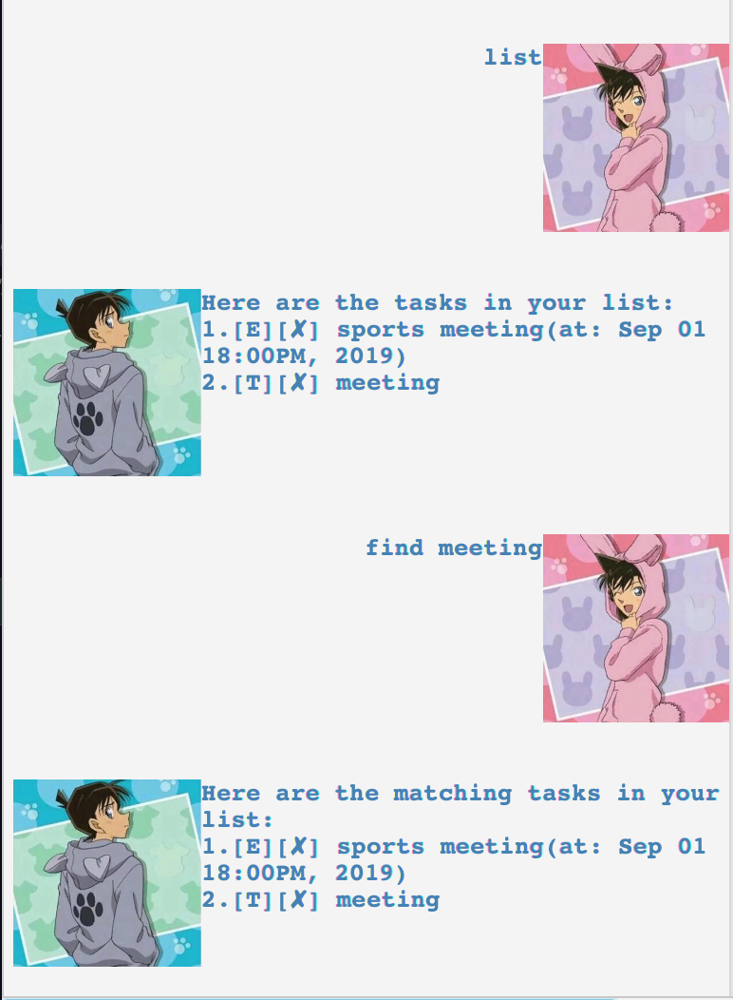
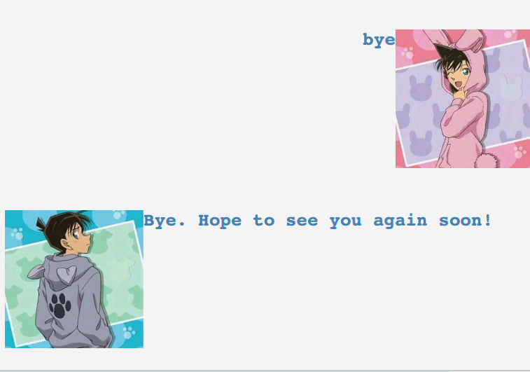

# User Guide

## Application Screenshot

## Features 

### Users can:
* Add todo/deadline/event tasks to the list.

* Delete a task.

* Mark a task as done.

* Find a task using keyword search.

* View the list of all tasks.

* Access the help feature to view all commands.

* Exit the program.

* Adjust the size of the screen by dragging.

## Usage

###1. `todo` - Add a todo task

Add a todo task to the list with the description of the task, followed by the todo keyword.

* Format:

   `todo [DESCRIPTION]`

* Example of usage: 

   `todo homework`

* Expected outcome:

###2. `deadline` - Add a deadline task

Add a deadline task to the list with the description of the task and time, followed by the deadline keyword.

* Format:

   `deadline [DESCRIPTION] /by [DD/MM/YYYY HHmm]`

* Example of usage: 

   `deadline assignment submission /by 21/09/2019 2359`

* Expected outcome:

###2. `event` - Add an event task

Add an event task to the list with the description of the task and time, followed by the event keyword.

* Format:

   `event [DESCRIPTION] /at [DD/MM/YYYY HHmm]`

* Example of usage: 

   `event workshop /at 08/10/2019 1400`

* Expected outcome:

###3. `delete` - Delete a task

Delete a task specified by its index.

* Format:

   `delete [INDEX]`

* Example of usage:

   `delete 3`

* Expected outcome:

###4. `done` - Mark a task as done

Mark a task specified by its index as done.

* Format:

   `done [INDEX]`

* Example of usage:

   `done 7`

* Expected outcome:

###5. `find` - Find a task

Find a task by keyword search.

* Format:

   `find [KEYWORD]`

* Example of usage:

   `find meeting`

* Expected outcome:

###5. `list` - View all tasks

View the list of all tasks with respective fields.

* Format:

   `list`

* Expected outcome:

###6. `help` - View help

Access the help feature to view all commands.

* Format:

   `help`

* Expected outcome:

###7. `bye` - Exit the program

Exit the program after the exit message is shown.

* Format:

   `bye`

* Expected outcome:

###8. Adjust the size of the screen

Users can adjust the size of the window by dragging the corners.
