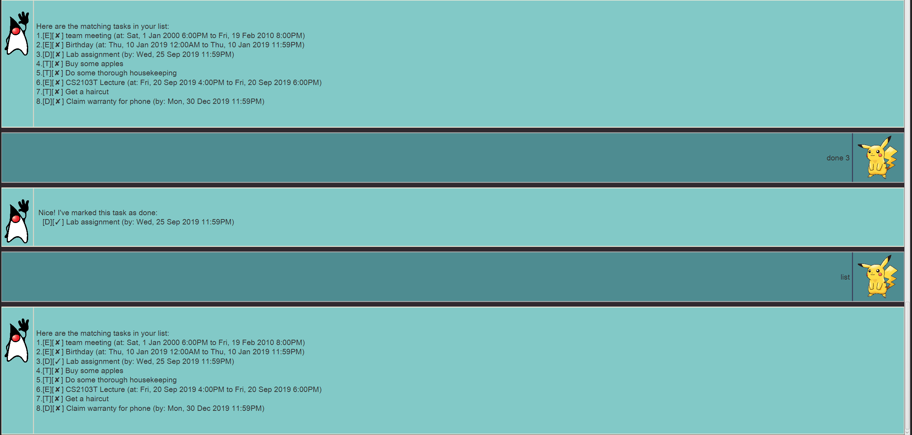

# Duke - User Guide

## Contents
- ##### [What is duke?](#what-is-duke??)
- ##### [Features](#features)
- ##### [Command Usage](#command-usage)
- ##### [Advanced Usage](#advanced-usage)

## What is Duke?
Duke is an [Graphical User Interface](https://en.wikipedia.org/wiki/Graphical_user_interface) (GUI) application that focuses on helping the user manage his tasks.

These tasks could be a simple todo, a deadline, or an event occuring at a specific point of time.

Duke is tailored for users who love to use command line input and type fast, as most operations require typing something out.

## Features 
### Add various types of tasks to the user task list
- ##### Todos - tasks with a simple description
- ##### Deadlines - tasks with a description and deadline timing
- ##### Events - tasks with a description and a start and end timing
### See all current tasks in the user task list
- ##### The user can view his current task list with a simple command
- ##### The data is presented in a simple list format, and shows the relavant details of the task ( description, timings, whether it is done )
### Mark tasks in the task list as done
- ##### Tasks can be marked as done with a simple command
### Delete tasks from the task list
- ##### Tasks can be entirely removed from the user task list if the list is getting cluttered
### Find and filter tasks quickly
- ##### The task list can be filtered quickly by a search term
### Task list is preserved across application exits
- ##### The task list is saved whenever the task list is changed
- ##### The task list is read on application startup from the disk
### Easily editable task storage file
- ##### By using a easily readable json file format, Duke allows easy user editing of the storage task file on disk
### Save task list to disk and start afresh
- ##### The task list can be archived and saved to a seperate disk file, preserving data while allowing the user to start from an empty list

## Command Usage

### General command usage info
- Commands are case insensitive, that is, typing "List" or "LIST" will work the same
- There shouldn't be leading whitespaces before any command. (e.g. " List" will not work)
- You can send your input by pressing enter, or clicking the send button on the bottom right
- Commands that do not require arguments will check whether you gave it extraneous arguments! It is always good to type lesser :hugs:

### `List` - Lists the task list

Prints the numbered task list to the GUI, showing its done status, timing, description, and other relevant info.

Format: `list (no arguments)`

Example of usage: `list`

Expected outcome:

### `Todo` - Adds a todo task

Adds a todo task to the task list

Format: `todo (Description)`
- Description is simply the text description of the todo task

Example of usage: 
`todo Get a haircut`

Expected outcome:

### `Deadline` - Adds a deadline task

Adds a deadline task to the task list

Format: `deadline (Description) /by (Timing)`
- Note the use of the "/by" seperator
- Description is simply the text description of the todo task
- Timing is of the format `d/m/yyyy HHmm`

Example of usage: 
`deadline Claim warranty for iphone /by 30/12/2019 2359`

Expected outcome:

### `Event` - Adds a event task

Adds a event task to the task list

Format: `deadline (description) /by (TimingStart) to (TimingEnd)`
- Note the use of the "/by" and "to" seperators
- Description is simply the text description of the todo task
- TimingStart is of the format `d/m/yyyy HHmm`
- TimingEnd is either of the TimingStart format, or simply `HHmm` for events that start and end on the same day.
- TimingEnd must also be later than the TimingStart, failing which Duke will prompt you again

Examples of usage: 
- `event Software Engineering Lecture /at 08/01/2019 1200 to 09/01/2019 1400`
- `event Software Engineering Lecture /at 08/01/2019 1200 to 1400`

Expected outcome:

### `Done` - Marks a task as done

Marks an task as done in the task list.

Format: `done (Number)`
- Number is simply the number of the task in the task list, as shown in the `list` command

Examples of usage: 
- `done 3`

Expected outcome:

### `Delete` - Remove a task from the task list

Removes a task from the task list.
The operation is **final!**

Format: `delete (Number)`
- Number is simply the number of the task in the task list, as shown in the `list` command

Examples of usage: 
- `delete 5`

Expected outcome:

### `Find` - Search for a task quickly

Searches the task list's tasks' descriptions, filtering through the matching tasks that contain the search term.

Format: `find (Search term)`

Examples of usage: 
- `find meeting`

Expected outcome:

### `Archive` - Archives and wipes the task list

Archives the current task list to disk, creating an archive directory in the directory of the application if not present near ( 5 directories upward ) the location of the application.

It then wipes the task list, allowing starting from an empty task list.

Format: `archive`

Expected outcome:

### `Bye` - Exits the prograrm

Shows a goodbye message then exits Duke after a brief delay.

Note that you can always use the standard gui close button to exit Duke!

Format: `bye`

Expected outcome:

 

## Advanced Usage

### Editing the storage files
- The task list is stored in the data directory located at or upward ( to a limit of 5 ) from the location of the application, as `taskData.txt`.
- The storage file follows an easy to read and editable [json](https://www.json.org/) format
    - For example, the event task produced from the command `event CS2103T Lecture /at 20/9/2019 1600 to 1800` and is not marked as done would be stored as `{ type: event, done: false, description: CS2103T Lecture, time: 20/9/2019 1600 to 1800 }` inside the storage file
    - type can be one of `todo`, `deadline`, or `event`
    - done can be either `true` or `false`
    - description and timing are as entered in the original command
- The file is read from disk on application startup, hence, ensure the program is not running before attempting to edit it.

### Retrieving the archive files
- The archive files are stored as detailed in the [archive command section](#archive---archives-and-wipes-the-task-list)
- You can restore it by simply replacing the current storage file as detailed above with it, or merge one with the other.