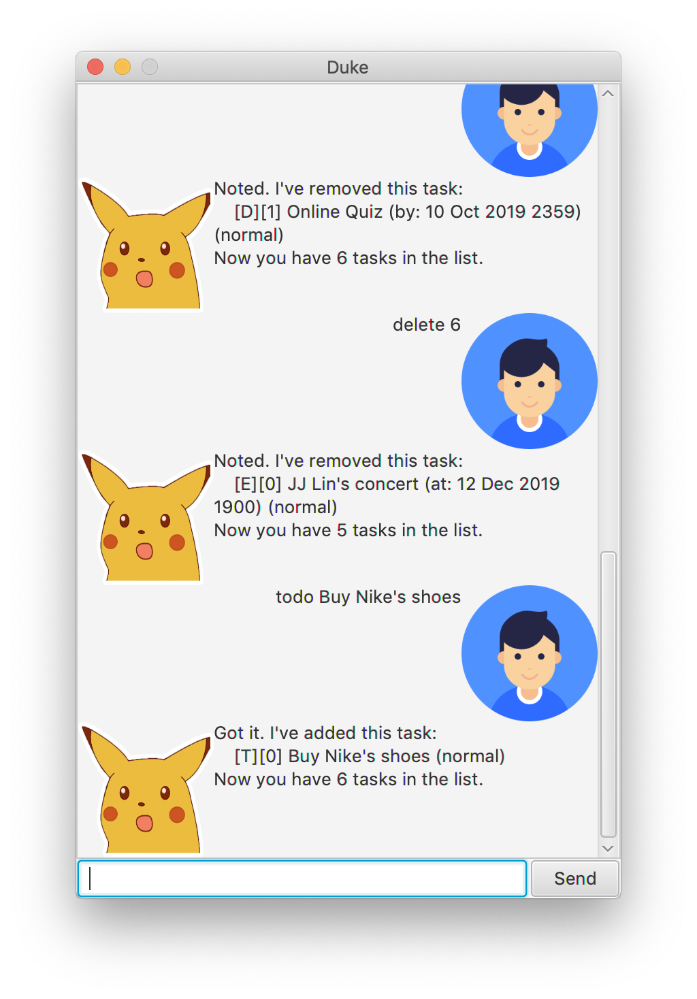

# User Guide

## About

PikaDuke is a simple task tracker that helps users to keep track of
their todo tasks, events and deadlines.

## Features 

### Feature 1 - Done

Tick items off and mark them as completed.

### Feature 2 - Prioritize 

Set priority to all your tasks.

## Commands

### 1. `todo` - Add a new todo task

You can add a new todo task and 
it will be automatically added to your task list.
`todo {taskName}`

Example of usage: 

`todo Buy Nike's shoes`

Expected outcome:

### 2. `event` - Add a new event task

`event {taskName} /at {d MMM yyyy HHmm}`

Example:

`event JJ Lin's concert /at 12 Dec 2019 1900`

Expected outcome:

### 3. `deadline` - Add a new deadline task

`deadline {taskName} /by {d MMM yyyy HHmm}`

Example:

`deadline Online Quiz /by 10 Oct 2019 2359`

Expected outcome:

### 4. `done` - Mark a task as done 

`done {taskNumber}`

Example:

`done 9`

Expected outcome:

### 5. `list` - View your current list

Example:

`list`

Expected outcome:

### 6. `find` - Search list

Search list with a keyword

`find {keyword}`

Example:

`find concert`

Expected outcome:

### 7. `priority` - Set priority

Set priority of task according to 1/2/3/4.
1. Normal
1. Standard
1. Urgent
1. Emergency

`priority {task_number} {1/2/3/4}`

Example:

`priority 3 1`

Expected outcome:

### 8. `delete` - Delete task

`delete {task_number}`

Example:

`delete 3`

Expected outcome:

### 9. `bye` - Exit

Example:

`exit`

Expected outcome:

