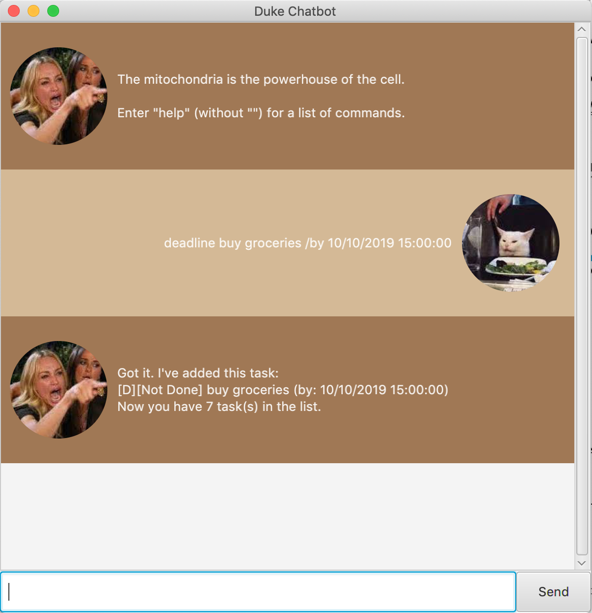
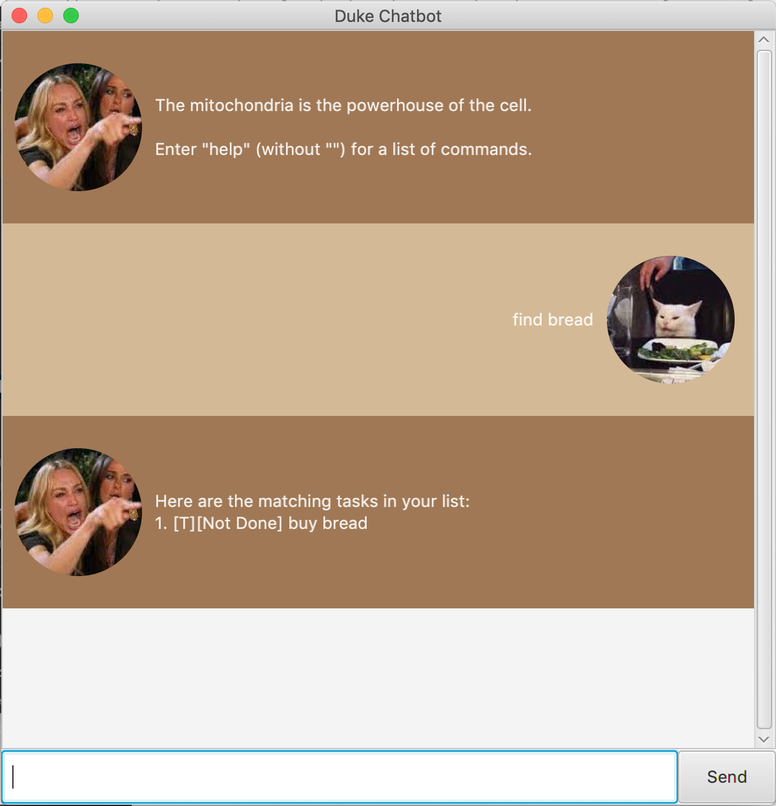

# User Guide
## About Duke
Duke is a personal task manager powered by keyboard inputs.

## Features 
- Add task
- Mark task as done
- Delete task
- Sort tasks alphabetically
- Add dates/time for events and deadlines
- Save and load tasks whenever you open or exit the programme

## Usage

### `todo` - adds a todo to list of tasks

Example of usage: 

`todo homework`

Expected outcome:

### `event` - adds an event to list of tasks

Example of usage: 

`event party /at 10/10/2019 2200`

Expected outcome:

### `deadline` - adds a deadline to list of tasks

Example of usage: 

`deadline annotated bibliography /by 10/10/2019 2359`

Expected outcome:

### `list` - displays the list of tasks

Example of usage: 

`list`

Expected outcome:

### `done` - marks a task as done

Example of usage: 

`done 1`

Expected outcome:

### `delete` - displays the list of tasks

Example of usage: 

`delete 2`

Expected outcome:

### `sort` - sorts the list of tasks alphabetically

Example of usage: 

`sort`

Expected outcome:

### `find` - finds the task(s) using the keyword input

Example of usage:

`find`

Expected outcome:

