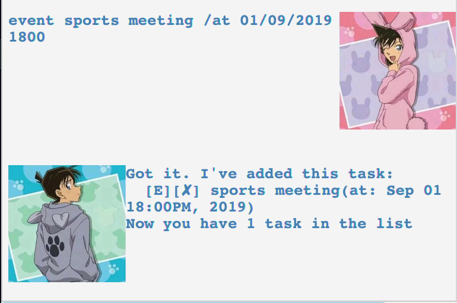

# ERA - Easily Remember All

**ERA** is a Java application specifically designed for students or those who want to track their daily tasks. ERA is designed for users who prefer to use CLI but equipped with GUI as well.
## 1.How to start
1. Ensure that you that Java11 installed.(Run `java -version` on your terminal)
2. Download the jar [here](https://github.com/Cary-Xx/duke/releases/tag/v1.0) . 
3. Copy the jar file in a base folder where you can save and load your tasks.  
4. Double-click the jar or run `java -jar ERA-1.0.jar` in terminal in case the former does not work.  
5. The GUI will appear.
6. Type your command and press `Enter` and the command will be executed. A full list of possible commands can be found below.  

**Play with it!**

 

## 2.Features 

### 2.1 Add a task: `todo`  
Add a **TODO** task to the taskList, `TASK_A` is the description of the task.

Format: `todo TASK_A` 
 
Example: `todo borrow book`  

Expected Outcome: 

  

### 2.2 Add a task: `deadline`
Add a **DEADLINE** task to the taskList, `TASK_A` is the description of the task. `SOME_DATE` is the deadline date.

Format: `deadline TASK_A /by SOME_DATE`  
`SOME_DATE` can be in the format of `dd/MM/YYYY Hmm` or `dd/MM/yyyy` or `d/MM/yyyy Hmm` or `d/MM/yyyy` or simply `Monday` or `September 01`,etc.  

Example: `deadline return book /by 01/10/2019 900`, `deadline return book /by Sunday`  

Expected Outcome:

 

### 2.3 Add a task: `event`
Add a **EVENT** task to the taskList, `TASK_A` is the description of the task. `SOME_DATE` is the event date.

Format: `event TASK_A /at SOME_DATE`
`SOME_DATE` can be in the format of `dd/MM/YYYY Hmm` or `dd/MM/yyyy` or `d/MM/yyyy Hmm` or `d/MM/yyyy` or simply `Monday` or `September 01`,etc.  

Example: `event sports meeting /at 01/09/2019 1800`, `event sports meeting /at Sunday`  

Expected Outcome:

 

### 2.4 List all the tasks: `list`
List all the tasks in the task list.

Format: `list`  

Expected Outcome:

 

### 2.5 Delete a task in the taskList: `delete`
Delete a task based on its index.

Format: `delete SOME_INDEX`  
`SOME_INDEX`corresponds to the index of a certain task displayed in your taskList.  

Example: `delete 2`  

Expected Outcome:

 

### 2.6 Find a keyword in the taskList: `find`
Search for a keyword in the description of all the tasks.

Format: `find SOME_KEYWORD`

Example: `find book`  

Expected Outcome: 

 

### 2.7 Mark a task as done: `done`
Mark a task as done(which will display a tick sign) based on its index.

Format: `done SOME_INDEX`

Example: `done 2`  

Expected Outcome:

 

### 2.8 Check duplicates in the taskList: `check`
Check all the duplicates in your taskList.

Format: `check`

Expected Outcome:

 

### 2.9 Clear the taskList: `clear`
Clear all the entries in the taskList.

Format: `clear`

Expected Outcome:

 

### 2.10 Exit the application: `bye`
Terminate the program and exit.

Format: `bye`

Expected Outcome:

 

### 2.11 Saving and loading tasks
The data of your taskList will be saved and it will be automatically loaded when you open the application.

## 3.Feedback, Bug Reports
* If you have feedback or bug reports, please post in [Cary-Xx/duke issue tracker](https://github.com/Cary-Xx/duke/issues).
* Pull requests are welcome too.
